## 1.Vue 有了数据响应式，为何还要 diff ？

**参考答案：**

Vue 中的数据响应式和虚拟 DOM 的 diff 算法是两个不同的概念，它们分别解决了不同的问题，相互协作以提高页面渲染的效率和性能。

**数据响应式**

Vue 的数据响应式系统通过 `Object.defineProperty` 或者 ES6 的 `Proxy` 来实现，主要解决了以下问题：

1.数据绑定：保证了视图与数据的同步更新，当数据发生变化时，视图会自动更新，避免了手动操作 DOM 的繁琐和易出错性。

2.依赖追踪：Vue 能够追踪每个数据的依赖关系，即哪些组件或者计算属性依赖于某个数据。当数据变化时，自动更新依赖的组件或者计算属性。

**虚拟 DOM 和 Diff 算法**

虚拟 DOM 是一种内存中的表示结构，它是对真实 DOM 的抽象。Diff 算法是一种高效更新 DOM 的策略，它通过比较新旧虚拟 DOM 树的差异，最小化了更新操作，提高了页面的渲染效率。

**为什么还需要 Diff 算法？**

1.性能优化：直接操作真实 DOM 是非常昂贵的，而虚拟 DOM 可以在内存中快速进行比较和计算差异。Diff 算法帮助减少了更新操作的次数和范围，从而提升了页面渲染的性能。

2.批量更新：Diff 算法能够将多次 DOM 更新操作合并为一次，避免了频繁的 DOM 操作，减少了浏览器的重排和重绘。

3.跨平台兼容：虚拟 DOM 和 Diff 算法使得 Vue 可以运行在不同的平台上，例如浏览器、Weex 等，统一了渲染逻辑和数据响应式的实现。

4.更新效率：即使是响应式系统可以自动更新视图，但是如果每次数据变化都直接操作真实 DOM，可能会带来性能问题。Diff 算法可以智能地比较新旧 DOM 树的变化，只更新必要的部分，从而提高了更新效率。

**综合作用**

Vue 的数据响应式系统和虚拟 DOM + Diff 算法是紧密协作的：

- 数据响应式：保证了数据和视图的同步更新，提供了便捷的开发方式。

- 虚拟 DOM + Diff 算法：提高了页面渲染的效率和性能，减少了不必要的 DOM 操作，确保了页面的流畅性和响应性。

总体来说，数据响应式和 Diff 算法是为了解决不同层面的问题，结合起来使得 Vue 能够提供高效、流畅的用户体验。

## 2.vue3 为什么不需要时间分片？

**参考答案：**

Vue 3 不需要时间分片（time slicing）主要是因为它的核心渲染机制和性能优化策略已经足够高效，能够在大多数情况下提供流畅的用户体验。以下是详细的原因：

**1. 编译器优化**

Vue 3 引入了一个全新的编译器，能够生成更高效的渲染函数。这个编译器在编译过程中进行了一系列优化，例如：

- 静态提升：将不变的节点提升为常量，只在初次渲染时计算一次。

- 预字符串化：将静态内容直接转化为字符串，减少了运行时的开销。

- 缓存事件处理程序：避免了不必要的重新绑定。

这些优化措施大大减少了 Vue 3 在更新 DOM 时的计算量，使得渲染过程更加高效。

**2. 响应式系统的改进**

Vue 3 使用了基于代理的响应式系统，替代了 Vue 2 中基于 `Object.defineProperty` 的实现。新的响应式系统更加高效，具备以下优点：

- 精细的依赖追踪：只追踪实际使用的属性，避免了不必要的依赖收集。

- 懒惰计算：仅在需要时才计算依赖，减少了计算量。

这些改进使得 Vue 3 能够更快速地响应数据变化，从而减少了渲染开销。

**3. 虚拟 DOM 和 Diff 算法的优化**

Vue 3 对虚拟 DOM 及其 diff 算法进行了优化，使得差异计算更加高效：

- 静态标记：编译期间标记静态节点，跳过不变的部分。

- 块级优化：将动态节点分块，只对发生变化的块进行更新。

这些优化措施减少了 DOM 更新的频率和范围，提高了整体渲染性能。

Composition API 天然地支持 TypeScript，使得类型推断和类型检查更为自然和方便。相比于 Options API，通过 Composition API 定义的逻辑更容易进行类型声明和类型推断，提升了开发体验。

**示例：**

```
代码块
import { ref, computed } from 'vue';

export default {
  setup() {
    const count = ref<number>(0);
    const doubleCount = computed<number>(() => count.value * 2);
    
    const increment = (): void => {
      count.value++;
    };
    
    return {
      count,
      doubleCount,
      increment
    };
  }
};
```

4.**适应函数式编程趋势**

1.**子组件**

```
代码块
<template>
  <div>子组件</div>
</template>

<script>
export default {
  name: 'ChildComponent',
  inject: ['notifyParent'],
  mounted() {
    this.notifyParent('mounted');
  }
}
</script>
```

2.**父组件**

```
代码块
<template>
  <div>
    <ChildComponent />
  </div>
</template>

<script>
import ChildComponent from './ChildComponent.vue';

export default {
  components: {
    ChildComponent
  },
  provide() {
    return {
      notifyParent: this.handleNotification
    }
  },
  methods: {
    handleNotification(hook) {
      if (hook === 'mounted') {
        console.log('子组件已挂载');
      }
    }
  }
}
</script>
```


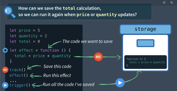

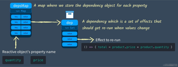

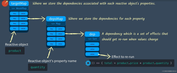

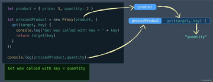

**三、activeEffect 和 ref**

在上一节代码中，还存在一个问题： `track` 函数中的依赖（ `effect` 函数）是外部定义的，当依赖发生变化， `track` 函数收集依赖时都要手动修改其依赖的方法名。

比如现在的依赖为 `foo` 函数，就要修改 `track` 函数的逻辑，可能是这样：

```
代码块
const foo = () => { /**/ };
const track = (target, key) => {     // ②
  // ...
  dep.add(foo);
}
```

那么如何解决这个问题呢？

1.**引入 activeEffect 变量**

接下来引入 `activeEffect` 变量，来保存当前运行的 effect 函数。

```
代码块
let activeEffect = null;
const effect = eff => {
  activeEffect = eff; // 1. 将 eff 函数赋值给 activeEffect
  activeEffect();     // 2. 执行 activeEffect
  activeEffect = null;// 3. 重置 activeEffect
}
```

然后在 `track` 函数中将 `activeEffect` 变量作为依赖：

```
代码块
const track = (target, key) => {
    if (activeEffect) {  // 1. 判断当前是否有 activeEffect
        let depsMap = targetMap.get(target);
        if (!depsMap) {
            targetMap.set(target, (depsMap = new Map()));
        }
        let dep = depsMap.get(key);
        if (!dep) {
            depsMap.set(key, (dep = new Set()));
        }
        dep.add(activeEffect);  // 2. 添加 activeEffect 依赖
    }
}
```

使用方式修改为：

```
代码块
effect(() => {
    total = product.price * product.quantity
});
```

这样就可以解决手动修改依赖的问题，这也是 Vue3 解决该问题的方法。完善一下测试代码后，如下：

```
代码块
const targetMap = new WeakMap();
let activeEffect = null; // 引入 activeEffect 变量

const effect = eff => {
  activeEffect = eff; // 1. 将副作用赋值给 activeEffect
  activeEffect();     // 2. 执行 activeEffect
  activeEffect = null;// 3. 重置 activeEffect
}

const track = (target, key) => {
    if (activeEffect) {  // 1. 判断当前是否有 activeEffect
        let depsMap = targetMap.get(target);
        if (!depsMap) {
            targetMap.set(target, (depsMap = new Map()));
        }
        let dep = depsMap.get(key);
        if (!dep) {
            depsMap.set(key, (dep = new Set()));
        }
        dep.add(activeEffect);  // 2. 添加 activeEffect 依赖
    }
}

const trigger = (target, key) => {
    const depsMap = targetMap.get(target);
    if (!depsMap) return;
    let dep = depsMap.get(key);
    if (dep) {
        dep.forEach(effect => effect());
    }
```

```
代码块
effect(() => {
    total = salePrice * product.quantity
});
effect(() => {
    salePrice = product.price * 0.9
});
console.log(total, salePrice);  // 0 9
product.quantity = 5;
console.log(total, salePrice);  // 45 9
product.price = 20;
console.log(total, salePrice);  // 45 18
```

得到的结果完全不同，因为 `salePrice` 并不是响应式变化，而是需要调用第二个 `effect` 函数才会变化，也就是 `product.price` 变量值发生变化。

2.**引入 ref 方法**

熟悉 Vue3 Composition API 的朋友可能会想到 Ref，它接收一个值，并返回一个响应式可变的[ Ref 对象](https://v3.cn.vuejs.org/api/refs-api.html)，其值可以通过 `value` 属性获取。

ref：接受一个内部值并返回一个响应式且可变的 ref 对象。ref 对象具有指向内部值的单个 property .value。

官网的使用示例如下：

```
代码块
const count = ref(0)
console.log(count.value) // 0

count.value++
console.log(count.value) // 1
```

我们有 2 种方法实现 ref 函数：

1.**使用 ****`reactive`**** 函数**

```
代码块
const ref = intialValue => reactive({value: intialValue});
```

这样是可以的，虽然 Vue3 不是这么实现。

2.**使用对象的属性访问器（计算属性）**

属性方式包括：[getter](https://developer.mozilla.org/zh-CN/docs/Web/JavaScript/Reference/Functions/get) 和 [setter](https://developer.mozilla.org/zh-CN/docs/Web/JavaScript/Reference/Functions/set)。

```
代码块
const ref = raw => {
  const r = {
    get value(){
      track(r, 'value');
      return raw;
    },
    
    set value(newVal){
            raw = newVal;
      trigger(r, 'value');
    }
  }
  return r;
}
```

使用方式如下：

```
代码块
let product = reactive({ price: 10, quantity: 2 });
let total = 0, salePrice = ref(0);
effect(() => {
    salePrice.value = product.price * 0.9
});
effect(() => {
    total = salePrice.value * product.quantity
});
console.log(total, salePrice.value); // 18 9
product.quantity = 5;
console.log(total, salePrice.value); // 45 9
product.price = 20;
console.log(total, salePrice.value); // 90 18
```

在 Vue3 中 ref 实现的核心也是如此。

**四、实现简易 Computed 方法**

用过 Vue 的同学可能会好奇，上面的 `salePrice` 和 `total` 变量为什么不使用 `computed` 方法呢？

没错，这个可以的，接下来一起实现个简单的 `computed` 方法。

```
代码块
const computed = getter => {
    let result = ref();
    effect(() => result.value = getter());
    return result;
}

let product = reactive({ price: 10, quantity: 2 });
let salePrice = computed(() => {
    return product.price * 0.9;
})
let total = computed(() => {
    return salePrice.value * product.quantity;
})

console.log(total.value, salePrice.value);
product.quantity = 5;
console.log(total.value, salePrice.value);
product.price = 20;
console.log(total.value, salePrice.value);
```

这里我们将一个函数作为参数传入 `computed` 方法，`computed` 方法内通过 `ref` 方法构建一个 ref 对象，然后通过 `effct` 方法，将 `getter` 方法返回值作为 `computed` 方法的返回值。

这样我们实现了个简单的 `computed` 方法，执行效果和前面一样。

**五、源码学习建议**

1.**构建 reactivity.cjs.js**

这一节介绍如何去从[ Vue 3 仓库](https://github.com/vuejs/vue-next)打包一个 Reactivity 包来学习和使用。

a.从[ Vue 3 仓库](https://github.com/vuejs/vue-next)下载最新 Vue3 源码

```
代码块
const { reactive, computed, effect } = require("./reactivity.cjs.js");
```

2.**Vue3 Reactivity 文件目录**

在源码的 `packages/reactivity/src`目录下，有以下几个主要文件：

1.effect.ts：用来定义 `effect` / `track` / `trigger` ；

2.baseHandlers.ts：定义 Proxy 处理器（ get 和 set）；

3.reactive.ts：定义 `reactive` 方法并创建 ES6 Proxy；

4.ref.ts：定义 reactive 的 ref 使用的对象访问器；

5.computed.ts：定义计算属性的方法；

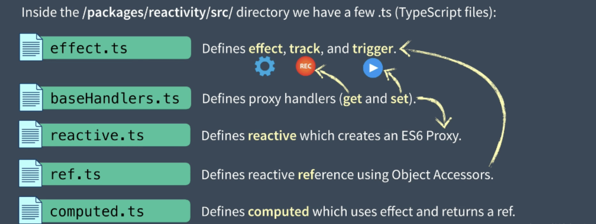

## 11.Vue中，created和mounted两个钩子之间调用时间差值受什么影响？

**参考答案：**

`created` 和 `mounted` 这两个生命周期钩子，分别在实例创建和挂载的不同阶段被调用。

它们之间的时间差值主要受以下几个因素的影响：

- ◦当实例被创建时，Vue 会编译模板（或将模板转换为渲染函数），这个过程在 `created` 钩子之前完成。如果模板非常复杂或包含大量指令、组件，这个过程会更耗时，从而延长 `created` 和 `mounted` 之间的时间差。

- ◦在 `mounted` 钩子调用之前，Vue 会将虚拟 DOM 渲染为实际的 DOM 元素。渲染复杂的组件树或处理大量数据绑定会增加这段时间。

- ◦如果在 `created` 钩子中发起了异步操作（如 API 请求），这些操作本身不会直接影响 `created` 和 `mounted` 的时间差，但如果这些操作涉及数据更新，可能会间接增加挂载时间。

- ◦浏览器的性能和设备的硬件配置也会影响模板编译和 DOM 渲染的速度，从而影响这两个钩子之间的时间差。

- ◦在 `beforeCreate`、`created`、`beforeMount` 等钩子中执行的代码也会影响到 `mounted` 钩子的触发时间。如果这些钩子中有大量计算或耗时操作，也会增加时间差。

总结起来，`created` 和 `mounted` 之间的时间差主要受到模板编译、虚拟 DOM 渲染的复杂性、异步操作、浏览器性能及其他生命周期钩子中执行代码的影响。在编写 Vue 应用时，优化这些方面可以减少 `created` 和 `mounted` 之间的时间差，提高应用性能。

## 12.vue中，推荐在哪个生命周期发起请求？

**参考答案：**

推荐在 `mounted` 生命周期钩子中发起请求。这样做有几个重要的理由：

- ◦`mounted` 钩子在组件的 DOM 已经被插入文档之后调用。这意味着你可以确保所有的 DOM 元素都已经存在，如果你的请求结果需要直接操作或依赖这些 DOM 元素，那么在 `mounted` 中发起请求是安全的。

- ◦在 `created` 钩子中发起请求有时会导致在组件还没有挂载时请求数据。如果组件在请求完成之前被销毁，可能会引发内存泄漏或不必要的资源浪费。因此，等待组件挂载完成再发起请求可以减少这些潜在问题。

- ◦在 `mounted` 钩子中发起请求，能够确保你有机会在请求开始前处理组件的状态（例如设置加载状态），并且在请求完成后更新组件的状态（例如显示数据或处理错误）。

尽管 `mounted` 是推荐的生命周期钩子，但也有一些特定场景可能需要在 `created` 钩子中发起请求，例如：

- SSR（服务器端渲染）：在服务器端渲染中，Vue 实例的 `mounted` 钩子不会被调用，因为 DOM 并不会被真正挂载。在这种情况下，你可能需要在 `created` 钩子中发起请求。

- 依赖数据初始化：如果组件在挂载之前就需要某些数据来初始化，可以在 `created` 钩子中发起请求，以确保数据在组件挂载时已经可用。

**代码示例**

```
代码块
export default {
  data() {
    return {
      items: [],
      loading: false,
      error: null
    };
  },
  mounted() {
    this.fetchData();
  },
  methods: {
    async fetchData() {
      this.loading = true;
      try {
```

前端合理利用`localStorage`

**UI框架按需加载**

在日常使用`UI`框架，例如`element-UI`、或者`antd`，我们通常会直接引用整个`UI`库

```
代码块
import ElementUI from 'element-ui'
Vue.use(ElementUI)
```

但实际上我用到的组件只有按钮，分页，表格，输入与警告 所以我们要按需引用

```
代码块
import { Button, Input, Pagination, Table, TableColumn, MessageBox } from 'element-ui';
Vue.use(Button)
Vue.use(Input)
Vue.use(Pagination)
```

**组件重复打包**

假设`A.js`文件是一个常用的库，现在有多个路由使用了`A.js`文件，这就造成了重复下载

解决方案：在`webpack`的`config`文件中，修改`CommonsChunkPlugin`的配置

```
代码块
minChunks: 3
```

`minChunks`为3表示会把使用3次及以上的包抽离出来，放进公共依赖文件，避免了重复加载组件

**图片资源的压缩**

图片资源虽然不在编码过程中，但它却是对页面性能影响最大的因素

对于所有的图片资源，我们可以进行适当的压缩

对页面上使用到的`icon`，可以使用在线字体图标，或者雪碧图，将众多小图标合并到同一张图上，用以减轻`http`请求压力。

**开启GZip压缩**

拆完包之后，我们再用`gzip`做一下压缩 安装`compression-webpack-plugin`

```
代码块
cnmp i compression-webpack-plugin -D
```

在`vue.congig.js`中引入并修改`webpack`配置

```
代码块
const CompressionPlugin = require('compression-webpack-plugin')

configureWebpack: (config) => {
        if (process.env.NODE_ENV === 'production') {
            // 为生产环境修改配置...
            config.mode = 'production'
            return {
                plugins: [new CompressionPlugin({
                    test: /\.js$|\.html$|\.css/, //匹配文件名
                    threshold: 10240, //对超过10k的数据进行压缩
                    deleteOriginalAssets: false //是否删除原文件
                })]
            }
        }
```

在服务器我们也要做相应的配置 如果发送请求的浏览器支持`gzip`，就发送给它`gzip`格式的文件 我的服务器是用`express`框架搭建的 只要安装一下`compression`就能使用

```
代码块
const compression = require('compression')
app.use(compression())  *// 在其他中间件使用之前调用*
```

**使用SSR**

SSR（Server side ），也就是服务端渲染，组件或页面通过服务器生成html字符串，再发送到浏览器

从头搭建一个服务端渲染是很复杂的，`vue`应用建议使用`Nuxt.js`实现服务端渲染

**小结：**

减少首屏渲染时间的方法有很多，总的来讲可以分成两大部分 ：资源加载优化 和 页面渲染优化

下图是更为全面的首屏优化的方案

大家可以根据自己项目的情况选择各种方式进行首屏渲染的优化

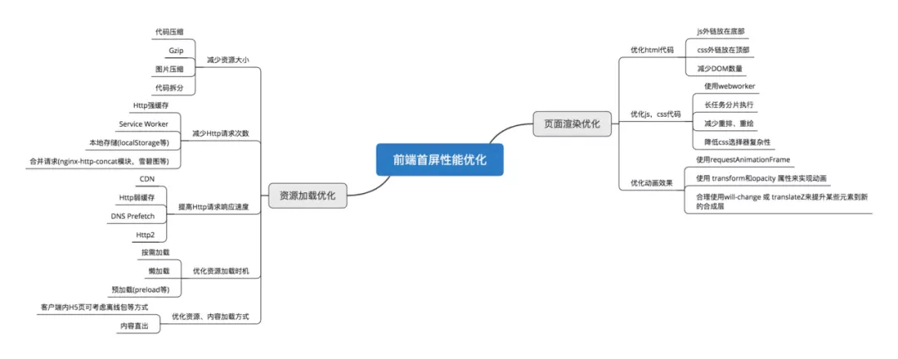

## 15.说下Vite的原理

**参考答案：**

**背景**

这里的背景介绍会从与`Vite`紧密相关的两个概念的发展史说起，一个是`JavaScript`的模块化标准，另一个是前端构建工具。

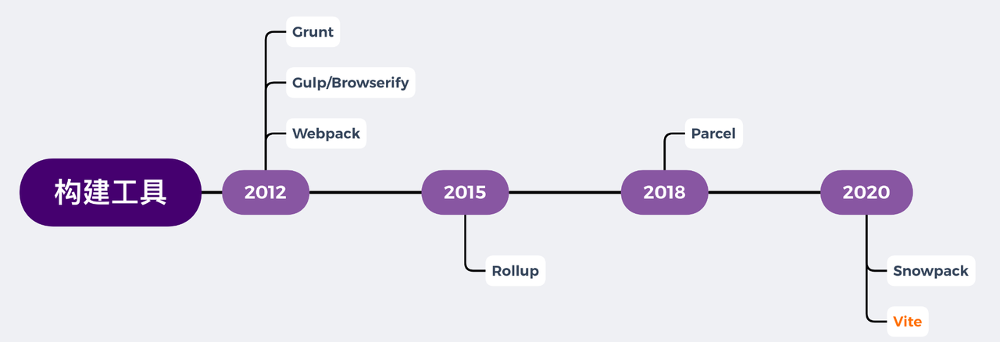

**当前工程化痛点**

现在常用的构建工具如`Webpack`，主要是通过抓取-编译-构建整个应用的代码（也就是常说的打包过程），生成一份编译、优化后能良好兼容各个浏览器的的生产环境代码。在开发环境流程也基本相同，需要先将整个应用构建打包后，再把打包后的代码交给`dev server`（开发服务器）。

`Webpack`等构建工具的诞生给前端开发带来了极大的便利，但随着前端业务的复杂化，js代码量呈指数增长，打包构建时间越来越久，`dev server`（开发服务器）性能遇到瓶颈：

- 缓慢的服务启动： 大型项目中`dev server`启动时间达到几十秒甚至几分钟。

- 缓慢的HMR热更新： 即使采用了 HMR 模式，其热更新速度也会随着应用规模的增长而显著下降，已达到性能瓶颈，无多少优化空间。

**缓慢的开发环境，大大降低了开发者的幸福感，在以上背景下****`Vite`****应运而生。**

**什么是Vite？**

基于esbuild与Rollup，依靠浏览器自身ESM编译功能， 实现极致开发体验的新一代构建工具！

**概念**

先介绍以下文中会经常提到的一些基础概念：

- 依赖： 指开发不会变动的部分(npm包、UI组件库)，esbuild进行预构建。

- 源码： 浏览器不能直接执行的非js代码(.jsx、.css、.vue等)，vite只在浏览器请求相关源码的时候进行转换，以提供ESM源码。

**开发环境**

- 利用浏览器原生的`ES Module`编译能力，省略费时的编译环节，直给浏览器开发环境源码，`dev server`只提供轻量服务。

- 浏览器执行ESM的`import`时，会向`dev server`发起该模块的`ajax`请求，服务器对源码做简单处理后返回给浏览器。

- `Vite`中HMR是在原生 ESM 上执行的。当编辑一个文件时，Vite 只需要精确地使已编辑的模块失活，使得无论应用大小如何，HMR 始终能保持快速更新。

- 使用`esbuild`处理项目依赖，`esbuild`使用go编写，比一般`node.js`编写的编译器快几个数量级。

**生产环境**

- 集成`Rollup`打包生产环境代码，依赖其成熟稳定的生态与更简洁的插件机制。

**处理流程对比**

`Webpack`通过先将整个应用打包，再将打包后代码提供给`dev server`，开发者才能开始开发。

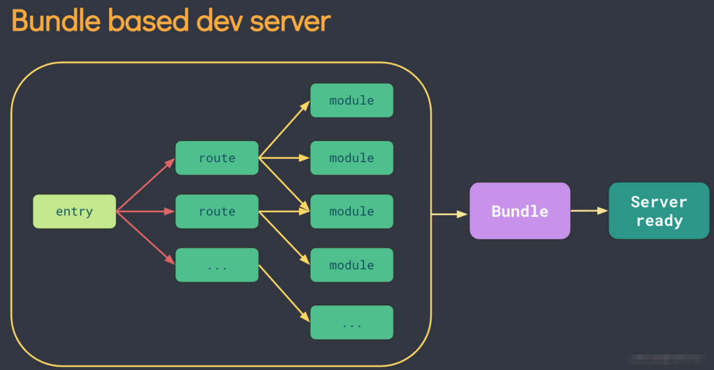

`Vite`直接将源码交给浏览器，实现`dev server`秒开，浏览器显示页面需要相关模块时，再向`dev server`发起请求，服务器简单处理后，将该模块返回给浏览器，实现真正意义的按需加载。

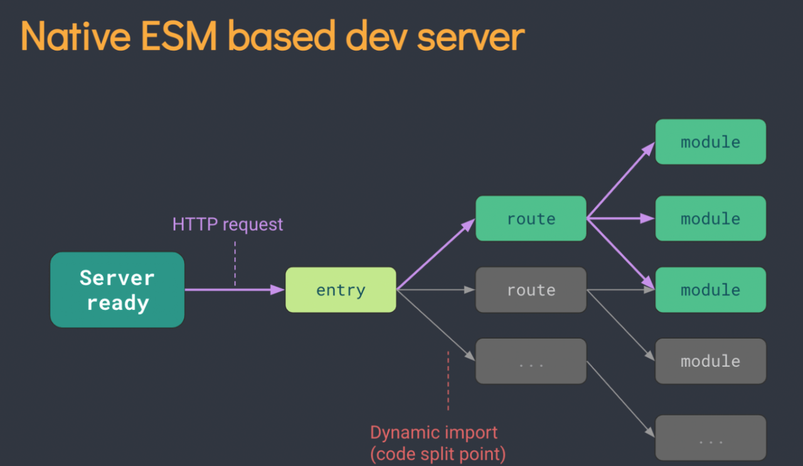

**基本用法**

**创建vite项目**

```
代码块
$ npm create vite@latest
```

**选取模板**

`Vite` 内置6种常用模板与对应的TS版本，可满足前端大部分开发场景，可以点击下列表格中模板直接在 [StackBlitz](https://vite.new/) 中在线试用，还有其他更多的 [社区维护模板](https://github.com/vitejs/awesome-vite#templates)可以使用。

- 可使用官方插件 `@vitejs/plugin-legacy`，转义成传统版本和相对应的`polyfill`

**未来探索**

- 传统构建工具性能已到瓶颈，主打开发体验的`Vite`，可能会受到欢迎。

- 主流浏览器基本支持ESM，ESM将成为主流。

- `Vite`在`Vue3.0`代替`vue-cli`，作为官方脚手架，会大大提高使用量。

- `Vite2.0`推出后，已可以在实际项目中使用`Vite`。

- 如果觉得直接使用`Vite`太冒险，又确实有`dev server`速度慢的问题需要解决，可以尝试用`Vite`单独搭建一套`dev server`

**相关资源**

**官方插件**

除了支持现有的`Rollup`插件系统外，官方提供了四个最关键的插件

- `@vitejs/plugin-vue` 提供 Vue3 单文件组件支持

- `@vitejs/plugin-vue-jsx` 提供 Vue3 JSX 支持（专用的 Babel 转换插件）

- `@vitejs/plugin-react` 提供完整的 React 支持

- `@vitejs/plugin-legacy` 为打包后的文件提供传统浏览器兼容性支持

## 16.Vue2.0为什么不能检查数组的变化，该怎么解决？

**参考答案：**

**前言**

我们都知道，Vue2.0对于响应式数据的实现有一些不足：

- 无法检测数组/对象的新增

- 无法检测通过索引改变数组的操作。

**分析**

- 无法检测数组/对象的新增？

Vue检测数据的变动是通过Object.defineProperty实现的，所以无法监听数组的添加操作是可以理解的，因为是在构造函数中就已经为所有属性做了这个检测绑定操作。

- 无法检测通过索引改变数组的操作。即vm.items[indexOfItem] = newValue？

[官方文档](https://cn.vuejs.org/v2/guide/list.html#%E6%B3%A8%E6%84%8F%E4%BA%8B%E9%A1%B9)中对于这两点都是简要的概括为“由于JavaScript的限制”无法实现，而Object.defineProperty是实现检测数据改变的方案，这个限制是指Object.defineProperty

**思考**

**vm.items[indexOfItem] = newValue真的不能被监听么？**

Vue对数组的7个变异方法（push、pop、shift、unshift、splice、sort、reverse）实现了响应式。这里就不做测试了。我们测试一下通过索引改变数组的操作，能不能被监听到。

遍历数组，用Object.defineProperty对每一项进行监测

```
代码块
function defineReactive(data, key, value) {
         Object.defineProperty(data, key, {
                 enumerable: true,
                 configurable: true,
                 get: function defineGet() {
                         console.log(`get key: ${key} value: ${value}`)
                         return value
                 },
                 set: function defineSet(newVal) {
                         console.log(`set key: ${key} value: ${newVal}`)
                         value = newVal
                 }
         })
}
 
function observe(data) {
        Object.keys(data).forEach(function(key) {
                defineReactive(data, key, data[key])
        })
}
 
let arr = [1, 2, 3]
observe(arr)
```


**测试说明**

通过索引改变arr[1]，我们发现触发了set，也就是Object.defineProperty是可以检测到通过索引改变数组的操作的，那Vue2.0为什么没有实现呢？是尤大能力不行？这肯定毋庸置疑。那他为什么不实现呢？

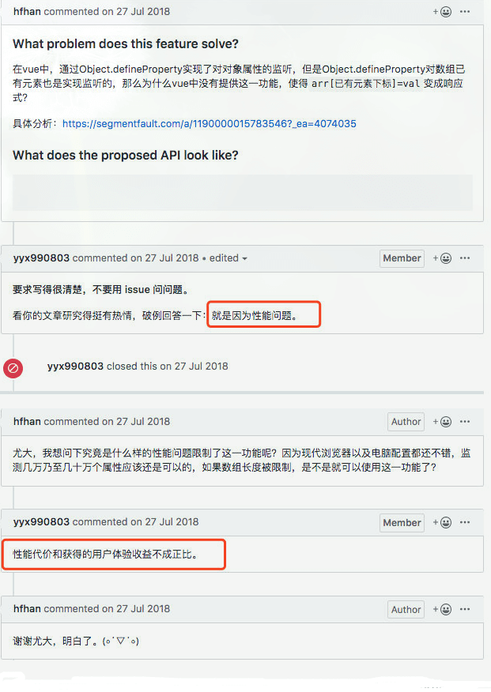

**解决方案**

**数组**

1.this.$set(array, index, data)

```
代码块
//这是个深度的修改，某些情况下可能导致你不希望的结果，因此最好还是慎用
this.dataArr = this.originArr
this.$set(this.dataArr, 0, {data: '修改第一个元素'})
console.log(this.dataArr)        
console.log(this.originArr)  //同样的 源数组也会被修改 在某些情况下会导致你不希望的结果 
```

2.splice

```
代码块
*//因为splice会被监听有响应式，而splice又可以做到增删改。*
```

3.利用临时变量进行中转

```
代码块
let tempArr = [...this.targetArr]
tempArr[0] = {data: 'test'}
this.targetArr = tempArr
```

**对象**

1.this.$set(obj, key ,value) - 可实现增、改

2.watch时添加`deep：true`深度监听，只能监听到属性值的变化，新增、删除属性无法监听

```
代码块
this.$watch('blog', this.getCatalog, {
    deep: true
    // immediate: true // 是否第一次触发
  });
```

3.watch时直接监听某个key

```
代码块
watch: {
  'obj.name'(curVal, oldVal) {
    // TODO
  }
}
```

## 17.说说Vue 页面渲染流程

**参考答案：**

**前言**

在 `Vue` 核心中除了响应式原理外，视图渲染也是重中之重。我们都知道每次更新数据，都会走视图渲染的逻辑，而这当中牵扯的逻辑也是十分繁琐。

本文主要解析的是初始化视图渲染流程，你将会了解到从挂载组件开始，`Vue` 是如何构建 `VNode`，又是如何将 `VNode` 转为真实节点并挂载到页面。

**挂载组件($mount)**

`Vue` 是一个构造函数，通过 `new` 关键字进行实例化。

```
代码块
// src/core/instance/index.js
function Vue (options) {
  if (process.env.NODE_ENV !== 'production' &&
    !(this instanceof Vue)
  ) {
    warn('Vue is a constructor and should be called with the `new` keyword')
  }
  this._init(options)
}
```

在实例化时，会调用 `_init` 进行初始化。

```
代码块
// src/core/instance/init.js
Vue.prototype._init = function (options?: Object) {
    const vm: Component = this
    // ...
    if (vm.$options.el) {
      vm.$mount(vm.$options.el)
    }
  }
```

`_init` 内会调用 `$mount` 来挂载组件，而 `$mount` 方法实际调用的是 `mountComponent`。

```
代码块
// src/core/instance/lifecycle.js
export function mountComponent (
  vm: Component,
  el: ?Element,
  hydrating?: boolean
): Component {
  vm.$el = el
  // ...
  callHook(vm, 'beforeMount')

  let updateComponent
  /* istanbul ignore if */
  if (process.env.NODE_ENV !== 'production' && config.performance && mark) {
    // ...
  } else {
    updateComponent = () => {
      vm._update(vm._render(), hydrating)  // 渲染页面函数
    }
  }

  // we set this to vm._watcher inside the watcher's constructor
  // since the watcher's initial patch may call $forceUpdate (e.g. inside child
  // component's mounted hook), which relies on vm._watcher being already defined
  new Watcher(vm, updateComponent, noop, { //  渲染watcher
    before () {
      if (vm._isMounted && !vm._isDestroyed) {
        callHook(vm, 'beforeUpdate')
      }
    }
  }, true /* isRenderWatcher */)
```

`mountComponent` 除了调用一些生命周期的钩子函数外，最主要是 `updateComponent`，它就是负责渲染视图的核心方法，其只有一行核心代码：

```
代码块
vm._update(vm._render(), hydrating)
```

`vm._render` 创建并返回 `VNode`，`vm._update` 接受 `VNode` 将其转为真实节点。

`updateComponent` 会被传入 `渲染Watcher`，每当数据变化触发 `Watcher` 更新就会执行该函数，重新渲染视图。`updateComponent` 在传入 `渲染Watcher` 后会被执行一次进行初始化页面渲染。

所以我们着重分析的是 `vm._render` 和 `vm._update` 两个方法，这也是本文主要了解的原理——`Vue` 视图渲染流程。

**构建VNode(_render)**

首先是 `_render` 方法，它用来构建组件的 `VNode`。

```
代码块
// src/core/instance/render.js
Vue.prototype._render = function () {
    const { render, _parentVnode } = vm.$options
    vnode = render.call(vm._renderProxy, vm.$createElement)
    return vnode
}
```

`_render` 内部会执行 `render` 方法并返回构建好的 `VNode`。`render` 一般是模板编译后生成的方法，也有可能是用户自定义。

```
代码块
// src/core/instance/render.js
export function initRender (vm) {
    vm._c = (a, b, c, d) => createElement(vm, a, b, c, d, false)
    vm.$createElement = (a, b, c, d) => createElement(vm, a, b, c, d, true)
}
```

`initRender` 在初始化就会执行为实例上绑定两个方法，分别是 `vm._c` 和 `vm.$createElement`。它们两者都是调用 `createElement` 方法，它是创建 `VNode` 的核心方法，最后一个参数用于区别是否为用户自定义。

`vm._c` 应用场景是在编译生成的 `render` 函数中调用，`vm.$createElement` 则用于用户自定义 `render` 函数的场景。就像上面 `render` 在调用时会传入参数 `vm.$createElement`，我们在自定义 `render` 函数接收到的参数就是它。

**createElement**

```
代码块
// src/core/vdom/create-elemenet.js
export function createElement (
  context: Component,
  tag: any,
  data: any,
  children: any,
  normalizationType: any,
  alwaysNormalize: boolean
): VNode | Array<VNode> {
  if (Array.isArray(data) || isPrimitive(data)) {
    normalizationType = children
    children = data
    data = undefined
  }
  if (isTrue(alwaysNormalize)) {
    normalizationType = ALWAYS_NORMALIZE
  }
  return _createElement(context, tag, data, children, normalizationType)
}
```

`createElement` 方法实际上是对 `_createElement` 方法的封装，它允许传入的参数更加灵活。

```
代码块
export function _createElement (
  context: Component,
  tag?: string | Class<Component> | Function | Object,
  data?: VNodeData,
  children?: any,
  normalizationType?: number
): VNode | Array<VNode> {
  if (isDef(data) && isDef(data.is)) {
    tag = data.is
  }
  if (!tag) {
    // in case of component :is set to falsy value
    return createEmptyVNode()
  }
  // support single function children as default scoped slot
  if (Array.isArray(children) &&
    typeof children[0] === 'function'
  ) {
    data = data || {}
    data.scopedSlots = { default: children[0] }
    children.length = 0
  }
  if (normalizationType === ALWAYS_NORMALIZE) {
    children = normalizeChildren(children)
  } else if (normalizationType === SIMPLE_NORMALIZE) {
    children = simpleNormalizeChildren(children)
  }
  let vnode, ns
  if (typeof tag === 'string') {
    let Ctor
```

`simpleNormalizeChildren` 方法调用场景是 render 函数当函数是编译生成的。`normalizeChildren` 方法的调用场景主要是 render 函数是用户手写的。

经过对 `children` 的规范化，`children` 变成了一个类型为 `VNode` 的数组。之后就是创建 `VNode` 的逻辑。

```
代码块
// src/core/vdom/patch.js
let vnode, ns
if (typeof tag === 'string') {
  let Ctor
  ns = (context.$vnode && context.$vnode.ns) || config.getTagNamespace(tag)
  if (config.isReservedTag(tag)) {
    // platform built-in elements
    vnode = new VNode(
      config.parsePlatformTagName(tag), data, children,
      undefined, undefined, context
    )
  } else if (isDef(Ctor = resolveAsset(context.$options, 'components', tag))) {
    // component
    vnode = createComponent(Ctor, data, context, children, tag)
  } else {
    // unknown or unlisted namespaced elements
    // check at runtime because it may get assigned a namespace when its
    // parent normalizes children
    vnode = new VNode(
      tag, data, children,
      undefined, undefined, context
    )
  }
} else {
  // direct component options / constructor
  vnode = createComponent(tag, data, context, children)
}
```

如果 `tag` 是 `string` 类型，则接着判断如果是内置的一些节点，创建一个普通 `VNode`；如果是为已注册的组件名，则通过 `createComponent` 创建一个组件类型的 `VNode`；否则创建一个未知的标签的 `VNode`。

如果 `tag` 不是 `string` 类型，那就是 `Component` 类型, 则直接调用 `createComponent` 创建一个组件类型的 `VNode` 节点。

最后 `_createElement` 会返回一个 `VNode`，也就是调用 `vm._render` 时创建得到的`VNode`。之后 `VNode` 会传递给 `vm._update` 函数，用于生成真实dom。

**生成真实dom(_update)**

```
代码块
// src/core/instance/lifecycle.js
Vue.prototype._update = function (vnode: VNode, hydrating?: boolean) {
  const vm: Component = this
  const prevEl = vm.$el
  const prevVnode = vm._vnode
  const prevActiveInstance = activeInstance
  activeInstance = vm
  vm._vnode = vnode
  // Vue.prototype.__patch__ is injected in entry points
  // based on the rendering backend used.
  if (!prevVnode) {
    // initial render
    vm.$el = vm.__patch__(vm.$el, vnode, hydrating, false /* removeOnly */)
  } else {
    // updates
    vm.$el = vm.__patch__(prevVnode, vnode)
  }
  activeInstance = prevActiveInstance
  // update __vue__ reference
  if (prevEl) {
    prevEl.__vue__ = null
  }
  if (vm.$el) {
    vm.$el.__vue__ = vm
  }
  // if parent is an HOC, update its $el as well
  if (vm.$vnode && vm.$parent && vm.$vnode === vm.$parent._vnode) {
    vm.$parent.$el = vm.$el
  }
  // updated hook is called by the scheduler to ensure that children are
  // updated in a parent's updated hook.
}
```

`_update` 里最核心的方法就是 `vm.__patch__` 方法，不同平台的 `patch` 方法的定义会稍有不同，在 web 平台中它是这样定义的：

```
代码块
*// src/platforms/web/runtime/index.js*
import { patch } from './patch'
*// install platform patch function*
Vue.prototype.__patch__ = inBrowser ? patch : noop
```

可以看到 `patch` 实际调用的是 `patch` 方法。

```
代码块
// src/platforms/web/runtime/patch.js
import * as nodeOps from 'web/runtime/node-ops'
import { createPatchFunction } from 'core/vdom/patch'
import baseModules from 'core/vdom/modules/index'
import platformModules from 'web/runtime/modules/index'

// the directive module should be applied last, after all
// built-in modules have been applied.
const modules = platformModules.concat(baseModules)

export const patch: Function = createPatchFunction({ nodeOps, modules })
```

而 `patch` 方法是由 `createPatchFunction` 方法创建返回出来的函数。

```
代码块
// src/core/vdom/patch.js
const hooks = ['create', 'activate', 'update', 'remove', 'destroy']
```

**注：** 监听函数有两个参数，第一个参数是最新的值，第二个参数是输入之前的值，顺序一定是**新值，旧值**，如果只写一个参数，那就是最新属性值。

在使用时选择 watch 还是 computed，还有一个参考点就是官网说的：当需要在数据变化时执行异步或开销较大的操作时，watch方式是最有用的。所以 watch 一定是**支持异步**的。

上面仅限监听简单数据类型，监听复杂数据类型就需要用到深度监听 deep。

**deep：**为了发现对象内部值的变化，可以在选项参数中指定 deep: true。注意监听数组的变更不需要这么做。

```
代码块
data: {
    fullName: {
        firstName: 'David',
        lastName: 'Beckham'
    }
},
watch: {
    fullName: {
        handler(newVal, oldVal) {
            console.log(newVal);
            console.log(oldVal);
        },
        deep: true
    }
}
```

以上打印结果：

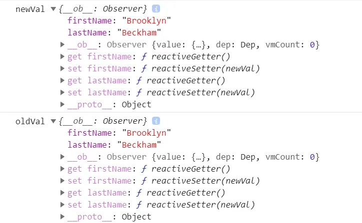

打印出来的 newVal 和 oldVal 值是一样的，所以深度监听虽然可以监听到对象的变化，但是无法监听到对象里面哪个具体属性的变化。这是因为它们的引用指向同一个对象/数组。Vue 不会保留变更之前值的副本。

若果要监听对象的单个属性的变化，有两种方法：

1.直接监听对象的属性

```
代码块
watch:{
    fullName.firstName: function(newVal,oldVal){
        console.log(newVal,oldVal);
    }
}
```

2.与 computed 属性配合使用，computed 返回想要监听的属性值，watch 用来监听

```
代码块
computed: {
    firstNameChange() {
    return this.fullName.firstName
    }
},
watch: {
    firstNameChange() {
        console.log(this.fullName)
    }
}
```

**总结：**

**watch和computed都是以Vue的依赖追踪机制为基础的**，当某一个依赖型数据（依赖型数据：简单理解即放在 data 等对象下的实例数据）发生变化的时候，所有依赖这个数据的相关数据会自动发生变化，即自动调用相关的函数，来实现数据的变动。

**当依赖的值变化时，在watch中，是可以做一些复杂的操作的，而computed中的依赖，仅仅是一个值依赖于另一个值，是值上的依赖。**

**应用场景：**

computed：用于处理复杂的逻辑运算；一个数据受一个或多个数据影响；用来处理watch和methods无法处理的，或处理起来不方便的情况。例如处理模板中的复杂表达式、购物车里面的商品数量和总金额之间的变化关系等。

watch：用来处理当一个属性发生变化时，需要执行某些具体的业务逻辑操作，或要在数据变化时执行异步或开销较大的操作；一个数据改变影响多个数据。例如用来监控路由、inpurt 输入框值的特殊处理等。

**区别：**

**computed**

- 初始化显示或者相关的 data、props 等属性数据发生变化的时候调用；

- 计算属性不在 data 中，它是基于data 或 props 中的数据通过计算得到的一个新值，这个新值根据已知值的变化而变化；

- 在 computed 属性对象中定义计算属性的方法，和取data对象里的数据属性一样，以属性访问的形式调用；

- 如果 computed 属性值是函数，那么默认会走 get 方法，必须要有一个返回值，函数的返回值就是属性的属性值；

- computed 属性值默认会**缓存**计算结果，在重复的调用中，只要依赖数据不变，直接取缓存中的计算结果，只有**依赖型数据发生改变**，computed 才会重新计算；

- 在computed中的，属性都有一个 get 和一个 set 方法，当数据变化时，调用 set 方法。

**watch**

- 主要用来监听某些特定数据的变化，从而进行某些具体的业务逻辑操作，可以看作是 computed 和 methods 的结合体；

`state`辅助函数为`mapState`，`actions`辅助函数为`mapActions`，`mutations`辅助函数为`mapMutations`。（`Vuex`实例身上有`mapState`、`mapActions`、`mapMutations`属性，属性值都是函数）

**如何使用辅助函数**

首先，需要在当前组件中引入`Vuex`。

然后，通过Vuex来调用辅助函数。

**辅助函数如何去映射vuex.store中的属性**

1.**mapState:把state属性映射到computed身上**

```
代码块
computed:{
  ...Vuex.mapState({
    input:state=>state.inputVal,
    n:state=>state.n
  })   
}
```

`state`：用来存储公共的状态 在`state`中的数据都是响应式的。

响应式原因：`state`里面有一个`getters`、`setters`方法；`data`中的数据也是响应式的，因为里面也有`getters`和`setters`方法

在`computed`属性中来接收`state`中的数据,接收方式有2种（数组和对象，推荐对象）.

优点：

- 本身key值是别名，要的是val的值，key的值a 和 val="a"一样就行，随意写。减少state里面长的属性名。

- 可以在函数内部查看state中的数据，数组方式的话，必须按照state中的属性名。

```
代码块
  computed:Vuex.mapState({
    key:state=>state.属性
  })
```

如果自身组件也需要使用computed的话，通过解构赋值去解构出来

```
代码块
  computed:{
    ...Vuex.mapState({
       key:state=>state.属性
    })
  }
```

2.**mapAcions：把actions里面的方法映射到methods中**

```
代码块
methods:{
        ...Vuex.mapActions({
            add:"handleTodoAdd",    *//val为actions里面的方法名称*
            change:"handleInput"     
        })
    }
```

add、change为action方法别名，直接代用add和change方法就行，不过要记得在actions里面做完数据业务逻辑的操作。

等价于如下的函数调用，

```
代码块
methods: {
        handleInput(e){           
                let val = e.target.value;
                this.$store.dispatch("handleInput",val )
        },
        handleAdd(){
                this.$store.dispatch("handleTodoAdd")
        }
}
```

`actions`里面的函数主要用来处理异步的函数以及一些业务逻辑,每一个函数里面都有一个形参，这个形参是一个对象，里面有一个`commit`方法，这个方法用来触发mutations里面的方法

3. **mapMutations：把mutations里面的方法映射到methods中**

只是做简单的数据修改（例如n++），它没有涉及到数据的处理，没有用到业务逻辑或者异步函数，可以直接调用mutations里的方法修改数据。

```
代码块
methods:{
        ...Vuex.mapMutations({
            handleAdd:"handlMutationseAdd"
        })
    }
```

`mutations`里面的函数主要用来修改`state`中的数据。`mutations`里面的所有方法都会有2个参数，一个是`store`中的`state`，另外一个是需要传递的参数。

理解`state`、`actions`、`mutations`，可以参考`MVC`框架。

- `state`看成一个数据库，只是它是响应式的，刷新页面数据就会改变；

- `actions`看成controller层，做数据的业务逻辑；

- `mutations`看成model层，做数据的增删改查操作。

4.**mapGetters:把getters属性映射到computed身上**

```
代码块
 computed:{
        ...Vuex.mapGetters({
            NumN:"NumN"
        })
    }
```

`getters`类似于组件里面`computed`，同时也监听属性的变化，当`state`中的属性发生改变的时候就会触发`getters`里面的方法。`getters`里面的每一个方法中都会有一个参数 `state`。

```
代码块
$modal.show({
  title: '演示 h 函数',
  content(h) {
    return h(
      'div',
      {
        style: 'color:red;',
        onClick: ($event: Event) => console.log('clicked', $event.target)
      },
      'hello world ~'
    );
  }
});
```

- JSX

```
代码块
$modal.show({
  title: '演示 jsx 语法',
  content() {
    return (
      <div
        onClick={($event: Event) => console.log('clicked', $event.target)}
      >
        hello world ~
      </div>
    );
  }
});
```

**实现 API 形式**

那么组件如何实现`API`形式调用`Modal`组件呢？

在`Vue2`中，我们可以借助`Vue`实例以及`Vue.extend`的方式获得组件实例，然后挂载到`body`上

```
代码块
import Modal from './Modal.vue';
const ComponentClass = Vue.extend(Modal);
const instance = new ComponentClass({ el: document.createElement("div") });
document.body.appendChild(instance.$el);
```

虽然`Vue3`移除了`Vue.extend`方法，但可以通过`createVNode`实现

```
代码块
import Modal from './Modal.vue';
const container = document.createElement('div');
const vnode = createVNode(Modal);
render(vnode, container);
const instance = vnode.component;
document.body.appendChild(container);
```

在`Vue2`中，可以通过`this`的形式调用全局 API

```
代码块
export default {
    install(vue) {
       vue.prototype.$create = create
    }
}
```

而在 Vue3 的 `setup` 中已经没有 `this `概念了，需要调用`app.config.globalProperties`挂载到全局

```
代码块
export default {
    install(app) {
        app.config.globalProperties.$create = create
    }
}
```

**事件处理**

下面再看看看`Modal`组件内部是如何处理「确定」「取消」事件的，既然是`Vue3`，当然采用`Compositon API` 形式

```
代码块
// Modal.vue
setup(props, ctx) {
  let instance = getCurrentInstance(); // 获得当前组件实例
  onBeforeMount(() => {
    instance._hub = {
      'on-cancel': () => {},
      'on-confirm': () => {}
    };
  });

  const handleConfirm = () => {
    ctx.emit('on-confirm');
    instance._hub['on-confirm']();
  };
  const handleCancel = () => {
    ctx.emit('on-cancel');
    ctx.emit('update:modelValue', false);
    instance._hub['on-cancel']();
  };

  return {
    handleConfirm,
    handleCancel
  };
}
```

在上面代码中，可以看得到除了使用传统`emit`的形式使父组件监听，还可通过`_hub`属性中添加 `on-cancel`，`on-confirm`方法实现在`API`中进行监听

```
代码块
app.config.globalProperties.$modal = {
   show({}) {
     /* 监听 确定、取消 事件 */
   }
}
```

```
代码块
// index.ts
app.config.globalProperties.$modal = {
    show({
        /* 其他选项 */
        onConfirm,
        onCancel
    }) {
        /* ... */

        const { props, _hub } = instance;

        const _closeModal = () => {
            props.modelValue = false;
            container.parentNode!.removeChild(container);
        };
        // 往 _hub 新增事件的具体实现
        Object.assign(_hub, {
            async 'on-confirm'() {
            if (onConfirm) {
                const fn = onConfirm();
                // 当方法返回为 Promise
                if (fn && fn.then) {
                    try {
                        props.loading = true;
                        await fn;
                        props.loading = false;
                        _closeModal();
                    } catch (err) {
                        // 发生错误时，不关闭弹框
                        console.error(err);
```

**其他完善**

关于组件实现国际化、与`typsScript`结合，大家可以根据自身情况在此基础上进行更改

## 21.Vue 3.0中Treeshaking特性是什么，并举例进行说明？

**参考答案：**

**一、是什么**

`Tree shaking` 是一种通过清除多余代码方式来优化项目打包体积的技术，专业术语叫 `Dead code elimination`

简单来讲，就是在保持代码运行结果不变的前提下，去除无用的代码

如果把代码打包比作制作蛋糕，传统的方式是把鸡蛋（带壳）全部丢进去搅拌，然后放入烤箱，最后把（没有用的）蛋壳全部挑选并剔除出去

而`treeshaking`则是一开始就把有用的蛋白蛋黄（import）放入搅拌，最后直接作出蛋糕

也就是说 ，`tree shaking` 其实是找出使用的代码

在`Vue2`中，无论我们使用什么功能，它们最终都会出现在生产代码中。主要原因是`Vue`实例在项目中是单例的，捆绑程序无法检测到该对象的哪些属性在代码中被使用到

```
代码块
import Vue from 'vue'
 
Vue.nextTick(() => {})
```

而`Vue3`源码引入`tree shaking`特性，将全局 API 进行分块。如果您不使用其某些功能，它们将不会包含在您的基础包中

```
代码块
import { nextTick, observable } from 'vue'
 
nextTick(() => {})
```

**二、如何做**

`Tree shaking`是基于`ES6`模板语法（`import`与`export`），主要是借助`ES6`模块的静态编译思想，在编译时就能确定模块的依赖关系，以及输入和输出的变量

`Tree shaking`无非就是做了两件事：

- 编译阶段利用`ES6 Module`判断哪些模块已经加载

- 判断那些模块和变量未被使用或者引用，进而删除对应代码

下面就来举个例子：

通过脚手架`vue-cli`安装`Vue2`与`Vue3`项目

```
代码块
vue create vue-demo
```

**Vue2 项目**

组件中使用`data`属性

```
代码块
<script>
    export default {
        data: () => ({
            count: 1,
        }),
    };
</script>
```

对项目进行打包，体积如下图

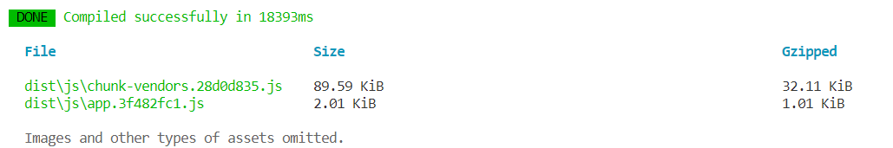

为组件设置其他属性（`compted`、`watch`）

```
代码块
export default {
    data: () => ({
        question:"", 
        count: 1,
    }),
    computed: {
        double: function () {
            return this.count * 2;
        },
    },
    watch: {
        question: function (newQuestion, oldQuestion) {
            this.answer = 'xxxx'
        }
};
```

组件中简单使用

```
代码块
import { reactive, defineComponent } from "vue";
export default defineComponent({
  setup() {
    const state = reactive({
      count: 1,
    });
    return {
      state,
    };
  },
});
```

将项目进行打包

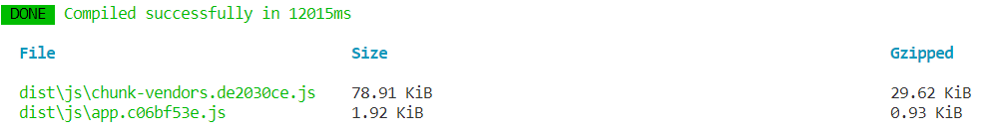

在组件中引入`computed`和`watch`

```
代码块
import { reactive, defineComponent, computed, watch } from "vue";
export default defineComponent({
  setup() {
    const state = reactive({
      count: 1,
    });
    const double = computed(() => {
      return state.count * 2;
    });

    watch(
      () => state.count,
      (count, preCount) => {
        console.log(count);
        console.log(preCount);
      }
    );
    return {
      state,
      double,
    };
  },
});
```

再次对项目进行打包，可以看到在引入`computer`和`watch`之后，项目整体体积变大了

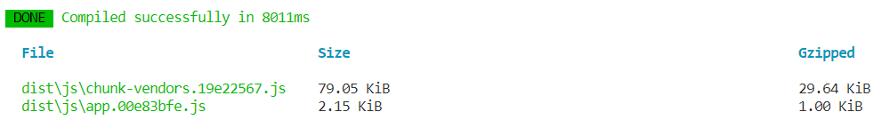

**三、作用**

通过`Tree shaking`，`Vue3`给我们带来的好处是：

- 减少程序体积（更小）

- 减少程序执行时间（更快）

- 便于将来对程序架构进行优化（更友好）

## 22.Vue3.0 所采用的 Composition Api 与 Vue2.x 使用的 Options Api 有什么不同？

**参考答案：**

**开始之前**

`Composition API` 可以说是`Vue3`的最大特点，那么为什么要推出`Composition Api`，解决了什么问题？

通常使用`Vue2`开发的项目，普遍会存在以下问题：

- 代码的可读性随着组件变大而变差

- 每一种代码复用的方式，都存在缺点

- TypeScript支持有限

以上通过使用`Composition Api`都能迎刃而解

**正文**

**一、Options Api**

`Options API`，即大家常说的选项API，即以`vue`为后缀的文件，通过定义`methods`，`computed`，`watch`，`data`等属性与方法，共同处理页面逻辑

如下图：

可以看到`Options`代码编写方式，如果是组件状态，则写在`data`属性上，如果是方法，则写在`methods`属性上...

用组件的选项 (`data`、`computed`、`methods`、`watch`) 组织逻辑在大多数情况下都有效

然而，当组件变得复杂，导致对应属性的列表也会增长，这可能会导致组件难以阅读和理解

**二、Composition Api**

在 Vue3 Composition API 中，组件根据逻辑功能来组织的，一个功能所定义的所有 API 会放在一起（更加的高内聚，低耦合）

即使项目很大，功能很多，我们都能快速的定位到这个功能所用到的所有 API

**三、对比**

下面对`Composition Api `与`Options Api`进行两大方面的比较

- 逻辑组织

- 逻辑复用

**逻辑组织**

**Options API**

假设一个组件是一个大型组件，其内部有很多处理逻辑关注点（对应下图不同颜色）

可以看到，这种碎片化使得理解和维护复杂组件变得困难

选项的分离掩盖了潜在的逻辑问题。此外，在处理单个逻辑关注点时，我们必须不断地“跳转”相关代码的选项块

**Compostion API**

而`Compositon API`正是解决上述问题，将某个逻辑关注点相关的代码全都放在一个函数里，这样当需要修改一个功能时，就不再需要在文件中跳来跳去

下面举个简单例子，将处理`count`属性相关的代码放在同一个函数了

```
代码块
```

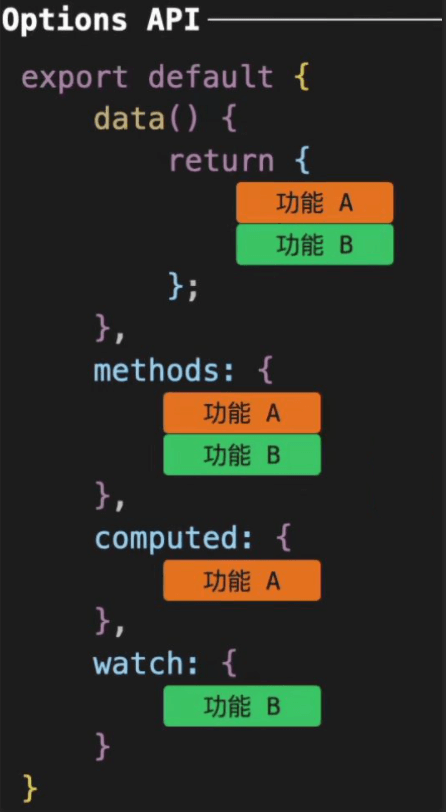

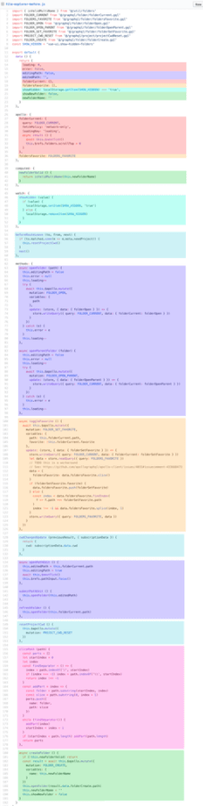

组件上中使用`count`

```
代码块
export default defineComponent({
    setup() {
        const { count, double, handleConut } = useCount();
        return {
            count,
            double,
            handleConut
        }
    },
});
```

再来一张图进行对比，可以很直观地感受到 `Composition API `在逻辑组织方面的优势，以后修改一个属性功能的时候，只需要跳到控制该属性的方法中即可


**逻辑复用**

在`Vue2`中，我们是用过`mixin`去复用相同的逻辑

```
代码块
          this.x--;
          break;
        case "ArrowRight":
          this.x++;
          break;
      }
    },
  },

  mounted() {
    window.addEventListener("keyup", this.handleKeyup);
  },

  unmounted() {
    window.removeEventListener("keyup", this.handleKeyup);
  },
};
```

然后在组件中使用

```
代码块
<template>
  <div>
    Mouse position: x {{ x }} / y {{ y }}
  </div>
</template>
<script>
import mousePositionMixin from './mouse'
export default {
  mixins: [mousePositionMixin]
}
</script>
```

使用单个`mixin`似乎问题不大，但是当我们一个组件混入大量不同的 `mixins` 的时候

```
代码块
mixins: [mousePositionMixin, fooMixin, barMixin, otherMixin]
```

会存在两个非常明显的问题：

- 命名冲突

- 数据来源不清晰

现在通过`Compositon API`这种方式改写上面的代码

```
代码块
import { onMounted, onUnmounted, reactive } from "vue";
export function useMove() {
  const position = reactive({
    x: 0,
    y: 0,
  });

  const handleKeyup = (e) => {
    console.log(e.code);
    // 上下左右 x y
    switch (e.code) {
      case "ArrowUp":
        // y.value--;
        position.y--;
        break;
      case "ArrowDown":
        // y.value++;
        position.y++;
        break;
      case "ArrowLeft":
        // x.value--;
        position.x--;
        break;
      case "ArrowRight":
        // x.value++;
        position.x++;
        break;
    }
  };

  onMounted(() => {
    window.addEventListener("keyup", handleKeyup);
  });

  onUnmounted(() => {
    window.removeEventListener("keyup", handleKeyup);
  });

  return { position };
}
```

在组件中使用

```
代码块
<template>
  <div>
    Mouse position: x {{ x }} / y {{ y }}
  </div>
</template>

<script>
import { useMove } from "./useMove";
import { toRefs } from "vue";
export default {
  setup() {
    const { position } = useMove();
    const { x, y } = toRefs(position);
    return {
      x,
      y,
    };

  },
};
</script>
```

```
代码块
import { computed, defineComponent, ref } from 'vue';
export default defineComponent({
    setup(props, context) {
        const age = ref(18)

        let state = reactive({
            name: 'test'
        })

        const readOnlyAge = computed(() => age.value++) // 19

        return {
            age,
            state,
            readOnlyAge
        }
    }
});
```

**三、响应式系统**

`vue2`中采用 `defineProperty`来劫持整个对象，然后进行深度遍历所有属性，给每个属性添加`getter`和`setter`，实现响应式

`vue3`采用`proxy`重写了响应式系统，因为`proxy`可以对整个对象进行监听，所以不需要深度遍历

- 可以监听动态属性的添加

- 可以监听到数组的索引和数组`length`属性

- 可以监听删除属性

## 24.Vue3.0的设计目标是什么？做了哪些优化?

**参考答案：**

**一、设计目标**

不以解决实际业务痛点的更新都是耍流氓，下面我们来列举一下`Vue3`之前我们或许会面临的问题

- 随着功能的增长，复杂组件的代码变得越来越难以维护

- 缺少一种比较「干净」的在多个组件之间提取和复用逻辑的机制

- 类型推断不够友好

- `bundle`的时间太久了

而 `Vue3` 经过长达两三年时间的筹备，做了哪些事情？

我们从结果反推

- 更小

- 更快

- TypeScript支持

- API设计一致性

- 提高自身可维护性

- 开放更多底层功能

一句话概述，就是更小更快更友好了

**更小**

`Vue3`移除一些不常用的 `API`

引入`tree-shaking`，可以将无用模块“剪辑”，仅打包需要的，使打包的整体体积变小了

**更快**

主要体现在编译方面：

- diff算法优化

- 静态提升

- 事件监听缓存

- SSR优化

**更友好**

`vue3`在兼顾`vue2`的`options API`的同时还推出了`composition API`，大大增加了代码的逻辑组织和代码复用能力

这里代码简单演示下：

存在一个获取鼠标位置的函数

```
代码块
import { toRefs, reactive } from 'vue';
function useMouse(){
    const state = reactive({x:0,y:0});
    const update = e=>{
        state.x = e.pageX;
        state.y = e.pageY;
    }
    onMounted(()=>{
        window.addEventListener('mousemove',update);
    })
    onUnmounted(()=>{
        window.removeEventListener('mousemove',update);
    })

    return toRefs(state);
}
```

我们只需要调用这个函数，即可获取`x`、`y`的坐标，完全不用关注实现过程

试想一下，如果很多类似的第三方库，我们只需要调用即可，不必关注实现过程，开发效率大大提高

同时，`VUE3`是基于`typescipt`编写的，可以享受到自动的类型定义提示

**三、优化方案**

`vue3`从很多层面都做了优化，可以分成三个方面：

- 源码

- 性能

- 语法 API

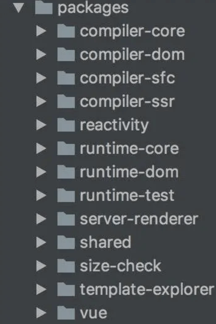

这样使得模块拆分更细化，职责划分更明确，模块之间的依赖关系也更加明确，开发人员也更容易阅读、理解和更改所有模块源码，提高代码的可维护性

另外一些 `package`（比如 `reactivity` 响应式库）是可以独立于 `Vue` 使用的，这样用户如果只想使用 `Vue3 `的响应式能力，可以单独依赖这个响应式库而不用去依赖整个 `Vue`

**TypeScript**

`Vue3`是基于`typeScript`编写的，提供了更好的类型检查，能支持复杂的类型推导

**性能**

`vue3`是从什么哪些方面对性能进行进一步优化呢？

- 体积优化

- 编译优化

- 数据劫持优化

这里讲述数据劫持：

在`vue2`中，数据劫持是通过`Object.defineProperty `，这个 API 有一些缺陷，并不能检测对象属性的添加和删除

```
代码块
Object.defineProperty(data, 'a',{
  get(){
    // track
  },
  set(){
    // trigger
  }
})
```

尽管` Vue`为了解决这个问题提供了 `set `和`delete `实例方法，但是对于用户来说，还是增加了一定的心智负担

同时在面对嵌套层级比较深的情况下，就存在性能问题

```
代码块
default {
  data: {
    a: {
      b: {
          c: {
          d: 1
        }
      }
    }
  }
}
```

相比之下，`vue3`是通过`proxy`监听整个对象，那么对于删除还是监听当然也能监听到

同时`Proxy `并不能监听到内部深层次的对象变化，而 `Vue3` 的处理方式是在` getter` 中去递归响应式，这样的好处是真正访问到的内部对象才会变成响应式，而不是无脑递归

**语法 API**

这里当然说的就是`composition API`，其两大显著的优化：

- 优化逻辑组织

- 优化逻辑复用

**逻辑组织**

一张图，我们可以很直观地感受到 `Composition API `在逻辑组织方面的优势

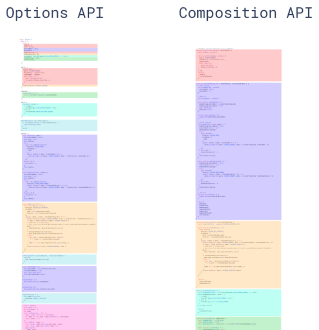

相同功能的代码编写在一块，而不像`options API`那样，各个功能的代码混成一块

**逻辑复用**

在`vue2`中，我们是通过`mixin`实现功能混合，如果多个`mixin`混合，会存在两个非常明显的问题：命名冲突和数据来源不清晰

而通过`composition`这种形式，可以将一些复用的代码抽离出来作为一个函数，只要的使用的地方直接进行调用即可

同样是上文的获取鼠标位置的例子

```
代码块
import { toRefs, reactive, onUnmounted, onMounted } from 'vue';
function useMouse(){
    const state = reactive({x:0,y:0});
    const update = e=>{
        state.x = e.pageX;
        state.y = e.pageY;
    }
    onMounted(()=>{
        window.addEventListener('mousemove',update);
    })
    onUnmounted(()=>{
        window.removeEventListener('mousemove',update);
    })

    return toRefs(state);
}
```

**参考答案：**

**一、如何部署**

前后端分离开发模式下，前后端是独立布署的，前端只需要将最后的构建物上传至目标服务器的`web`容器指定的静态目录下即可

我们知道`vue`项目在构建后，是生成一系列的静态文件

常规布署我们只需要将这个目录上传至目标服务器即可

```
代码块
*// scp 上传 user为主机登录用户，host为主机外网ip, xx为web容器静态资源路径*
scp dist.zip user@host:/xx/xx/xx
```

让`web`容器跑起来，以`nginx`为例

```
代码块
server {
  listen  80;
  server_name  www.xxx.com;

  location / {
    index  /data/dist/index.html;
  }
}
```

配置完成记得重启`nginx`

```
代码块
*// 检查配置是否正确*
nginx -t 

*// 平滑重启*
nginx -s reload
```

操作完后就可以在浏览器输入域名进行访问了

当然上面只是提到最简单也是最直接的一种布署方式

什么自动化，镜像，容器，流水线布署，本质也是将这套逻辑抽象，隔离，用程序来代替重复性的劳动

**二、404问题**

这是一个经典的问题，相信很多同学都有遇到过，那么你知道其真正的原因吗？

我们先还原一下场景：

- `vue`项目在本地时运行正常，但部署到服务器中，刷新页面，出现了404错误

先定位一下，HTTP 404 错误意味着链接指向的资源不存在

问题在于为什么不存在？且为什么只有`history`模式下会出现这个问题？

**为什么history模式下有问题**

`Vue`是属于单页应用（single-page application）

而`SPA`是一种网络应用程序或网站的模型，所有用户交互是通过动态重写当前页面，前面我们也看到了，不管我们应用有多少页面，构建物都只会产出一个`index.html`

现在，我们回头来看一下我们的`nginx`配置

```
代码块
server {
  listen  80;
  server_name  www.xxx.com;

  location / {
    index  /data/dist/index.html;
  }
}
```

可以根据 `nginx` 配置得出，当我们在地址栏输入 `[www.xxx.com](http://www.xxx.com)` 时，这时会打开我们 `dist` 目录下的 `index.html` 文件，然后我们在跳转路由进入到 `[www.xxx.com/login](http://www.xxx.com/login)`

关键在这里，当我们在 `[website.com/login](http://website.com/login)` 页执行刷新操作，`nginx location` 是没有相关配置的，所以就会出现 404 的情况

**为什么hash模式下没有问题**

`router hash` 模式我们都知道是用符号#表示的，如 `[website.com/#/login](http://website.com/#/login,)`[,](http://website.com/#/login,) `hash` 的值为 `#/login`

它的特点在于：`hash` 虽然出现在 `URL` 中，但不会被包括在 `HTTP` 请求中，对服务端完全没有影响，因此改变 `hash` 不会重新加载页面

`hash` 模式下，仅 `hash` 符号之前的内容会被包含在请求中，如 `[website.com/#/login](http://website.com/#/login)` 只有 `[website.com](http://website.com)` 会被包含在请求中 ，因此对于服务端来说，即使没有配置`location`，也不会返回404错误

**解决方案**

看到这里我相信大部分同学都能想到怎么解决问题了，

产生问题的本质是因为我们的路由是通过JS来执行视图切换的，

当我们进入到子路由时刷新页面，`web`容器没有相对应的页面此时会出现404

所以我们只需要配置将任意页面都重定向到 `index.html`，把路由交由前端处理

对`nginx`配置文件`.conf`修改，添加`try_files $uri $uri/ /index.html;`

```
代码块
server {
  listen  80;
  server_name  www.xxx.com;

  location / {
    index  /data/dist/index.html;
    try_files $uri $uri/ /index.html;
  }
}
```

修改完配置文件后记得配置的更新

```
代码块
nginx -s reload
```

解决跨域的方法有很多，下面列举了三种：

- JSONP

- CORS

- Proxy

而在`vue`项目中，我们主要针对`CORS`或`Proxy`这两种方案进行展开

**CORS**

CORS （Cross-Origin Resource Sharing，跨域资源共享）是一个系统，它由一系列传输的HTTP头组成，这些HTTP头决定浏览器是否阻止前端 JavaScript 代码获取跨域请求的响应

`CORS` 实现起来非常方便，只需要增加一些 `HTTP` 头，让服务器能声明允许的访问来源

只要后端实现了 `CORS`，就实现了跨域

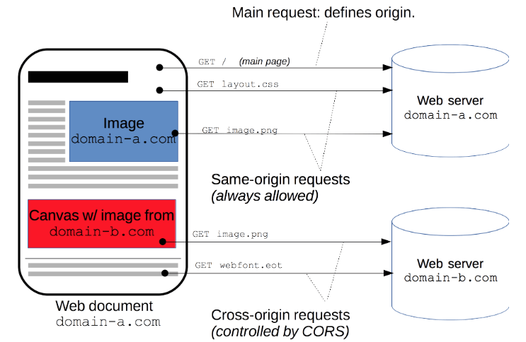

以` koa`框架举例

添加中间件，直接设置`Access-Control-Allow-Origin`请求头

```
代码块
app.use(async (ctx, next)=> {
  ctx.set('Access-Control-Allow-Origin', '*');
  ctx.set('Access-Control-Allow-Headers', 'Content-Type, Content-Length, Authorization, Accept, X-Requested-With , yourHeaderFeild');
  ctx.set('Access-Control-Allow-Methods', 'PUT, POST, GET, DELETE, OPTIONS');
  if (ctx.method == 'OPTIONS') {
    ctx.body = 200; 
  } else {
    await next();
  }
})
```

ps: `Access-Control-Allow-Origin` 设置为*其实意义不大，可以说是形同虚设，实际应用中，上线前我们会将`Access-Control-Allow-Origin` 值设为我们目标`host`

**Proxy**

代理（Proxy）也称网络代理，是一种特殊的网络服务，允许一个（一般为客户端）通过这个服务与另一个网络终端（一般为服务器）进行非直接的连接。一些网关、路由器等网络设备具备网络代理功能。一般认为代理服务有利于保障网络终端的隐私或安全，防止攻击

方案一

如果是通过`vue-cli`脚手架工具搭建项目，我们可以通过`webpack`为我们起一个本地服务器作为请求的代理对象

通过该服务器转发请求至目标服务器，得到结果再转发给前端，但是最终发布上线时如果web应用和接口服务器不在一起仍会跨域

在`vue.config.js`文件，新增以下代码

```
代码块
amodule.exports = {
    devServer: {
        host: '127.0.0.1',
        port: 8084,
        open: true,// vue项目启动时自动打开浏览器
        proxy: {
            '/api': { // '/api'是代理标识，用于告诉node，url前面是/api的就是使用代理的
                target: "http://xxx.xxx.xx.xx:8080", //目标地址，一般是指后台服务器地址
                changeOrigin: true, //是否跨域
                pathRewrite: { // pathRewrite 的作用是把实际Request Url中的'/api'用""代替
                    '^/api': "" 
                }
            }
        }
    }
}
```

通过`axios`发送请求中，配置请求的根路径

```
代码块
axios.defaults.baseURL = '/api'
```

**方案二**

此外，还可通过服务端实现代理请求转发

以`express`框架为例

```
代码块
var express = require('express');
const proxy = require('http-proxy-middleware')
const app = express()
app.use(express.static(__dirname + '/'))
app.use('/api', proxy({ target: 'http://localhost:4000', changeOrigin: false
                      }));
module.exports = app
```

**方案三**

- 菜单信息写死在前端，要改个显示文字或权限信息，需要重新编译

- 菜单跟路由耦合在一起，定义路由的时候还有添加菜单显示标题，图标之类的信息，而且路由不一定作为菜单显示，还要多加字段进行标识

**菜单权限**

菜单权限可以理解成将页面与理由进行解耦

**方案一**

菜单与路由分离，菜单由后端返回

前端定义路由信息

```
代码块
{
    name: "login",
    path: "/login",
    component: () => import("@/pages/Login.vue")
}
```

`name`字段都不为空，需要根据此字段与后端返回菜单做关联，后端返回的菜单信息中必须要有`name`对应的字段，并且做唯一性校验

全局路由守卫里做判断

```
代码块
function hasPermission(router, accessMenu) {
  if (whiteList.indexOf(router.path) !== -1) {
    return true;
  }
  let menu = Util.getMenuByName(router.name, accessMenu);
  if (menu.name) {
    return true;
  }
  return false;

}

Router.beforeEach(async (to, from, next) => {
  if (getToken()) {
    let userInfo = store.state.user.userInfo;
    if (!userInfo.name) {
      try {
        await store.dispatch("GetUserInfo")
        await store.dispatch('updateAccessMenu')
        if (to.path === '/login') {
          next({ name: 'home_index' })
        } else {
          //Util.toDefaultPage([...routers], to.name, router, next);
          next({ ...to, replace: true })//菜单权限更新完成,重新进一次当前路由
        }
      }  
      catch (e) {
        if (whiteList.indexOf(to.path) !== -1) { // 在免登录白名单，直接进入
          next()
        } else {
          next('/login')
        }
      }
    } else {
      if (to.path === '/login') {
        next({ name: 'home_index' })
      } else {
        if (hasPermission(to, store.getters.accessMenu)) {
          Util.toDefaultPage(store.getters.accessMenu,to, routes, next);
        } else {
          next({ path: '/403',replace:true })
        }
      }
    }
  } else {
    if (whiteList.indexOf(to.path) !== -1) { // 在免登录白名单，直接进入
      next()
    } else {
      next('/login')
    }
  }
  let menu = Util.getMenuByName(to.name, store.getters.accessMenu);
  Util.title(menu.title);
});

Router.afterEach((to) => {
  window.scrollTo(0, 0);
});
```

这时候我们就需要对`axios`进行二次封装，让使用更为便利

**三、如何封装**

封装的同时，你需要和 后端协商好一些约定，请求头，状态码，请求超时时间.......

设置接口请求前缀：根据开发、测试、生产环境的不同，前缀需要加以区分

请求头 : 来实现一些具体的业务，必须携带一些参数才可以请求(例如：会员业务)

状态码: 根据接口返回的不同`status` ， 来执行不同的业务，这块需要和后端约定好

请求方法：根据`get`、`post`等方法进行一个再次封装，使用起来更为方便

请求拦截器: 根据请求的请求头设定，来决定哪些请求可以访问

响应拦截器： 这块就是根据 后端`返回来的状态码判定执行不同业务

**设置接口请求前缀**

利用`node`环境变量来作判断，用来区分开发、测试、生产环境

```
代码块
if (process.env.NODE_ENV === 'development') {
  axios.defaults.baseURL = 'http://dev.xxx.com'
} else if (process.env.NODE_ENV === 'production') {
  axios.defaults.baseURL = 'http://prod.xxx.com'
}
```

在本地调试的时候，还需要在`vue.config.js`文件中配置`devServer`实现代理转发，从而实现跨域

```
代码块
devServer: {
    proxy: {
      '/proxyApi': {
        target: 'http://dev.xxx.com',
        changeOrigin: true,
        pathRewrite: {
          '/proxyApi': ''
        }
      }
    }
  }
```

```
代码块
// get 请求
export function httpGet({
  url,
  params = {}
}) {
  return new Promise((resolve, reject) => {
    axios.get(url, {
      params
    }).then((res) => {
      resolve(res.data)
    }).catch(err => {
      reject(err)
    })
  })
}

// post
// post请求
export function httpPost({
  url,
  data = {},
  params = {}
}) {
  return new Promise((resolve, reject) => {
    axios({
      url,
      method: 'post',
      transformRequest: [function (data) {
        let ret = ''
        for (let it in data) {
          ret += encodeURIComponent(it) + '=' + encodeURIComponent(data[it]) + '&'
        }
        return ret
      }],
      // 发送的数据
      data,
      // url参数
      params

    }).then(res => {
      resolve(res.data)
    })
  })
}
```

把封装的方法放在一个`api.js`文件中

```
代码块
import { httpGet, httpPost } from './http'
export const getorglist = (params = {}) => httpGet({ url: 'apps/api/org/list', params })
```

页面中就能直接调用

```
代码块
// .vue
import { getorglist } from '@/assets/js/api'

getorglist({ id: 200 }).then(res => {
  console.log(res)
})
```

这样可以把`api`统一管理起来，以后维护修改只需要在`api.js`文件操作即可

**请求拦截器**

请求拦截器可以在每个请求里加上token，做了统一处理后维护起来也方便

```
代码块
// 请求拦截器
axios.interceptors.request.use(
  config => {
    // 每次发送请求之前判断是否存在token
    // 如果存在，则统一在http请求的header都加上token，这样后台根据token判断你的登录情况，此处token一般是用户完成登录后储存到localstorage里的
    token && (config.headers.Authorization = token)
    return config
  },
  error => {
    return Promise.error(error)
  })
```

**响应拦截器**

响应拦截器可以在接收到响应后先做一层操作，如根据状态码判断登录状态、授权

```
代码块
// 响应拦截器
axios.interceptors.response.use(response => {
  // 如果返回的状态码为200，说明接口请求成功，可以正常拿到数据
  // 否则的话抛出错误
  if (response.status === 200) {
    if (response.data.code === 511) {
      // 未授权调取授权接口
    } else if (response.data.code === 510) {
      // 未登录跳转登录页
    } else {
      return Promise.resolve(response)
    }
  } else {
    return Promise.reject(response)
  }
}, error => {
  // 我们可以在这里对异常状态作统一处理
  if (error.response.status) {
    // 处理请求失败的情况
    // 对不同返回码对相应处理
    return Promise.reject(error.response)
  }
})
```

**小结**

- 封装是编程中很有意义的手段，简单的`axios`封装，就可以让我们可以领略到它的魅力

- 封装 `axios` 没有一个绝对的标准，只要你的封装可以满足你的项目需求，并且用起来方便，那就是一个好的封装方案

## 31.说说vue中的diff算法

**参考答案：**

**一、是什么**

`diff` 算法是一种通过同层的树节点进行比较的高效算法

其有两个特点：

- 比较只会在同层级进行, 不会跨层级比较

- 在diff比较的过程中，循环从两边向中间比较

`diff` 算法的在很多场景下都有应用，在 `vue` 中，作用于虚拟 `dom` 渲染成真实 `dom` 的新旧 `VNode` 节点比较

**二、比较方式**

`diff`整体策略为：深度优先，同层比较

1.比较只会在同层级进行, 不会跨层级比较

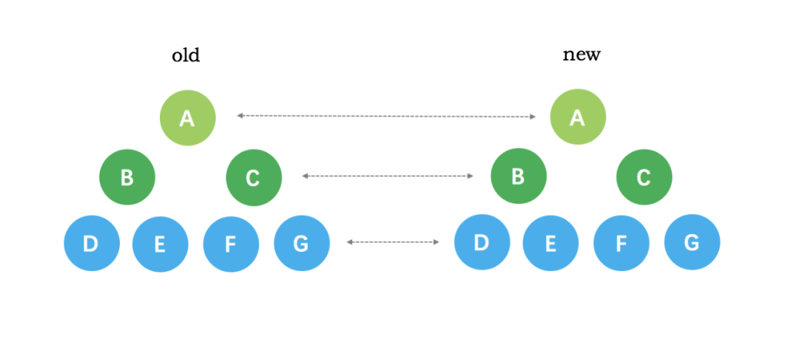

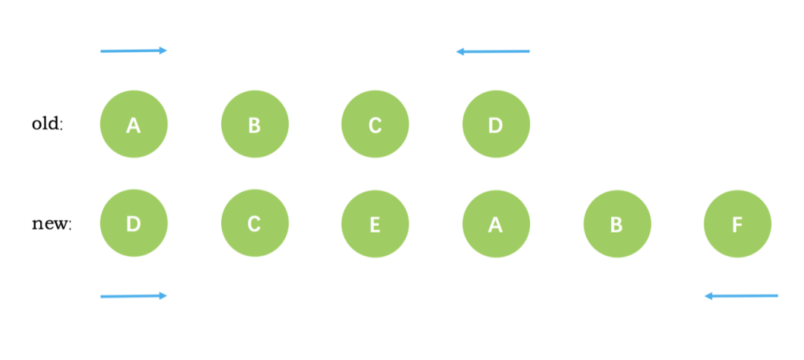

下面举个`vue`通过`diff`算法更新的例子：

新旧`VNode`节点如下图所示：

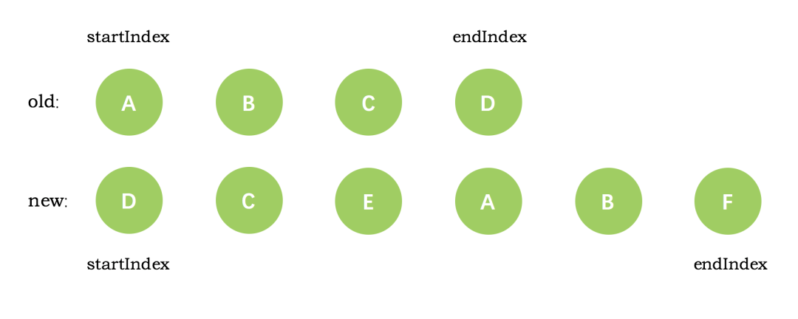

第一次循环后，发现旧节点D与新节点D相同，直接复用旧节点D作为`diff`后的第一个真实节点，同时旧节点`endIndex`移动到C，新节点的 `startIndex` 移动到了 C

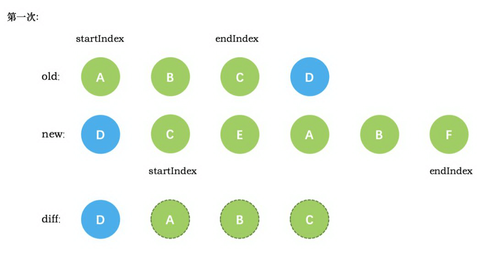

第二次循环后，同样是旧节点的末尾和新节点的开头(都是 C)相同，同理，`diff` 后创建了 C 的真实节点插入到第一次创建的 B 节点后面。同时旧节点的 `endIndex` 移动到了 B，新节点的 `startIndex` 移动到了 E

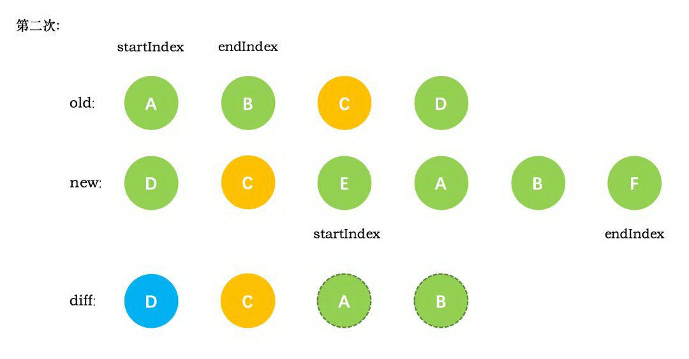

第三次循环中，发现E没有找到，这时候只能直接创建新的真实节点 E，插入到第二次创建的 C 节点之后。同时新节点的 `startIndex` 移动到了 A。旧节点的 `startIndex` 和 `endIndex` 都保持不动

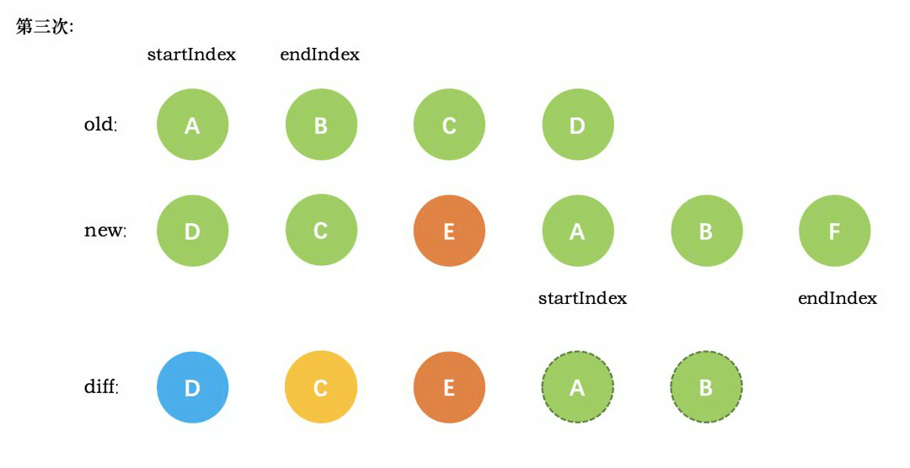

第四次循环中，发现了新旧节点的开头(都是 A)相同，于是 `diff` 后创建了 A 的真实节点，插入到前一次创建的 E 节点后面。同时旧节点的 `startIndex` 移动到了 B，新节点的` startIndex` 移动到了 B

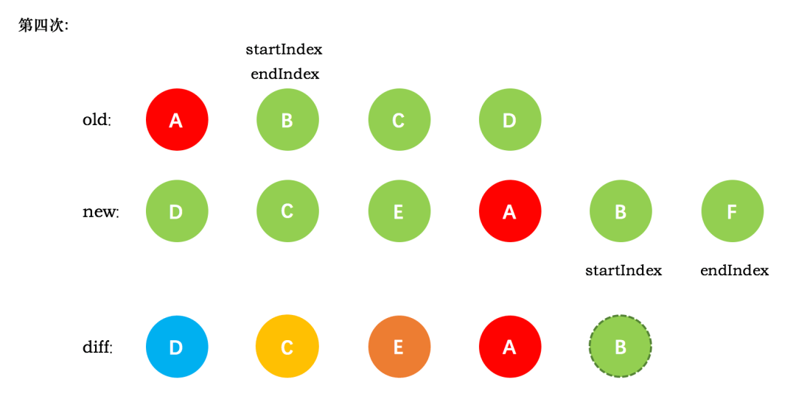

第五次循环中，情形同第四次循环一样，因此 `diff` 后创建了 B 真实节点 插入到前一次创建的 A 节点后面。同时旧节点的 `startIndex `移动到了 C，新节点的 startIndex 移动到了 F

**三、原理分析**

当数据发生改变时，`set`方法会调用`Dep.notify`通知所有订阅者`Watcher`，订阅者就会调用`patch`给真实的`DOM`打补丁，更新相应的视图

源码位置：src/core/vdom/patch.js

```
代码块
function patch(oldVnode, vnode, hydrating, removeOnly) {
    if (isUndef(vnode)) { // 没有新节点，直接执行destory钩子函数
        if (isDef(oldVnode)) invokeDestroyHook(oldVnode)
        return
    }

    let isInitialPatch = false
    const insertedVnodeQueue = []

    if (isUndef(oldVnode)) {
        isInitialPatch = true
        createElm(vnode, insertedVnodeQueue) // 没有旧节点，直接用新节点生成dom元素
    } else {
        const isRealElement = isDef(oldVnode.nodeType)
        if (!isRealElement && sameVnode(oldVnode, vnode)) {
            // 判断旧节点和新节点自身一样，一致执行patchVnode
            patchVnode(oldVnode, vnode, insertedVnodeQueue, null, null, removeOnly)
        } else {
            // 否则直接销毁及旧节点，根据新节点生成dom元素
            if (isRealElement) {

                if (oldVnode.nodeType === 1 && oldVnode.hasAttribute(SSR_ATTR)) {
                    oldVnode.removeAttribute(SSR_ATTR)
                    hydrating = true
                }
                if (isTrue(hydrating)) {
                    if (hydrate(oldVnode, vnode, insertedVnodeQueue)) {
                        invokeInsertHook(vnode, insertedVnodeQueue, true)
                        return oldVnode
                    }
                }
                oldVnode = emptyNodeAt(oldVnode)
            }
            return vnode.elm
        }
    }
}
```

`patch`函数前两个参数位为`oldVnode` 和 `Vnode` ，分别代表新的节点和之前的旧节点，主要做了四个判断：

- 没有新节点，直接触发旧节点的`destory`钩子

- 没有旧节点，说明是页面刚开始初始化的时候，此时，根本不需要比较了，直接全是新建，所以只调用 `createElm`

- 旧节点和新节点自身一样，通过 `sameVnode` 判断节点是否一样，一样时，直接调用 `patchVnode `去处理这两个节点

- 旧节点和新节点自身不一样，当两个节点不一样的时候，直接创建新节点，删除旧节点

下面主要讲的是`patchVnode`部分

```
代码块
function patchVnode (oldVnode, vnode, insertedVnodeQueue, removeOnly) {
    // 如果新旧节点一致，什么都不做
    if (oldVnode === vnode) {
      return
    }

    // 让vnode.el引用到现在的真实dom，当el修改时，vnode.el会同步变化
    const elm = vnode.elm = oldVnode.elm

    // 异步占位符
    if (isTrue(oldVnode.isAsyncPlaceholder)) {
      if (isDef(vnode.asyncFactory.resolved)) {
        hydrate(oldVnode.elm, vnode, insertedVnodeQueue)
      } else {
        vnode.isAsyncPlaceholder = true
      }
      return
    }
    // 如果新旧都是静态节点，并且具有相同的key
    // 当vnode是克隆节点或是v-once指令控制的节点时，只需要把oldVnode.elm和oldVnode.child都复制到vnode上
    // 也不用再有其他操作
    if (isTrue(vnode.isStatic) &&
      isTrue(oldVnode.isStatic) &&
      vnode.key === oldVnode.key &&
      (isTrue(vnode.isCloned) || isTrue(vnode.isOnce))
    ) {
      vnode.componentInstance = oldVnode.componentInstance
      return
    }

    let i
    const data = vnode.data
    if (isDef(data) && isDef(i = data.hook) && isDef(i = i.prepatch)) {
      i(oldVnode, vnode)
    }

    const oldCh = oldVnode.children
    const ch = vnode.children
    if (isDef(data) && isPatchable(vnode)) {
      for (i = 0; i < cbs.update.length; ++i) cbs.update[i](oldVnode, vnode)
```

`patchVnode`主要做了几个判断：

- 新节点是否是文本节点，如果是，则直接更新`dom`的文本内容为新节点的文本内容

- 新节点和旧节点如果都有子节点，则处理比较更新子节点

- 只有新节点有子节点，旧节点没有，那么不用比较了，所有节点都是全新的，所以直接全部新建就好了，新建是指创建出所有新`DOM`，并且添加进父节点

- 只有旧节点有子节点而新节点没有，说明更新后的页面，旧节点全部都不见了，那么要做的，就是把所有的旧节点删除，也就是直接把`DOM` 删除

子节点不完全一致，则调用`updateChildren`

```
代码块
```

```
代码块
export function _createElement(
    context: Component,
    tag?: string | Class<Component> | Function | Object,
    data?: VNodeData,
    children?: any,
    normalizationType?: number
): VNode | Array<VNode> {
    if (isDef(data) && isDef((data: any).__ob__)) {
        process.env.NODE_ENV !== 'production' && warn(
            `Avoid using observed data object as vnode data: ${JSON.stringify(data)}\n` +
            'Always create fresh vnode data objects in each render!',
            context`
        )
        return createEmptyVNode()
    }
    // object syntax in v-bind
    if (isDef(data) && isDef(data.is)) {
        tag = data.is
    }
    if (!tag) {
        // in case of component :is set to falsy value
        return createEmptyVNode()
    }
    ... 
    // support single function children as default scoped slot
    if (Array.isArray(children) &&
        typeof children[0] === 'function'
    ) {
        data = data || {}
        data.scopedSlots = { default: children[0] }
        children.length = 0
    }
    if (normalizationType === ALWAYS_NORMALIZE) {
        children = normalizeChildren(children)
    } else if ( === SIMPLE_NORMALIZE) {
        children = simpleNormalizeChildren(children)
    }
        // 创建VNode
    ...
}
```

可以看到`_createElement`接收5个参数：

- `context` 表示 `VNode` 的上下文环境，是 `Component` 类型

- tag 表示标签，它可以是一个字符串，也可以是一个 `Component`

- `data` 表示 `VNode` 的数据，它是一个 `VNodeData` 类型

- `children` 表示当前 `VNode `的子节点，它是任意类型的

- `normalizationType` 表示子节点规范的类型，类型不同规范的方法也就不一样，主要是参考 `render` 函数是编译生成的还是用户手写的

根据`normalizationType` 的类型，`children`会有不同的定义

```
代码块
if (normalizationType === ALWAYS_NORMALIZE) {
    children = normalizeChildren(children)
} else if ( === SIMPLE_NORMALIZE) {
    children = simpleNormalizeChildren(children)
}
```

`simpleNormalizeChildren`方法调用场景是 `render` 函数是编译生成的

`normalizeChildren`方法调用场景分为下面两种：

- `render` 函数是用户手写的

- 编译 `slot`、`v-for` 的时候会产生嵌套数组

无论是`simpleNormalizeChildren`还是`normalizeChildren`都是对`children`进行规范（使`children` 变成了一个类型为 `VNode` 的 `Array`），这里就不展开说了

规范化`children`的源码位置在：src/core/vdom/helpers/normalzie-children.js

在规范化`children`后，就去创建`VNode`

```
代码块
let vnode, ns
// 对tag进行判断
if (typeof tag === 'string') {
  let Ctor
  ns = (context.$vnode && context.$vnode.ns) || config.getTagNamespace(tag)
  if (config.isReservedTag(tag)) {
    // 如果是内置的节点，则直接创建一个普通VNode
    vnode = new VNode(
      config.parsePlatformTagName(tag), data, children,
      undefined, undefined, context
    )
  } else if (isDef(Ctor = resolveAsset(context.$options, 'components', tag))) {
    // component
    // 如果是component类型，则会通过createComponent创建VNode节点
    vnode = createComponent(Ctor, data, context, children, tag)
  } else {
    vnode = new VNode(
      tag, data, children,
      undefined, undefined, context
    )
  }
} else {
  // direct component options / constructor
  vnode = createComponent(tag, data, context, children)
}
```

`createComponent`同样是创建`VNode`

源码位置：src/core/vdom/create-component.js

```
代码块
export function createComponent (
  Ctor: Class<Component> | Function | Object | void,
  data: ?VNodeData,
  context: Component,
  children: ?Array<VNode>,
  tag?: string
): VNode | Array<VNode> | void {
  if (isUndef(Ctor)) {
    return
  }
 // 构建子类构造函数 
  const baseCtor = context.$options._base

  // plain options object: turn it into a constructor
  if (isObject(Ctor)) {
    Ctor = baseCtor.extend(Ctor)
  }

  // if at this stage it's not a constructor or an async component factory,
  // reject.
  if (typeof Ctor !== 'function') {
    if (process.env.NODE_ENV !== 'production') {
      warn(`Invalid Component definition: ${String(Ctor)}`, context)
    }
    return
  }

  // async component
```

稍微提下`createComponent`生成`VNode`的三个关键流程：

- 构造子类构造函数`Ctor`

- `installComponentHooks`安装组件钩子函数

- 实例化 `vnode`

**小结**

`createElement` 创建 `VNode` 的过程，每个 `VNode` 有 `children`，`children` 每个元素也是一个`VNode`，这样就形成了一个虚拟树结构，用于描述真实的`DOM`树结构

## 33.说说你对Vue中 keep-alive 的理解

**参考答案：**

**一、Keep-alive 是什么**

`keep-alive`是`vue`中的内置组件，能在组件切换过程中将状态保留在内存中，防止重复渲染`DOM`

`keep-alive` 包裹动态组件时，会缓存不活动的组件实例，而不是销毁它们

`keep-alive`可以设置以下`props`属性：

- `include` 字符串或正则表达式。只有名称匹配的组件会被缓存

- `exclude` 字符串或正则表达式。任何名称匹配的组件都不会被缓存

- `max` 数字。最多可以缓存多少组件实例

关于`keep-alive`的基本用法：

```
代码块
<keep-alive>
  <component :is="view"></component>
</keep-alive>
```

使用`includes`和`exclude`：

```
代码块
<keep-alive include="a,b">
  <component :is="view"></component>
</keep-alive>

<!-- 正则表达式 (使用 `v-bind`) -->
<keep-alive :include="/a|b/">
  <component :is="view"></component>
</keep-alive>

<!-- 数组 (使用 `v-bind`) -->
<keep-alive :include="['a', 'b']">
  <component :is="view"></component>
</keep-alive>
```

匹配首先检查组件自身的 `name` 选项，如果 `name` 选项不可用，则匹配它的局部注册名称 (父组件 `components` 选项的键值)，匿名组件不能被匹配

设置了 keep-alive 缓存的组件，会多出两个生命周期钩子（`activated`与`deactivated`）：

- 首次进入组件时：`beforeRouteEnter` > `beforeCreate` > `created`> `mounted` > `activated` ... ... > `beforeRouteLeave` > `deactivated`

- 再次进入组件时：`beforeRouteEnter` >`activated` ... ... > `beforeRouteLeave` > `deactivated`

**二、使用场景**

使用原则：当我们在某些场景下不需要让页面重新加载时我们可以使用`keepalive`

举个例子:

当我们从`首页`–>`列表页`–>`商详页`–>`再返回`，这时候列表页应该是需要`keep-alive`

从`首页`–>`列表页`–>`商详页`–>`返回到列表页(需要缓存)`–>`返回到首页(需要缓存)`–>`再次进入列表页(不需要缓存)`，这时候可以按需来控制页面的`keep-alive`

在路由中设置`keepAlive`属性判断是否需要缓存

```
代码块
{
  path: 'list',
  name: 'itemList', // 列表页
  component (resolve) {
    require(['@/pages/item/list'], resolve)
 },
 meta: {
  keepAlive: true,
  title: '列表页'
 }
}
```

```
代码块
      const { include, exclude } = this
      /* 如果name不在inlcude中或者存在于exlude中则表示不缓存，直接返回vnode */
      if (
        (include && (!name || !matches(include, name))) ||
        // excluded
        (exclude && name && matches(exclude, name))
      ) {
        return vnode
      }

      const { cache, keys } = this
      /* 获取组件的key值 */
      const key = vnode.key == null
        // same constructor may get registered as different local components
        // so cid alone is not enough (#3269)
        ? componentOptions.Ctor.cid + (componentOptions.tag ? `::${componentOptions.tag}` : '')
        : vnode.key
     /*  拿到key值后去this.cache对象中去寻找是否有该值，如果有则表示该组件有缓存，即命中缓存 */
      if (cache[key]) {
        vnode.componentInstance = cache[key].componentInstance
        // make current key freshest
        remove(keys, key)
        keys.push(key)
      }
        /* 如果没有命中缓存，则将其设置进缓存 */
        else {
        cache[key] = vnode
        keys.push(key)
        // prune oldest entry
        /* 如果配置了max并且缓存的长度超过了this.max，则从缓存中删除第一个 */
        if (this.max && keys.length > parseInt(this.max)) {
          pruneCacheEntry(cache, keys[0], keys, this._vnode)
        }
      }

      vnode.data.keepAlive = true
    }
    return vnode || (slot && slot[0])
  }
}
```

可以看到该组件没有`template`，而是用了`render`，在组件渲染的时候会自动执行`render`函数

`this.cache`是一个对象，用来存储需要缓存的组件，它将以如下形式存储：

```
代码块
this.cache = {
    'key1':'组件1',
    'key2':'组件2',
    *// ...*
}
```

在组件销毁的时候执行`pruneCacheEntry`函数

```
代码块
function pruneCacheEntry (
  cache: VNodeCache,
  key: string,
  keys: Array<string>,
  current?: VNode
) {
  const cached = cache[key]
  /* 判断当前没有处于被渲染状态的组件，将其销毁*/
  if (cached && (!current || cached.tag !== current.tag)) {
    cached.componentInstance.$destroy()
  }
  cache[key] = null
  remove(keys, key)
}
```

在`mounted`钩子函数中观测 `include` 和 `exclude` 的变化，如下：

```
代码块
mounted () {
    this.$watch('include', val => {
        pruneCache(this, name => matches(val, name))
    })
    this.$watch('exclude', val => {
        pruneCache(this, name => !matches(val, name))
    })
}
```

如果`include` 或`exclude` 发生了变化，即表示定义需要缓存的组件的规则或者不需要缓存的组件的规则发生了变化，那么就执行`pruneCache`函数，函数如下：

```
代码块
function pruneCache (keepAliveInstance, filter) {
  const { cache, keys, _vnode } = keepAliveInstance
  for (const key in cache) {
    const cachedNode = cache[key]
    if (cachedNode) {
      const name = getComponentName(cachedNode.componentOptions)
      if (name && !filter(name)) {
        pruneCacheEntry(cache, key, keys, _vnode)
      }
    }
  }
}
```

在该函数内对`this.cache`对象进行遍历，取出每一项的`name`值，用其与新的缓存规则进行匹配，如果匹配不上，则表示在新的缓存规则下该组件已经不需要被缓存，则调用`pruneCacheEntry`函数将其从`this.cache`对象剔除即可

关于`keep-alive`的最强大缓存功能是在`render`函数中实现

首先获取组件的`key`值：

```
代码块
const key = vnode.key == null? 
```

```
代码块
beforeRouteEnter(to, from, next){
    next(vm=>{
        console.log(vm)
        // 每次进入路由执行
        vm.getData()  // 获取数据
    })
},
```

**actived**

在`keep-alive`缓存的组件被激活的时候，都会执行`actived`钩子

```
代码块
activated(){
          this.getData() *// 获取数据*
},
```

注意：服务器端渲染期间`avtived`不被调用

## 34.Vue.observable是什么？

**参考答案：**

**一、Observable 是什么**

`Observable` 翻译过来我们可以理解成可观察的

我们先来看一下其在`Vue`中的定义

`Vue.observable`，让一个对象变成响应式数据。`Vue` 内部会用它来处理 `data` 函数返回的对象

返回的对象可以直接用于渲染函数和计算属性内，并且会在发生变更时触发相应的更新。也可以作为最小化的跨组件状态存储器

```
代码块
Vue.observable({ count : 1})
```

其作用等同于

```
代码块
new vue({ count : 1})
```

在 `Vue 2.x` 中，被传入的对象会直接被 `Vue.observable` 变更，它和被返回的对象是同一个对象

在 `Vue 3.x` 中，则会返回一个可响应的代理，而对源对象直接进行变更仍然是不可响应的

**二、使用场景**

在非父子组件通信时，可以使用通常的`bus`或者使用`vuex`，但是实现的功能不是太复杂，而使用上面两个又有点繁琐。这时，`observable`就是一个很好的选择

创建一个`js`文件

```
代码块
// 引入vue
import Vue from 'vue
// 创建state对象，使用observable让state对象可响应
export let state = Vue.observable({
  name: '张三',
  'age': 38
})
// 创建对应的方法
export let mutations = {
  changeName(name) {
    state.name = name
  },
  setAge(age) {
    state.age = age
  }
}
```

在`.vue`文件中直接使用即可

```
代码块
<template>
  <div>
    姓名：{{ name }}
    年龄：{{ age }}
    <button @click="changeName('李四')">改变姓名</button>
    <button @click="setAge(18)">改变年龄</button>
  </div>
```

**三、原理分析**

源码位置：src\core\observer\index.js

- 默认插槽

- 具名插槽

- 作用域插槽

**默认插槽**

子组件用`<slot>`标签来确定渲染的位置，标签里面可以放`DOM`结构，当父组件使用的时候没有往插槽传入内容，标签内`DOM`结构就会显示在页面

父组件在使用的时候，直接在子组件的标签内写入内容即可

子组件`Child.vue`

```
代码块
<template>
    <slot>
      <p>插槽后备的内容</p>
    </slot>
</template>
```

父组件

```
代码块
<Child>
  <div>默认插槽</div>  
</Child>
```

**具名插槽**

子组件用`name`属性来表示插槽的名字，不传为默认插槽

父组件中在使用时在默认插槽的基础上加上`slot`属性，值为子组件插槽`name`属性值

子组件`Child.vue`

```
代码块
<template>
    <slot>插槽后备的内容</slot>
  <slot name="content">插槽后备的内容</slot>
</template>
```

父组件

```
代码块
<child>
    <template v-slot:default>具名插槽</template>
    <!-- 具名插槽⽤插槽名做参数 -->
    <template v-slot:content>内容...</template>
</child>
```

**作用域插槽**

子组件在作用域上绑定属性来将子组件的信息传给父组件使用，这些属性会被挂在父组件`v-slot`接受的对象上

父组件中在使用时通过`v-slot:`（简写：#）获取子组件的信息，在内容中使用

子组件`Child.vue`

```
代码块
<template> 
  <slot name="footer" testProps="子组件的值">
          <h3>没传footer插槽</h3>
    </slot>
</template>
```

父组件

```
代码块
<child> 
    <!-- 把v-slot的值指定为作⽤域上下⽂对象 -->
    <template v-slot:default="slotProps">
      来⾃⼦组件数据：{{slotProps.testProps}}
    </template>
  <template #default="slotProps">
      来⾃⼦组件数据：{{slotProps.testProps}}
    </template>
</child>
```

**小结：**

- `v-slot`属性只能在`<template>`上使用，但在只有默认插槽时可以在组件标签上使用

- 默认插槽名为`default`，可以省略default直接写`v-slot`

- 缩写为`#`时不能不写参数，写成`#default`

- 可以通过解构获取`v-slot={user}`，还可以重命名`v-slot="{user: newName}"`和定义默认值`v-slot="{user = '默认值'}"`

```
代码块
new Vue({
    el: '#app',
    template: '<button-counter><span>我是slot传入内容</span></button-counter>',
    components:{buttonCounter}
})
```

获取`buttonCounter`组件渲染函数

```
代码块
(function anonymous(
) {
with(this){return _c('div',[_t("default",[_v("我是默认内容")])],2)}
})
```

`_v`表示穿件普通文本节点，`_t`表示渲染插槽的函数

渲染插槽函数`renderSlot`（做了简化）

```
代码块
function renderSlot (
  name,
  fallback,
  props,
  bindObject
) {
  // 得到渲染插槽内容的函数    
  var scopedSlotFn = this.$scopedSlots[name];
  var nodes;
  // 如果存在插槽渲染函数，则执行插槽渲染函数，生成nodes节点返回
  // 否则使用默认值
  nodes = scopedSlotFn(props) || fallback;
  return nodes;
}
```

`name`属性表示定义插槽的名字，默认值为`default`，`fallback`表示子组件中的`slot`节点的默认值

关于`this.$scopredSlots`是什么，我们可以先看看`vm.slot`

```
代码块
function initRender (vm) {
  ...
  vm.$slots = resolveSlots(options._renderChildren, renderContext);
  ...
}
```

`resolveSlots`函数会对`children`节点做归类和过滤处理，返回`slots`

```
代码块
function resolveSlots (
    children,
    context
  ) {
    if (!children || !children.length) {
      return {}
    }
    var slots = {};
    for (var i = 0, l = children.length; i < l; i++) {
      var child = children[i];
      var data = child.data;
      // remove slot attribute if the node is resolved as a Vue slot node
      if (data && data.attrs && data.attrs.slot) {
        delete data.attrs.slot;
      }
      // named slots should only be respected if the vnode was rendered in the
      // same context.
      if ((child.context === context || child.fnContext === context) &&
        data && data.slot != null
      ) {
        // 如果slot存在(slot="header") 则拿对应的值作为key
        var name = data.slot;
        var slot = (slots[name] || (slots[name] = []));
        // 如果是tempalte元素 则把template的children添加进数组中，这也就是为什么你写的template标签并不会渲染成另一个标签到页面
        if (child.tag === 'template') {
          slot.push.apply(slot, child.children || []);
        } else {
          slot.push(child);
        }
      } else {
```

`_render`渲染函数通过`normalizeScopedSlots`得到`vm.$scopedSlots`

```
代码块
vm.$scopedSlots = normalizeScopedSlots(
  _parentVnode.data.scopedSlots,
  vm.$slots,
  vm.$scopedSlots
);
```

作用域插槽中父组件能够得到子组件的值是因为在`renderSlot`的时候执行会传入`props`，也就是上述`_t`第三个参数，父组件则能够得到子组件传递过来的值

这时，可以通过`Vue`的`mixin`功能将相同或者相似的代码提出来

举个例子

定义一个`modal`弹窗组件，内部通过`isShowing`来控制显示

```
代码块
const Modal = {
  template: '#modal',
  data() {
    return {
      isShowing: false
    }
  },
  methods: {
    toggleShow() {
      this.isShowing = !this.isShowing;
    }
  }
}
```

定义一个`tooltip`提示框，内部通过`isShowing`来控制显示

```
代码块
const Tooltip = {
  template: '#tooltip',
  data() {
    return {
      isShowing: false
    }
  },
  methods: {
    toggleShow() {
      this.isShowing = !this.isShowing;
    }
  }
}
```

通过观察上面两个组件，发现两者的逻辑是相同，代码控制显示也是相同的，这时候`mixin`就派上用场了

首先抽出共同代码，编写一个`mixin`

```
代码块
const toggle = {
  data() {
    return {
      isShowing: false
    }
  },
  methods: {
    toggleShow() {
      this.isShowing = !this.isShowing;
    }
  }
}
```

两个组件在使用上，只需要引入`mixin`

```
代码块
const Modal = {
  template: '#modal',
  mixins: [toggle]
};
 
const Tooltip = {
  template: '#tooltip',
  mixins: [toggle]
}
```

通过上面小小的例子，让我们知道了`Mixin`对于封装一些可复用的功能如此有趣、方便、实用

**三、源码分析**

首先从`Vue.mixin`入手

源码位置：/src/core/global-api/mixin.js

```
代码块
export function initMixin (Vue: GlobalAPI) {
  Vue.mixin = function (mixin: Object) {
    this.options = mergeOptions(this.options, mixin)
    return this
  }
}
```

主要是调用`merOptions`方法

源码位置：/src/core/util/options.js

```
代码块
export function mergeOptions (
  parent: Object,
  child: Object,
  vm?: Component
): Object {

if (child.mixins) { // 判断有没有mixin 也就是mixin里面挂mixin的情况 有的话递归进行合并
    for (let i = 0, l = child.mixins.length; i < l; i++) {
    parent = mergeOptions(parent, child.mixins[i], vm)
    }
}

  const options = {} 
  let key
  for (key in parent) {
    mergeField(key) // 先遍历parent的key 调对应的strats[XXX]方法进行合并
  }
  for (key in child) {
    if (!hasOwn(parent, key)) { // 如果parent已经处理过某个key 就不处理了
```

替换型合并有`props`、`methods`、`inject`、`computed`

```
代码块
strats.props =
strats.methods =
strats.inject =
strats.computed = function (
  parentVal: ?Object,
  childVal: ?Object,
  vm?: Component,
  key: string
): ?Object {
  if (!parentVal) return childVal // 如果parentVal没有值，直接返回childVal
  const ret = Object.create(null) // 创建一个第三方对象 ret
  extend(ret, parentVal) // extend方法实际是把parentVal的属性复制到ret中
  if (childVal) extend(ret, childVal) // 把childVal的属性复制到ret中
  return ret
}
strats.provide = mergeDataOrFn
```

同名的`props`、`methods`、`inject`、`computed`会被后来者代替

**合并型**

和并型合并有：`data`

```
代码块
strats.data = function(parentVal, childVal, vm) {    
    return mergeDataOrFn(
        parentVal, childVal, vm
    )
};

function mergeDataOrFn(parentVal, childVal, vm) {    
    return function mergedInstanceDataFn() {        
        var childData = childVal.call(vm, vm) // 执行data挂的函数得到对象
        var parentData = parentVal.call(vm, vm)        
        if (childData) {            
            return mergeData(childData, parentData) // 将2个对象进行合并                                 
        } else {            
            return parentData // 如果没有childData 直接返回parentData
        }
    }
}

function mergeData(to, from) {    
    if (!from) return to    
    var key, toVal, fromVal;    
    var keys = Object.keys(from);   
    for (var i = 0; i < keys.length; i++) {
        key = keys[i];
        toVal = to[key];
        fromVal = from[key];    
        // 如果不存在这个属性，就重新设置
        if (!to.hasOwnProperty(key)) {
            set(to, key, fromVal);
        }      
        // 存在相同属性，合并对象
        else if (typeof toVal =="object" && typeof fromVal =="object") {
            mergeData(toVal, fromVal);
        }
    }    
    return to
}
```

`mergeData`函数遍历了要合并的 data 的所有属性，然后根据不同情况进行合并：

- 当目标 data 对象不包含当前属性时，调用 `set` 方法进行合并（set方法其实就是一些合并重新赋值的方法）

- 当目标 data 对象包含当前属性并且当前值为纯对象时，递归合并当前对象值，这样做是为了防止对象存在新增属性

**队列性**

队列性合并有：全部生命周期和`watch`

```
代码块
function mergeHook (
  parentVal: ?Array<Function>,
  childVal: ?Function | ?Array<Function>
): ?Array<Function> {
  return childVal
    ? parentVal
      ? parentVal.concat(childVal)
      : Array.isArray(childVal)
        ? childVal
        : [childVal]
    : parentVal
}

LIFECYCLE_HOOKS.forEach(hook => {
  strats[hook] = mergeHook
})

// watch
strats.watch = function (
  parentVal,
  childVal,
  vm,
  key
) {
  // work around Firefox's Object.prototype.watch...
  if (parentVal === nativeWatch) { parentVal = undefined; }
  if (childVal === nativeWatch) { childVal = undefined; }
  /* istanbul ignore if */
  if (!childVal) { return Object.create(parentVal || null) }
  {
    assertObjectType(key, childVal, vm);
  }
  if (!parentVal) { return childVal }
  var ret = {};
  extend(ret, parentVal);
```

```
代码块
strats.components=
strats.directives=

strats.filters = function mergeAssets(
    parentVal, childVal, vm, key
) {    
    var res = Object.create(parentVal || null);    
    if (childVal) { 
        for (var key in childVal) {
            res[key] = childVal[key];
        }   
    } 
    return res
}
```

叠加型主要是通过原型链进行层层的叠加

**小结：**

- 替换型策略有`props`、`methods`、`inject`、`computed`，就是将新的同名参数替代旧的参数

- 合并型策略是`data`, 通过`set`方法进行合并和重新赋值

- 队列型策略有生命周期函数和`watch`，原理是将函数存入一个数组，然后正序遍历依次执行

- 叠加型有`component`、`directives`、`filters`，通过原型链进行层层的叠加

## 37.Vue中的$nextTick有什么作用？

**参考答案：**

**一、NextTick是什么**

官方对其的定义

在下次 DOM 更新循环结束之后执行延迟回调。在修改数据之后立即使用这个方法，获取更新后的 DOM

什么意思呢？

我们可以理解成，`Vue` 在更新 `DOM` 时是异步执行的。当数据发生变化，`Vue`将开启一个异步更新队列，视图需要等队列中所有数据变化完成之后，再统一进行更新

举例一下

`Html`结构

```
代码块
<div id="app"> {{ message }} </div>
```

构建一个`vue`实例

```
代码块
const vm = new Vue({
  el: '#app',
  data: {
    message: '原始值'
  }
})
```

修改`message`

```
代码块
this.message = '修改后的值1'
this.message = '修改后的值2'
this.message = '修改后的值3'
```

这时候想获取页面最新的`DOM`节点，却发现获取到的是旧值

```
代码块
console.log(vm.$el.textContent) *// 原始值*
```

这是因为`message`数据在发现变化的时候，`vue`并不会立刻去更新`Dom`，而是将修改数据的操作放在了一个异步操作队列中

如果我们一直修改相同数据，异步操作队列还会进行去重

等待同一事件循环中的所有数据变化完成之后，会将队列中的事件拿来进行处理，进行`DOM`的更新

**为什么要有nexttick**

举个例子

```
代码块
{{num}}
for(let i=0; i<100000; i++){
    num = i
}
```

如果没有 `nextTick` 更新机制，那么 `num` 每次更新值都会触发视图更新(上面这段代码也就是会更新10万次视图)，有了`nextTick`机制，只需要更新一次，所以`nextTick`本质是一种优化策略

**二、使用场景**

如果想要在修改数据后立刻得到更新后的`DOM`结构，可以使用`Vue.nextTick()`

第一个参数为：回调函数（可以获取最近的`DOM`结构）

第二个参数为：执行函数上下文

```
代码块
// 修改数据
vm.message = '修改后的值'
// DOM 还没有更新
console.log(vm.$el.textContent) // 原始的值
Vue.nextTick(function () {
  // DOM 更新了
  console.log(vm.$el.textContent) // 修改后的值
})
```

组件内使用 `vm.$nextTick()` 实例方法只需要通过`this.$nextTick()`，并且回调函数中的 `this` 将自动绑定到当前的 `Vue` 实例上

```
代码块
this.message = '修改后的值'
console.log(this.$el.textContent) // => '原始的值'
this.$nextTick(function () {
    console.log(this.$el.textContent) // => '修改后的值'
})
```

`$nextTick()` 会返回一个 `Promise` 对象，可以是用`async/await`完成相同作用的事情

```
代码块
this.message = '修改后的值'
console.log(this.$el.textContent) // => '原始的值'
await this.$nextTick()
console.log(this.$el.textContent) // => '修改后的值'
```

**三、实现原理**

源码位置：`/src/core/util/next-tick.js`

`callbacks`也就是异步操作队列

`callbacks`新增回调函数后又执行了`timerFunc`函数，`pending`是用来标识同一个时间只能执行一次

```
代码块
export function nextTick(cb?: Function, ctx?: Object) {
  let _resolve;

  // cb 回调函数会经统一处理压入 callbacks 数组
  callbacks.push(() => {
    if (cb) {
      // 给 cb 回调函数执行加上了 try-catch 错误处理
      try {
        cb.call(ctx);
      } catch (e) {
        handleError(e, ctx, 'nextTick');
      }
    } else if (_resolve) {
      _resolve(ctx);
    }
  });

  // 执行异步延迟函数 timerFunc
  if (!pending) {
    pending = true;
    timerFunc();
  }

  // 当 nextTick 没有传入函数参数的时候，返回一个 Promise 化的调用
  if (!cb && typeof Promise !== 'undefined') {
    return new Promise(resolve => {
      _resolve = resolve;
    });
  }
}
```

`timerFunc`函数定义，这里是根据当前环境支持什么方法则确定调用哪个，分别有：

`Promise.then`、`MutationObserver`、`setImmediate`、`setTimeout`

通过上面任意一种方法，进行降级操作

```
代码块
export let isUsingMicroTask = false
if (typeof Promise !== 'undefined' && isNative(Promise)) {
  //判断1：是否原生支持Promise
  const p = Promise.resolve()
  timerFunc = () => {
    p.then(flushCallbacks)
    if (isIOS) setTimeout(noop)
  }
  isUsingMicroTask = true
} else if (!isIE && typeof MutationObserver !== 'undefined' && (
  isNative(MutationObserver) ||
  MutationObserver.toString() === '[object MutationObserverConstructor]'
)) {
  //判断2：是否原生支持MutationObserver
  let counter = 1
  const observer = new MutationObserver(flushCallbacks)
  const textNode = document.createTextNode(String(counter))
  observer.observe(textNode, {
    characterData: true
  })
  timerFunc = () => {
    counter = (counter + 1) % 2
    textNode.data = String(counter)
  }
  isUsingMicroTask = true
} else if (typeof setImmediate !== 'undefined' && isNative(setImmediate)) {
  //判断3：是否原生支持setImmediate
  timerFunc = () => {
    setImmediate(flushCallbacks)
  }
```

无论是微任务还是宏任务，都会放到`flushCallbacks`使用

这里将`callbacks`里面的函数复制一份，同时`callbacks`置空

依次执行`callbacks`里面的函数

```
代码块
function flushCallbacks () {
  pending = false
  const copies = callbacks.slice(0)
  callbacks.length = 0
  for (let i = 0; i < copies.length; i++) {
    copies[i]()
  }
}
```

小结：

1.把回调函数放入callbacks等待执行

2.将执行函数放到微任务或者宏任务中

3.事件循环到了微任务或者宏任务，执行函数依次执行callbacks中的回调

## 38.Vue组件间通信方式都有哪些?

**参考答案：**

**一、组件间通信的概念**

开始之前，我们把组件间通信这个词进行拆分

- 组件

- 通信

都知道组件是`vue`最强大的功能之一，`vue`中每一个`.vue`我们都可以视之为一个组件。

通信指的是发送者通过某种媒体以某种格式来传递信息到收信者以达到某个目的。

广义上，任何信息的交通都是通信。

组件间通信，即指组件(.vue)通过某种方式来传递信息以达到某个目的。

举个例子我们在使用`UI`框架中的`table`组件，可能会往`table`组件中传入某些数据，这个本质就形成了组件之间的通信。

**二、组件间通信解决了什么**

在古代，人们通过驿站、飞鸽传书、烽火报警、符号、语言、眼神、触碰等方式进行信息传递，到了今天，随着科技水平的飞速发展，通信基本完全利用有线或无线电完成，相继出现了有线电话、固定电话、无线电话、手机、互联网甚至视频电话等各种通信方式从上面这段话，我们可以看到通信的本质是信息同步，共享。

回到`vue`中，每个组件之间的都有独自的作用域，组件间的数据是无法共享的但实际开发工作中我们常常需要让组件之间共享数据，这也是组件通信的目的要让它们互相之间能进行通讯，这样才能构成一个有机的完整系统

**三、组件间通信的分类**

组件间通信的分类可以分成以下

- 父子组件之间的通信

- 兄弟组件之间的通信

- 祖孙与后代组件之间的通信

- 非关系组件间之间的通信

关系图:

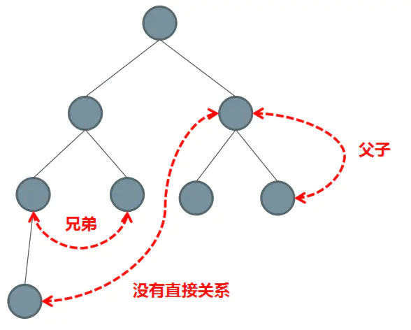

**四、组件间通信的方案**

整理`vue`中8种常规的通信方案

1.通过 props 传递

2.通过 $emit 触发自定义事件

3.使用 ref

4.EventBus

5.$parent或$root

6.attrs 与 listeners

7.Provide 与 Inject

8.Vuex

**props传递数据**

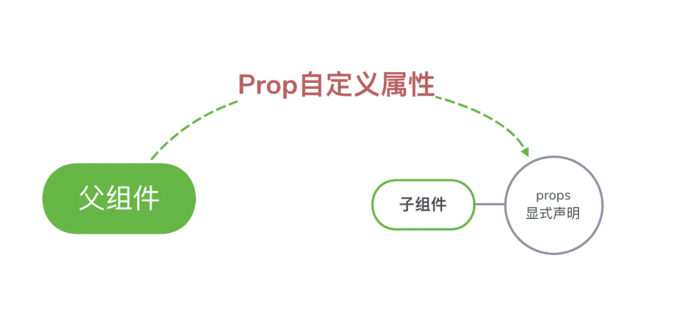

- 适用场景：父组件传递数据给子组件

- 子组件设置`props`属性，定义接收父组件传递过来的参数

- 父组件在使用子组件标签中通过字面量来传递值

`Children.vue`

```
代码块
props:{  
    // 字符串形式  
 name:String // 接收的类型参数  
    // 对象形式  
    age:{    
        type:Number, // 接收的类型为数值  
        defaule:18,  // 默认值为18  
       require:true // age属性必须传递  
    }  
}  
```

`Father.vue`组件

```
代码块
<Children name="jack" age=18 />  
```

**$emit 触发自定义事件**

- 适用场景：子组件传递数据给父组件

- 子组件通过`$emit触发`自定义事件，`$emit`第二个参数为传递的数值

- 父组件绑定监听器获取到子组件传递过来的参数

`Chilfen.vue`

```
代码块
this.$emit('add', good)  
```

Father.vue

```
代码块
```

**ref**

- 父组件在使用子组件的时候设置`ref`

- 父组件通过设置子组件`ref`来获取数据

父组件

```
代码块
<Children ref="foo" />  
  
this.$refs.foo  *// 获取子组件实例，通过子组件实例我们就能拿到对应的数据  *
```

**EventBus**

- 使用场景：兄弟组件传值

- 创建一个中央事件总线`EventBus`

- 兄弟组件通过`$emit`触发自定义事件，`$emit`第二个参数为传递的数值

- 另一个兄弟组件通过`$on`监听自定义事件

`Bus.js`

```
代码块
*// 创建一个中央时间总线类  *
class Bus {  
  constructor() {  
    this.callbacks = {};   *// 存放事件的名字  *
  }  
  $on(name, fn) {  
    this.callbacks[name] = this.callbacks[name] || [];  
    this.callbacks[name].push(fn);  
  }  
  $emit(name, args) {  
    if (this.callbacks[name]) {  
      this.callbacks[name].forEach((cb) => cb(args));  
    }  
  }  
}  
  
// main.js  
```

Children1.vue

```
代码块
this.$bus.$emit('foo')  
```

Children2.vue

```
代码块
this.$bus.$on('foo', this.handle)  
```

**$parent或$root**

- 通过共同祖辈`$parent`或者`$root`搭建通信侨联

兄弟组件

`this.$parent.$on('add',this.add)`

另一个兄弟组件

`this.$parent.$emit('add')`

**$attrs与$listeners**

- 适用场景：祖先传递数据给子孙

- 设置批量向下传属性`$attrs`和 `$listeners`

- 包含了父级作用域中不作为 `prop` 被识别 (且获取) 的特性绑定 ( class 和 style 除外)。

- 可以通过 `v-bind="$attrs"` 传⼊内部组件

```
代码块
*// child：并未在props中声明foo  *
<p>{{$attrs.foo}}</p>  
  
*// parent  *
<HelloWorld foo="foo"/>  
```

```
代码块
```

**provide 与 inject**

- 在祖先组件定义`provide`属性，返回传递的值

- 在后代组件通过`inject`接收组件传递过来的值

祖先组件

```
代码块
provide(){  
    return {  
        foo:'foo'  
    }  
}  
```

后代组件

```
代码块
inject:['foo'] *// 获取到祖先组件传递过来的值  *
```

**`vuex`**

- 适用场景: 复杂关系的组件数据传递

- `Vuex`作用相当于一个用来存储共享变量的容器

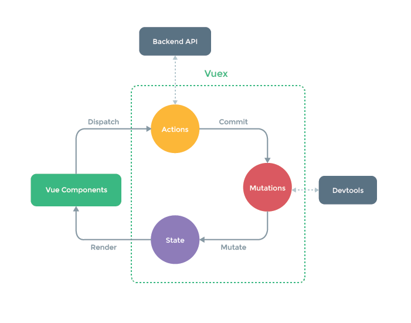

- `state`用来存放共享变量的地方

- `getter`，可以增加一个`getter`派生状态，(相当于`store`中的计算属性），用来获得共享变量的值

- `mutations`用来存放修改`state`的方法。

- `actions`也是用来存放修改state的方法，不过`action`是在`mutations`的基础上进行。常用来做一些异步操作

**小结**

- 父子关系的组件数据传递选择 `props`  与 `$emit`进行传递，也可选择`ref`

- 兄弟关系的组件数据传递可选择`$bus`，其次可以选择`$parent`进行传递

- 祖先与后代组件数据传递可选择`attrs`与`listeners`或者 `Provide`与 `Inject`

- 复杂关系的组件数据传递可以通过`vuex`存放共享的变量

## 39.Vue中组件和插件有什么区别？

**参考答案：**

**一、组件是什么**

回顾以前对组件的定义：

组件就是把图形、非图形的各种逻辑均抽象为一个统一的概念（组件）来实现开发的模式，在`Vue`中每一个`.vue`文件都可以视为一个组件

组件的优势

- 降低整个系统的耦合度，在保持接口不变的情况下，我们可以替换不同的组件快速完成需求，例如输入框，可以替换为日历、时间、范围等组件作具体的实现

- 调试方便，由于整个系统是通过组件组合起来的，在出现问题的时候，可以用排除法直接移除组件，或者根据报错的组件快速定位问题，之所以能够快速定位，是因为每个组件之间低耦合，职责单一，所以逻辑会比分析整个系统要简单

- 提高可维护性，由于每个组件的职责单一，并且组件在系统中是被复用的，所以对代码进行优化可获得系统的整体升级

**二、插件是什么**

插件通常用来为 `Vue` 添加全局功能。插件的功能范围没有严格的限制——一般有下面几种：

- 添加全局方法或者属性。如: `vue-custom-element`

- 添加全局资源：指令/过滤器/过渡等。如 `vue-touch`

- 通过全局混入来添加一些组件选项。如` vue-router`

- 添加 `Vue` 实例方法，通过把它们添加到 `Vue.prototype` 上实现。

- 一个库，提供自己的 `API`，同时提供上面提到的一个或多个功能。如` vue-router`

**三、两者的区别**

两者的区别主要表现在以下几个方面：

- 编写形式

- 注册形式

- 使用场景

**编写形式**

**编写组件**

编写一个组件，可以有很多方式，我们最常见的就是`vue`单文件的这种格式，每一个`.vue`文件我们都可以看成是一个组件

`vue`文件标准格式

```
代码块
<template>
</template>
<script>
```

我们还可以通过`template`属性来编写一个组件，如果组件内容多，我们可以在外部定义`template`组件内容，如果组件内容并不多，我们可直接写在`template`属性上

```
代码块
<template id="testComponent">     *// 组件显示的内容*
    <div>component!</div>   
</template>

Vue.component('componentA',{ 
    template: '#testComponent'  
    template: `<div>component</div>`  // 组件内容少可以通过这种形式
})
```

**编写插件**

`vue`插件的实现应该暴露一个 `install` 方法。这个方法的第一个参数是 `Vue` 构造器，第二个参数是一个可选的选项对象

```
代码块
MyPlugin.install = function (Vue, options) {
  *// 1. 添加全局方法或 property*
  Vue.myGlobalMethod = function () {
    *// 逻辑...*
  }

  *// 2. 添加全局资源*
  Vue.directive('my-directive', {
    bind (el, binding, vnode, oldVnode) {
      *// 逻辑...*
    }
    ...
  })

  *// 3. 注入组件选项*
  Vue.mixin({
    created: function () {
```

**注册形式**

**组件注册**

`vue`组件注册主要分为全局注册与局部注册

全局注册通过`Vue.component`方法，第一个参数为组件的名称，第二个参数为传入的配置项

```
代码块
Vue.component('my-component-name', { */* ... */* })
```

局部注册只需在用到的地方通过`components`属性注册一个组件

```
代码块
const component1 = {...} *// 定义一个组件*

export default {
        components:{
                component1   *// 局部注册*
        }
}
```

**插件注册**

插件的注册通过`Vue.use()`的方式进行注册（安装），第一个参数为插件的名字，第二个参数是可选择的配置项

```
代码块
Vue.use(插件名字,{ /* ... */} )
```

注意的是：

注册插件的时候，需要在调用 `new Vue()` 启动应用之前完成

`Vue.use`会自动阻止多次注册相同插件，只会注册一次

**使用场景**

具体的其实在插件是什么章节已经表述了，这里在总结一下

组件 `(Component)` 是用来构成你的 `App` 的业务模块，它的目标是 `App.vue`

插件 `(Plugin)` 是用来增强你的技术栈的功能模块，它的目标是 `Vue` 本身

简单来说，插件就是指对`Vue`的功能的增强或补充

## 40.为什么Vue中的data属性是一个函数而不是一个对象？

**参考答案：**

**一、实例和组件定义data的区别**

`vue`实例的时候定义`data`属性既可以是一个对象，也可以是一个函数

```
代码块
const app = new Vue({
    el:"#app",
    *// 对象格式*
    data:{
        foo:"foo"
    },
    *// 函数格式*
    data(){
        return {
             foo:"foo"
        }
    }
})
```

组件中定义`data`属性，只能是一个函数

如果为组件`data`直接定义为一个对象

```
代码块
Vue.component('component1',{
```

则会得到警告信息


警告说明：返回的`data`应该是一个函数在每一个组件实例中

**二、组件data定义函数与对象的区别**

上面讲到组件`data`必须是一个函数，不知道大家有没有思考过这是为什么呢？

在我们定义好一个组件的时候，`vue`最终都会通过`Vue.extend()`构成组件实例

这里我们模仿组件构造函数，定义`data`属性，采用对象的形式

```
代码块
function Component(){
 
}
Component.prototype.data = {
        count : 0
}
```

创建两个组件实例

```
代码块
const componentA = new Component()
const componentB = new Component()
```

修改`componentA`组件`data`属性的值，`componentB`中的值也发生了改变

```
代码块
console.log(componentB.data.count)  *// 0*
componentA.data.count = 1
console.log(componentB.data.count)  *// 1*
```

产生这样的原因这是两者共用了同一个内存地址，`componentA`修改的内容，同样对`componentB`产生了影响

如果我们采用函数的形式，则不会出现这种情况（函数返回的对象内存地址并不相同）

```
代码块
function Component(){
        this.data = this.data()
}
Component.prototype.data = function (){
    return {
                   count : 0
    }
}
```

修改`componentA`组件`data`属性的值，`componentB`中的值不受影响

```
代码块
console.log(componentB.data.count)  *// 0*
componentA.data.count = 1
console.log(componentB.data.count)  *// 0*
```

`vue`组件可能会有很多个实例，采用函数返回一个全新`data`形式，使每个实例对象的数据不会受到其他实例对象数据的污染

**三、原理分析**

首先可以看看`vue`初始化`data`的代码，`data`的定义可以是函数也可以是对象

源码位置：`/vue-dev/src/core/instance/state.js`

```
代码块
function initData (vm: Component) {
  let data = vm.$options.data
  data = vm._data = typeof data === 'function'
    ? getData(data, vm)
    : data || {}
    ...
}
```

`data`既能是`object`也能是`function`，那为什么还会出现上文警告呢？

别急，继续看下文

组件在创建的时候，会进行选项的合并

源码位置：`/vue-dev/src/core/util/options.js`

自定义组件会进入`mergeOptions`进行选项合并

```
代码块
Vue.prototype._init = function (options?: Object) {
    ...
    *// merge options*
    if (options && options._isComponent) {
      *// optimize internal component instantiation*
      *// since dynamic options merging is pretty slow, and none of the*
      *// internal component options needs special treatment.*
      initInternalComponent(vm, options)
    } else {
      vm.$options = mergeOptions(
        resolveConstructorOptions(vm.constructor),
        options || {},
        vm
      )
    }
    ...
  }
```

定义`data`会进行数据校验

源码位置：`/vue-dev/src/core/instance/init.js`

这时候`vm`实例为`undefined`，进入`if`判断，若`data`类型不是`function`，则出现警告提示

```
代码块
strats.data = function (
  parentVal: any,
  childVal: any,
  vm?: Component
): ?Function {
  if (!vm) {
    if (childVal && typeof childVal !== "function") {
      process.env.NODE_ENV !== "production" &&
        warn(
          'The "data" option should be a function ' +
            "that returns a per-instance value in component " +
            "definitions.",
          vm
        );
```

**四、结论**

- 根实例对象`data`可以是对象也可以是函数（根实例是单例），不会产生数据污染情况

- 组件实例对象`data`必须为函数，目的是为了防止多个组件实例对象之间共用一个`data`，产生数据污染。采用函数的形式，`initData`时会将其作为工厂函数都会返回全新`data`对象

## 41.说说你对Vue生命周期的理解

**参考答案：**

**一、生命周期是什么**

生命周期`（Life Cycle）`的概念应用很广泛，特别是在政治、经济、环境、技术、社会等诸多领域经常出现，其基本涵义可以通俗地理解为“从摇篮到坟墓”`（Cradle-to-Grave）`的整个过程在`Vue`中实例从创建到销毁的过程就是生命周期，即指从创建、初始化数据、编译模板、挂载Dom→渲染、更新→渲染、卸载等一系列过程我们可以把组件比喻成工厂里面的一条流水线，每个工人（生命周期）站在各自的岗位，当任务流转到工人身边的时候，工人就开始工作PS：在`Vue`生命周期钩子会自动绑定 `this` 上下文到实例中，因此你可以访问数据，对 `property` 和方法进行运算这意味着你不能使用箭头函数来定义一个生命周期方法 (例如 `created: () => this.fetchTodos()`)

**二、生命周期有哪些**

Vue生命周期总共可以分为8个阶段：创建前后, 载入前后,更新前后,销毁前销毁后，以及一些特殊场景的生命周期

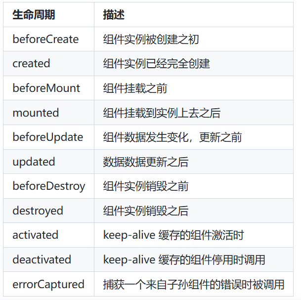

**三、生命周期整体流程**

`Vue`生命周期流程图

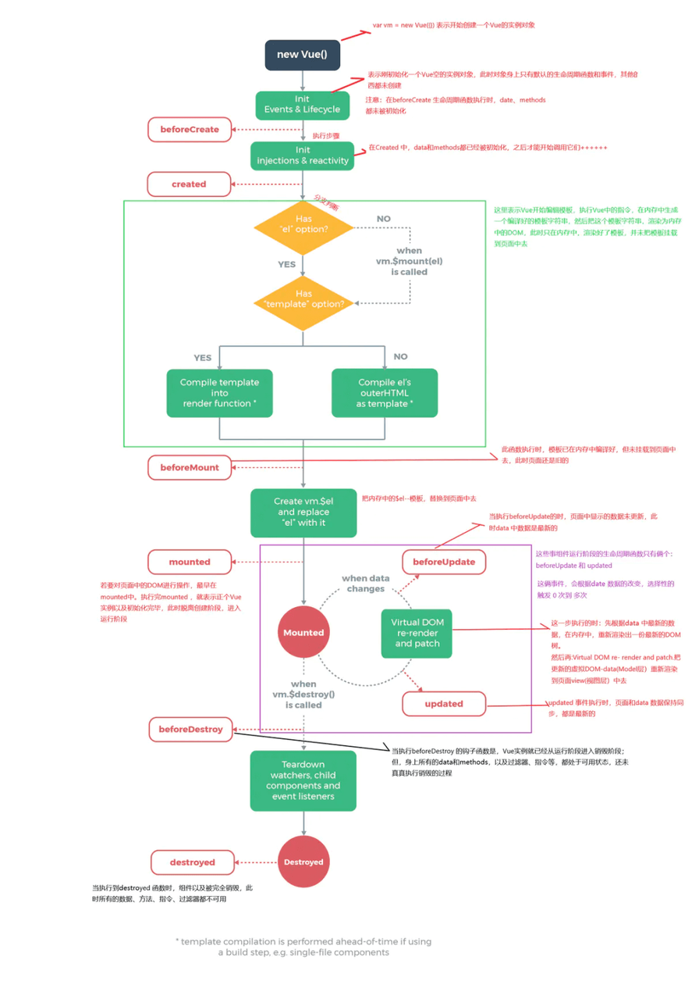

**具体分析**

**beforeCreate -> created**

- 初始化`vue`实例，进行数据观测

**created**

- 完成数据观测，属性与方法的运算，`watch`、`event`事件回调的配置

- 可调用`methods`中的方法，访问和修改data数据触发响应式渲染`dom`，可通过`computed`和`watch`完成数据计算

- 此时`vm.$el` 并没有被创建

**created -> beforeMount**

- 判断是否存在`el`选项，若不存在则停止编译，直到调用`vm.$mount(el)`才会继续编译

- 优先级：`render` > `template` > `outerHTML`

- `vm.el`获取到的是挂载`DOM`的

**beforeMount**

- 在此阶段可获取到`vm.el`

- 此阶段`vm.el`虽已完成DOM初始化，但并未挂载在`el`选项上

**beforeMount -> mounted**

- 此阶段`vm.el`完成挂载，`vm.$el`生成的`DOM`替换了`el`选项所对应的`DOM`

**mounted**

- `vm.el`已完成`DOM`的挂载与渲染，此刻打印`vm.$el`，发现之前的挂载点及内容已被替换成新的DOM

**beforeUpdate**

- 更新的数据必须是被渲染在模板上的（`el`、`template`、`rende`r之一）

- 此时`view`层还未更新

- 若在`beforeUpdate`中再次修改数据，不会再次触发更新方法

**updated**

- 完成`view`层的更新

- 若在`updated`中再次修改数据，会再次触发更新方法（`beforeUpdate`、`updated`）

**beforeDestroy**

- 实例被销毁前调用，此时实例属性与方法仍可访问

**destroyed**

- 完全销毁一个实例。可清理它与其它实例的连接，解绑它的全部指令及事件监听器

- 并不能清除DOM，仅仅销毁实例

**使用场景分析**

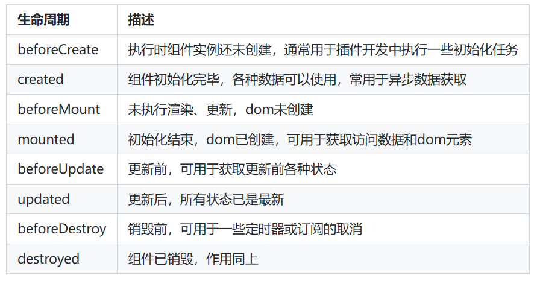

**四、题外话：数据请求在created和mouted的区别**

`created`是在组件实例一旦创建完成的时候立刻调用，这时候页面`dom`节点并未生成`mounted`是在页面`dom`节点渲染完毕之后就立刻执行的触发时机上`created`是比`mounted`要更早的两者相同点：都能拿到实例对象的属性和方法讨论这个问题本质就是触发的时机，放在`mounted`请求有可能导致页面闪动（页面`dom`结构已经生成），但如果在页面加载前完成则不会出现此情况建议：放在`create`生命周期当中

## 42.Vue实例挂载的过程中发生了什么？

**参考答案：**

**一、思考**

我们都听过知其然知其所以然这句话

那么不知道大家是否思考过`new Vue()`这个过程中究竟做了些什么？

过程中是如何完成数据的绑定，又是如何将数据渲染到视图的等等

**一、分析**

首先找到`vue`的构造函数

```
代码块
function Vue (options) {
  if (process.env.NODE_ENV !== 'production' &&
    !(this instanceof Vue)
  ) {
    warn('Vue is a constructor and should be called with the `new` keyword')
  }
  this._init(options)
}
```

`options`是用户传递过来的配置项，如`data、methods`等常用的方法

`vue`构建函数调用`_init`方法，但我们发现本文件中并没有此方法，但仔细可以看到文件下方定定义了很多初始化方法

```
代码块
initMixin(Vue);     *// 定义 _init*
stateMixin(Vue);    *// 定义 $set $get $delete $watch 等*
eventsMixin(Vue);   *// 定义事件  $on  $once $off $emit*
lifecycleMixin(Vue);*// 定义 _update  $forceUpdate  $destroy*
renderMixin(Vue);   *// 定义 _render 返回虚拟dom*
```

首先可以看`initMixin`方法，发现该方法在`Vue`原型上定义了`_init`方法

```
代码块
Vue.prototype._init = function (options?: Object) {
    const vm: Component = this
    *// a uid*
    vm._uid = uid++
    let startTag, endTag
    */* istanbul ignore if */*
    if (process.env.NODE_ENV !== 'production' && config.performance && mark) {
      startTag = `vue-perf-start:${vm._uid}`
      endTag = `vue-perf-end:${vm._uid}`
      mark(startTag)
    }

    *// a flag to avoid this being observed*
    vm._isVue = true
    *// merge options*
    *// 合并属性，判断初始化的是否是组件，这里合并主要是 mixins 或 extends 的方法*
    if (options && options._isComponent) {
      *// optimize internal component instantiation*
      *// since dynamic options merging is pretty slow, and none of the*
      *// internal component options needs special treatment.*
      initInternalComponent(vm, options)
    } else { *// 合并vue属性*
      vm.$options = mergeOptions(
        resolveConstructorOptions(vm.constructor),
        options || {},
        vm
      )
    }
    */* istanbul ignore else */*
    if (process.env.NODE_ENV !== 'production') {
      *// 初始化proxy拦截器*
```

仔细阅读上面的代码，我们得到以下结论：

- 在调用`beforeCreate`之前，数据初始化并未完成，像`data`、`props`这些属性无法访问到

- 到了`created`的时候，数据已经初始化完成，能够访问`data`、`props`这些属性，但这时候并未完成`dom`的挂载，因此无法访问到`dom`元素

- 挂载方法是调用`vm.$mount`方法

`initState`方法是完成`props/data/method/watch/methods`的初始化

```
代码块
export function initState (vm: Component) {
  *// 初始化组件的watcher列表*
```

我们和这里主要看初始化`data`的方法为`initData`，它与`initState`在同一文件上

```
代码块
function initData (vm: Component) {
  let data = vm.$options.data
  *// 获取到组件上的data*
  data = vm._data = typeof data === 'function'
    ? getData(data, vm)
    : data || {}
  if (!isPlainObject(data)) {
    data = {}
    process.env.NODE_ENV !== 'production' && warn(
      'data functions should return an object:\n' +
      'https://vuejs.org/v2/guide/components.html#data-Must-Be-a-Function',
      vm
    )
  }
  *// proxy data on instance*
  const keys = Object.keys(data)
  const props = vm.$options.props
  const methods = vm.$options.methods
  let i = keys.length
  while (i--) {
    const key = keys[i]
    if (process.env.NODE_ENV !== 'production') {
      *// 属性名不能与方法名重复*
```

仔细阅读上面的代码，我们可以得到以下结论：

- 初始化顺序：`props`、`methods`、`data`

- `data`定义的时候可选择函数形式或者对象形式（组件只能为函数形式）

关于数据响应式在这就不展开详细说明

上文提到挂载方法是调用`vm.$mount`方法

```
代码块
Vue.prototype.$mount = function (
  el?: string | Element,
  hydrating?: boolean
): Component {
  *// 获取或查询元素*
  el = el && query(el)

  */* istanbul ignore if */*
  *// vue 不允许直接挂载到body或页面文档上*
  if (el === document.body || el === document.documentElement) {
    process.env.NODE_ENV !== 'production' && warn(
```

阅读上面代码，我们能得到以下结论：

- 不要将根元素放到`body`或者`html`上

- 可以在对象中定义`template/render`或者直接使用`template`、`el`表示元素选择器

- 最终都会解析成`render`函数，调用`compileToFunctions`，会将`template`解析成`render`函数

对`template`的解析步骤大致分为以下几步：

- 将`html`文档片段解析成`ast`描述符

- 将`ast`描述符解析成字符串

- 生成`render`函数

生成`render`函数，挂载到`vm`上后，会再次调用`mount`方法

```
代码块
*// public mount method*
Vue.prototype.$mount = function (
  el?: string | Element,
  hydrating?: boolean
): Component {
  el = el && inBrowser ? query(el) : undefined
  *// 渲染组件*
  return mountComponent(this, el, hydrating)
}
```

调用`mountComponent`渲染组件

```
代码块
export function mountComponent (
  vm: Component,
  el: ?Element,
  hydrating?: boolean
): Component {
  vm.$el = el
  *// 如果没有获取解析的render函数，则会抛出警告*
  *// render是解析模板文件生成的*
  if (!vm.$options.render) {
    vm.$options.render = createEmptyVNode
    if (process.env.NODE_ENV !== 'production') {
      */* istanbul ignore if */*
      if ((vm.$options.template && vm.$options.template.charAt(0) !== '#') ||
        vm.$options.el || el) {
        warn(
          'You are using the runtime-only build of Vue where the template ' +
          'compiler is not available. Either pre-compile the templates into ' +
          'render functions, or use the compiler-included build.',
          vm
        )
      } else {
        *// 没有获取到vue的模板文件*
        warn(
          'Failed to mount component: template or render function not defined.',
          vm
        )
      }
    }
  }
  *// 执行beforeMount钩子*
  callHook(vm, 'beforeMount')

  let updateComponent
  */* istanbul ignore if */*
  if (process.env.NODE_ENV !== 'production' && config.performance && mark) {
    updateComponent = () => {
      const name = vm._name
      const id = vm._uid
      const startTag = `vue-perf-start:${id}`
      const endTag = `vue-perf-end:${id}`

      mark(startTag)
      const vnode = vm._render()
```

阅读上面代码，我们得到以下结论：

- 会触发`boforeCreate`钩子

- 定义`updateComponent`渲染页面视图的方法

- 监听组件数据，一旦发生变化，触发`beforeUpdate`生命钩子

`updateComponent`方法主要执行在`vue`初始化时声明的`render`，`update`方法

`render`的作用主要是生成`vnode`

```
代码块
*// 定义vue 原型上的render方法*
Vue.prototype._render = function (): VNode {
    const vm: Component = this
    *// render函数来自于组件的option*
    const { render, _parentVnode } = vm.$options

    if (_parentVnode) {
        vm.$scopedSlots = normalizeScopedSlots(
            _parentVnode.data.scopedSlots,
            vm.$slots,
            vm.$scopedSlots
        )
    }

    *// set parent vnode. this allows render functions to have access*
    *// to the data on the placeholder node.*
    vm.$vnode = _parentVnode
    *// render self*
    let vnode
    try {
        *// There's no need to maintain a stack because all render fns are called*
        *// separately from one another. Nested component's render fns are called*
        *// when parent component is patched.*
        currentRenderingInstance = vm
        *// 调用render方法，自己的独特的render方法， 传入createElement参数，生成vNode*
        vnode = render.call(vm._renderProxy, vm.$createElement)
    } catch (e) {
        handleError(e, vm, `render`)
        *// return error render result,*
        *// or previous vnode to prevent render error causing blank component*
        */* istanbul ignore else */*
        if (process.env.NODE_ENV !== 'production' && vm.$options.renderError) {
            try {
                vnode = vm.$options.renderError.call(vm._renderProxy, vm.$createElement, e)
            } catch (e) {
                handleError(e, vm, `renderError`)
                vnode = vm._vnode
            }
        } else {
            vnode = vm._vnode
        }
    } finally {
```

`_update`主要功能是调用`patch`，将`vnode`转换为真实`DOM`，并且更新到页面中

```
代码块
Vue.prototype._update = function (vnode: VNode, hydrating?: boolean) {
    const vm: Component = this
    const prevEl = vm.$el
    const prevVnode = vm._vnode
    *// 设置当前激活的作用域*
    const restoreActiveInstance = setActiveInstance(vm)
    vm._vnode = vnode
    *// Vue.prototype.__patch__ is injected in entry points*
    *// based on the rendering backend used.*
    if (!prevVnode) {
      *// initial render*
      *// 执行具体的挂载逻辑*
      vm.$el = vm.__patch__(vm.$el, vnode, hydrating, false */* removeOnly */*)
    } else {
      *// updates*
      vm.$el = vm.__patch__(prevVnode, vnode)
    }
    restoreActiveInstance()
```

**三、结论**

- `new Vue`的时候调用会调用`_init`方法

1.定义 `$set`、` $get` 、`$delete`、`$watch` 等方法

2.定义 `$on`、`$off`、`$emit`、`$off `等事件

3.定义 `_update`、`$forceUpdate`、`$destroy`生命周期

- 调用`$mount`进行页面的挂载

- 挂载的时候主要是通过`mountComponent`方法

- 定义`updateComponent`更新函数

- 执行`render`生成虚拟`DOM`

- `_update`将虚拟`DOM`生成真实`DOM`结构，并且渲染到页面中

## 43.谈谈对Vue中双向绑定的理解

**参考答案：**

**一、什么是双向绑定**

我们先从单向绑定切入单向绑定非常简单，就是把`Model`绑定到`View`，当我们用`JavaScript`代码更新`Model`时，`View`就会自动更新双向绑定就很容易联想到了，在单向绑定的基础上，用户更新了`View`，`Model`的数据也自动被更新了，这种情况就是双向绑定举个栗子


当用户填写表单时，`View`的状态就被更新了，如果此时可以自动更新`Model`的状态，那就相当于我们把`Model`和`View`做了双向绑定关系图如下

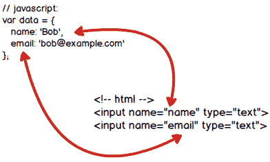

**二、双向绑定的原理是什么**

我们都知道 `Vue` 是数据双向绑定的框架，双向绑定由三个重要部分构成

- 数据层（Model）：应用的数据及业务逻辑

- 视图层（View）：应用的展示效果，各类UI组件

- 业务逻辑层（ViewModel）：框架封装的核心，它负责将数据与视图关联起来

而上面的这个分层的架构方案，可以用一个专业术语进行称呼：`MVVM`这里的控制层的核心功能便是 “数据双向绑定” 。自然，我们只需弄懂它是什么，便可以进一步了解数据绑定的原理

**理解ViewModel**

它的主要职责就是：

- 数据变化后更新视图

- 视图变化后更新数据

当然，它还有两个主要部分组成

- 监听器（Observer）：对所有数据的属性进行监听

- 解析器（Compiler）：对每个元素节点的指令进行扫描跟解析,根据指令模板替换数据,以及绑定相应的更新函数

**三、实现双向绑定**

我们还是以`Vue`为例，先来看看`Vue`中的双向绑定流程是什么的

1.`new Vue()`首先执行初始化，对`data`执行响应化处理，这个过程发生`Observe`中

2.同时对模板执行编译，找到其中动态绑定的数据，从`data`中获取并初始化视图，这个过程发生在`Compile`中

3.同时定义⼀个更新函数和`Watcher`，将来对应数据变化时`Watcher`会调用更新函数

4.由于`data`的某个`key`在⼀个视图中可能出现多次，所以每个`key`都需要⼀个管家`Dep`来管理多个`Watcher`

5.将来data中数据⼀旦发生变化，会首先找到对应的`Dep`，通知所有`Watcher`执行更新函数

流程图如下：

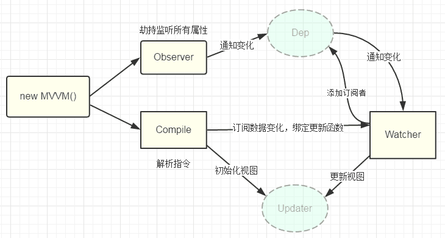

**实现**

先来一个构造函数：执行初始化，对`data`执行响应化处理

```
代码块
class Vue {  
  constructor(options) {  
    this.$options = options;  
    this.$data = options.data;  
        
    *// 对data选项做响应式处理  *
    observe(this.$data);  
```

对`data`选项执行响应化具体操作

```
代码块
function observe(obj) {  
  if (typeof obj !== "object" || obj == null) {  
    return;  
  }  
  new Observer(obj);  
}  
  
class Observer {  
  constructor(value) {  
    this.value = value;  
    this.walk(value);  
  }  
  walk(obj) {  
    Object.keys(obj).forEach((key) => {  
      defineReactive(obj, key, obj[key]);  
    });  
  }  
}  
```

**编译****`Compile`**

对每个元素节点的指令进行扫描跟解析,根据指令模板替换数据,以及绑定相应的更新函数

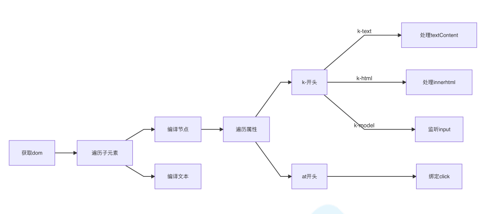

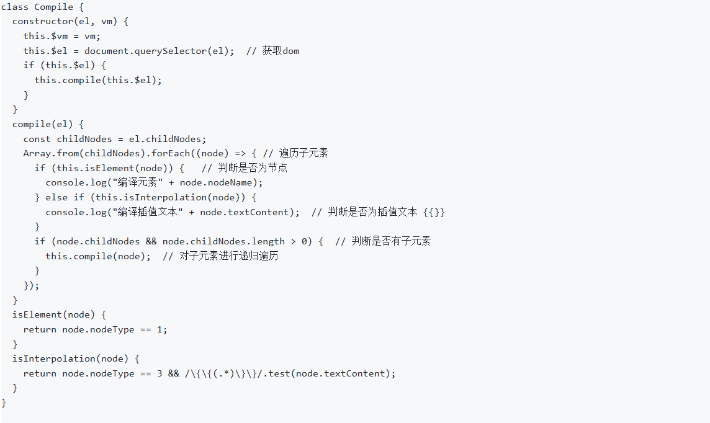

**依赖收集**

视图中会用到`data`中某`key`，这称为依赖。同⼀个`key`可能出现多次，每次都需要收集出来用⼀个`Watcher`来维护它们，此过程称为依赖收集多个`Watcher`需要⼀个`Dep`来管理，需要更新时由`Dep`统⼀通知

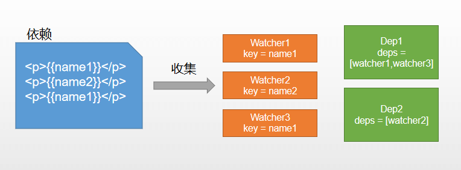

实现思路

1.`defineReactive`时为每⼀个`key`创建⼀个`Dep`实例

2.初始化视图时读取某个`key`，例如`name1`，创建⼀个`watcher1`

3.由于触发`name1`的`getter`方法，便将`watcher1`添加到`name1`对应的Dep中

4.当`name1`更新，`setter`触发时，便可通过对应`Dep`通知其管理所有`Watcher`更新

```
代码块
*// 负责更新视图  *
class Watcher {  
  constructor(vm, key, updater) {  
    this.vm = vm  
    this.key = key  
    this.updaterFn = updater  
  
    *// 创建实例时，把当前实例指定到Dep.target静态属性上  *
    Dep.target = this  
    *// 读一下key，触发get  *
    vm[key]  
    *// 置空  *
    Dep.target = null  
  }  
  
  *// 未来执行dom更新函数，由dep调用的  *
  update() {  
    this.updaterFn.call(this.vm, this.vm[this.key])  
  }  
}  
```

声明`Dep`

```
代码块
class Dep {  
  constructor() {  
    this.deps = [];  *// 依赖管理  *
  }  
  addDep(dep) {  
    this.deps.push(dep);  
  }  
```

创建`watcher`时触发`getter`

```
代码块
class Watcher {  
  constructor(vm, key, updateFn) {  
    Dep.target = this;  
    this.vm[this.key];  
    Dep.target = null;  
  }  
}  
  
```

依赖收集，创建`Dep`实例

```
代码块
function defineReactive(obj, key, val) {  
  this.observe(val);  
  const dep = new Dep();  
  Object.defineProperty(obj, key, {  
    get() {  
      Dep.target && dep.addDep(Dep.target);*// Dep.target也就是Watcher实例  *
      return val;  
    },  
    set(newVal) {  
      if (newVal === val) return;  
      dep.notify(); *// 通知dep执行更新方法  *
    },  
  });  
}  
```

## 44.Vue 模板是如何编译的

**参考答案：**

```
代码块
new Vue({
  render: h => h(App)
})
```

这个大家都熟悉，调用 render 就会得到传入的模板(`.vue`文件)对应的虚拟 DOM，那么这个 render 是哪来的呢？它是怎么把 `.vue` 文件转成浏览器可识别的代码的呢？

render 函数是怎么来的有两种方式

- 第一种就是经过模板编译生成 render 函数

- 第二种是我们自己在组件里定义了 render 函数，这种会跳过模板编译的过程

本文将为大家分别介绍这两种，以及详细的编译过程原理

**认识模板编译**

我们知道 `<template></template>` 这个是模板，不是真实的 HTML，浏览器是不认识模板的，所以我们需要把它编译成浏览器认识的原生的 HTML

这一块的主要流程就是

1.提取出模板中的原生 HTML 和非原生 HTML，比如绑定的属性、事件、指令等等

2.经过一些处理生成 render 函数

3.render 函数再将模板内容生成对应的 vnode

4.再经过 patch 过程( Diff )得到要渲染到视图中的 vnode

5.最后根据 vnode 创建真实的 DOM 节点，也就是原生 HTML 插入到视图中，完成渲染

上面的 1、2、3 条就是模板编译的过程了

那它是怎么编译，最终生成 render 函数的呢？

**模板编译详解——源码**

**baseCompile()**

这就是模板编译的入口函数，它接收两个参数

- `template`：就是要转换的模板字符串

- `options`：就是转换时需要的参数

编译的流程，主要有三步：

1.模板解析：通过正则等方式提取出 `<template></template>` 模板里的标签元素、属性、变量等信息，并解析成抽象语法树 `AST`

2.优化：遍历 `AST` 找出其中的静态节点和静态根节点，并添加标记

3.代码生成：根据 `AST` 生成渲染函数 `render`

这三步分别对应三个函数，后面会一一下介绍，先看一下 `baseCompile` 源码中是在哪里调用的

```
代码块
export const createCompiler = createCompilerCreator(function baseCompile (
  template: string, *// 就是要转换的模板字符串*
  options: CompilerOptions *//就是转换时需要的参数*
): CompiledResult {
  *// 1. 进行模板解析，并将结果保存为 AST*
  const ast = parse(template.trim(), options)
  
  *// 没有禁用静态优化的话*
  if (options.optimize !== false) {
    *// 2. 就遍历 AST，并找出静态节点并标记*
    optimize(ast, options)
  }
  *// 3. 生成渲染函数*
  const code = generate(ast, options)
  return {
    ast,
    render: code.render, *// 返回渲染函数 render*
    staticRenderFns: code.staticRenderFns
  }
})
```

就这么几行代码，三步，调用了三个方法很清晰

我们先看一下最后 return 出去的是个啥，再来深入上面这三步分别调用的方法源码，也好更清楚的知道这三步分别是要做哪些处理

**编译结果**

比如有这样的模板

```
代码块
<template>
    <div id="app">{{name}}</div>
</template>
```

打印一下编译后的结果，也就是上面源码 return 出去的结果，看看是啥

```
代码块
```

看不明白也没有关系，注意看上面提到的三步都干了啥

- `ast` 字段，就是第一步生成的

- `static` 字段，就是标记，是在第二步中根据 `ast` 里的 `type` 加上去的

- `render` 字段，就是第三步生成的

有个大概的印象了，然后再来看源码

1.**parse()**

源码地址：`src/complier/parser/index.js - 79行`

就是这个方法就是解析器的主函数，就是它通过正则等方法提取出 `<template></template>` 模板字符串里所有的 `tag`、`props`、`children` 信息，生成一个对应结构的 ast 对象

`parse` 接收两个参数

- `template` ：就是要转换的模板字符串

- `options`：就是转换时需要的参数。它包含有四个钩子函数，就是用来把 `parseHTML` 解析出来的字符串提取出来，并生成对应的 `AST`

核心步骤是这样的：

调用 `parseHTML` 函数对模板字符串进行解析

- 解析到开始标签、结束标签、文本、注释分别进行不同的处理

- 解析过程中遇到文本信息就调用文本解析器 `parseText` 函数进行文本解析

- 解析过程中遇到包含过滤器，就调用过滤器解析器 `parseFilters` 函数进行解析

每一步解析的结果都合并到一个对象上(就是最后的 AST)

```
代码块
export function parse (
  template: string, *// 要转换的模板字符串*
  options: CompilerOptions *// 转换时需要的参数*
): ASTElement | void {
  parseHTML(template, {
    warn,
    expectHTML: options.expectHTML,
    isUnaryTag: options.isUnaryTag,
    canBeLeftOpenTag: options.canBeLeftOpenTag,
    shouldDecodeNewlines: options.shouldDecodeNewlines,
    shouldDecodeNewlinesForHref: options.shouldDecodeNewlinesForHref,
    shouldKeepComment: options.comments,
    outputSourceRange: options.outputSourceRange,
    *// 解析到开始标签时调用，如 <div>*
    start (tag, attrs, unary, start, end) {
        *// unary 是否是自闭合标签，如 *
        ...
    },
    *// 解析到结束标签时调用，如 </div>*
    end (tag, start, end) {
        ...
    },
    *// 解析到文本时调用*
    chars (text: string, start: number, end: number) {
      *// 这里会判断判断很多东西，来看它是不是带变量的动态文本*
      *// 然后创建动态文本或静态文本对应的 AST 节点*
      ...
    },
    *// 解析到注释时调用*
    comment (text: string, start, end) {
      *// 注释是这么找的*
```

上面解析文本时调用的 `chars()` 会根据不同类型节点加上不同 `type`，来标记 `AST` 节点类型，这个属性在下一步标记的时候会用到

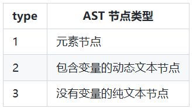

2.**optimize()**

这个函数就是在 `AST` 里找出静态节点和静态根节点，并添加标记，为了后面 `patch` 过程中就会跳过静态节点的对比，直接克隆一份过去，从而优化了 `patch` 的性能

函数里面调用的外部函数就不贴代码了，大致过程是这样的

- ◦type 值为1：就是包含子元素的节点，设置 static 为 false 并递归标记子节点，直到标记完所有子节点

- ◦type 值为 2：设置 static 为 false

- ◦type 值为 3：就是不包含子节点和动态属性的纯文本节点，把它的 static = true，patch 的时候就会跳过这个，直接克隆一份去

- ◦节点本身必须是静态节点

- ◦必须有子节点

- ◦子节点不能只有一个文本节点

```
代码块
```

3.**generate()**

这个就是生成 render 的函数，就是说最终会返回下面这样的东西

```
代码块
*// 比如有这么个模板*
<template>
    <div id="app">{{name}}</div>
</template>

*// 上面模板编译后返回的 render 字段 就是这样的*
render: `with(this){return _c('div',{attrs:{"id":"app"}},[_v(_s(name))])}`

*// 把内容格式化一下，容易理解一点*
with(this){
  return _c(
    'div',
    { attrs:{"id":"app"} },
    [  _v(_s(name))  ]
  )
}
```

这个结构是不是有点熟悉？

了解虚拟 DOM 就可以看出来，上面的 render 正是虚拟 DOM 的结构，就是把一个标签分为 `tag`、`props`、`children`，没有错

在看 `generate` 源码之前，我们要先了解一下上面这最后返回的 `render` 字段是什么意思，再来看 `generate` 源码，就会轻松得多，不然连函数返回的东西是干嘛的都不知道怎么可能看得懂这个函数呢

**render**

我们来翻译一下上面编译出来的 `render`

这个 `with` 在 《你不知道的JavaScript上卷里介绍的是，用来欺骗词法作用域的关键字，它可以让我们更快的引用一个对象上的多个属性

看个例子

```
代码块
const name = '掘金'
const obj = { name:'沐华', age: 18 }
with(obj){
    console.log(name) *// 沐华  不需要写 obj.name 了*
    console.log(age) *// 18   不需要写 obj.age 了*
}
```

上面的 `with(this){}` 里的 `this` 就是当前组件实例。因为通过 `with` 改变了词法作用域中属性的指向，所以标签里使用 `name` 直接用就是了，而不需要 `this.name` 这样

那 `_c`、 `_v` 和 `_s` 是什么呢？

在源码里是这样定义的，格式是：`_c`(**缩写**) = `createElement`(**函数名**)

```
代码块
*// 其实不止这几个，由于本文例子中没有用到就没都复制过来占位了*
export function installRenderHelpers (target: any) {
  target._s = toString *// 转字符串函数*
  target._l = renderList *// 生成列表函数*
  target._v = createTextVNode *// 创建文本节点函数*
  target._e = createEmptyVNode *// 创建空节点函数*
}
*// 补充*
_c = createElement *// 创建虚拟节点函数*
```

再来看是不是就清楚多了呢

```
代码块
with(this){ *// 欺骗词法作用域，将该作用域里所有属姓和方法都指向当前组件*
  return _c( *// 创建一个虚拟节点*
    'div', *// 标签为 div*
    { attrs:{"id":"app"} }, *// 有一个属性 id 为 'app'*
    [  _v(_s(name))  ] *// 是一个文本节点，所以把获取到的动态属性 name 转成字符串*
  )
}
```

接下来我们再来看 `generate()` 源码

**generate**

这个流程很简单，只有几行代码，就是先判断 `AST` 是不是为空，不为空就根据 AST 创建 vnode，否则就创建一个空div 的 vnode

```
代码块
export function generate (
  ast: ASTElement | void,
  options: CompilerOptions
): CodegenResult {
  const state = new CodegenState(options)
  *// 就是先判断 AST 是不是为空，不为空就根据 AST 创建 vnode，否则就创建一个空div的 vnode*
  const code = ast ? (ast.tag === 'script' ? 'null' : genElement(ast, state)) : '_c("div")'
  
  return {
    render: `with(this){return ${code}}`,
    staticRenderFns: state.staticRenderFns
  }
}
```

可以看出这里面主要就是通过 `genElement()` 方法来创建 `vnode` 的，所以我们来看一下它的源码，看是怎么创建的

**genElement()**

这里的逻辑还是很清晰的，就是一堆 `if/else` 判断传进来的 AST 元素节点的属性来执行不同的生成函数

这里还可以发现另一个知识点 v-for 的优先级要高于 v-if，因为先判断 for 的

```
代码块
export function genElement (el: ASTElement, state: CodegenState): string {
  if (el.parent) {
    el.pre = el.pre || el.parent.pre
  }

  if (el.staticRoot && !el.staticProcessed) {
    return genStatic(el, state)
  } else if (el.once && !el.onceProcessed) { *// v-once*
    return genOnce(el, state)
  } else if (el.for && !el.forProcessed) { *// v-for*
    return genFor(el, state)
  } else if (el.if && !el.ifProcessed) { *// v-if*
    return genIf(el, state)
     
```

每一种类型调用的生成函数就不一一列举了，总的来说最后创建出来的 vnode 节点类型无非就三种，元素节点、文本节点、注释节点

**自定义的 render**

先举个例子吧，三种情况如下

```
代码块
*// 1. test.vue*
<template>
    <h1>我是沐华</h1>
```

```
代码块
*// 2. test.vue*
<script>
  export default {
    render(h){
      return h('h1',{},'我是沐华')
    }
  }
</script>
```

```
代码块
*// 3. test.js*
export default {
  render(h){
    return h('h1',{},'我是沐华')
  }
}
```

**上面三种，最后渲染的出来的就是完全一模一样的**，因为这个 `h` 就是上面模板编译后的那个 `_c`

这时有人可能就会问，为什么要自己写呢，不是有模板编译自动生成吗？

这个问题问得好！自己写肯定是有好处的

1.自己把 vnode 给写了，就会直接跳过了模板编译，不用去解析模板里的动态属性、事件、指令等等了，所以性能上会有那么一丢丢提升。这一点在下面的渲染的优先级上就有体现

2.还有一些情况，能让我们代码写法的更加灵活，更加方便简洁，不会冗余

比如 `Element-UI` 里面的组件源码里就有大量直接写 render 函数

接下来分别看下这两点是如何体现的

1.**渲染优先级**

先看一下在官网的生命周期里，关于模板编译的部分

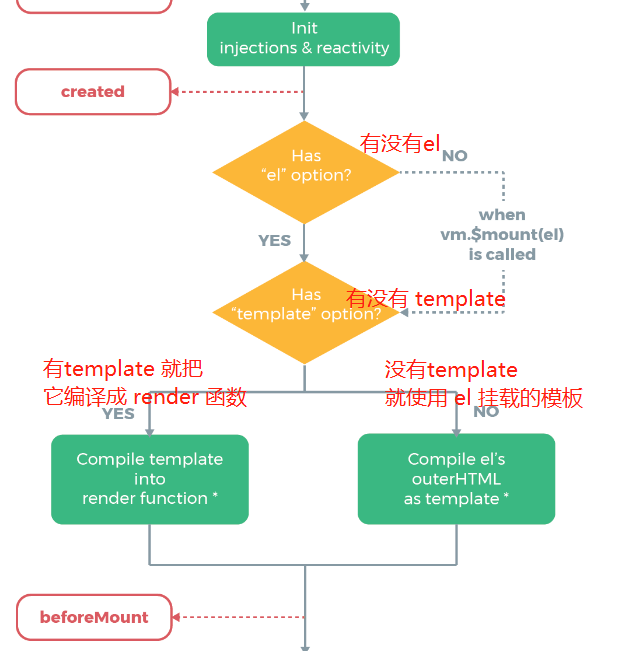

如图可以知道，如果有 `template`，就不会管 `el` 了，所以** template 比 el 的优先级更高**，比如

那我们自己写了 render 呢？

```
代码块
<div id='app'>
    <p>{{ name }}</p>
</div>
<script>
    new Vue({
        el:'#app',
        data:{ name:'沐华' },
        template:'<div>掘金</div>',
        render(h){
            return h('div', {}, '好好学习，天天向上')
        }
    })
</script>
```

这个代码执行后页面渲染出来只有 `<div>好好学习，天天向上</div>`

可以得出 render 函数的优先级更高

因为不管是 `el` 挂载的，还是 `template` 最后都会被编译成 `render` 函数，而如果已经有了 `render` 函数了，就跳过前面的编译了

这一点在源码里也有体现

```
代码块
  Vue.prototype.$mount = function ( el, hydrating ) {
    el = el && query(el);
    var options = this.$options;
    *// 如果没有 render *
    if (!options.render) {
      var template = options.template;
      *// 再判断，如果有 template*
      if (template) {
        if (typeof template === 'string') {
          if (template.charAt(0) === '#') {
            template = idToTemplate(template);
          }
        } else if (template.nodeType) {
          template = template.innerHTML;
        } else {
          return this
        }
      *// 再判断，如果有 el*
      } else if (el) {
        template = getOuterHTML(el);
      }
    }
    return mount.call(this, el, hydrating)
  };
```

2.**更灵活的写法**

比如说我们需要写很多 if 判断的时候

```
代码块
<template>
    <h1 v-if="level === 1">
      <a href="xxx">
```

不知道你有没有写过类似上面这样的代码呢？

我们换一种方式来写出和上面一模一样的代码看看，直接写 render

```
代码块
<script>
  export default {
    props:['level'],
    render(h){
      return h('h' + this.level, this.$slots.default())
    }
  }
</script>
```

搞定！就这！就这？

没错，就这！

或者下面这样，多次调用的时候就很方便

```
代码块
<script>
  export default {
    props:['level'],
```

## 45.说说 Vue 中 CSS scoped 的原理

**参考答案：**

**前言**

在日常的Vue项目开发过程中，为了让项目更好的维护一般都会使用模块化开发的方式进行。也就是每个组件维护独立的`template`，`script`，`style`。今天主要介绍一下使用`<style scoped>`为什么在页面渲染完后样式之间并不会造成污染。

**示例**

搭建一个简单的Vue项目测试一下：

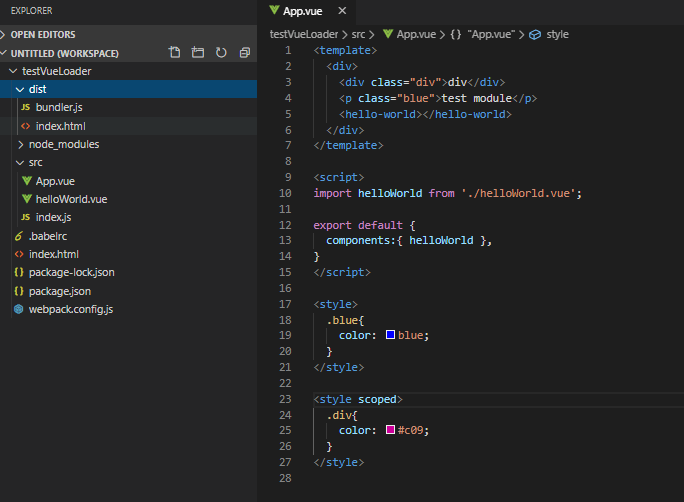

给个目录结构吧，代码并不是我们讲解的重点，如果需要源码测试的话后续我放到github上去。终端执行`npx webpack`输出dist目录，我们在浏览器打开index.html调试一下看看现象：

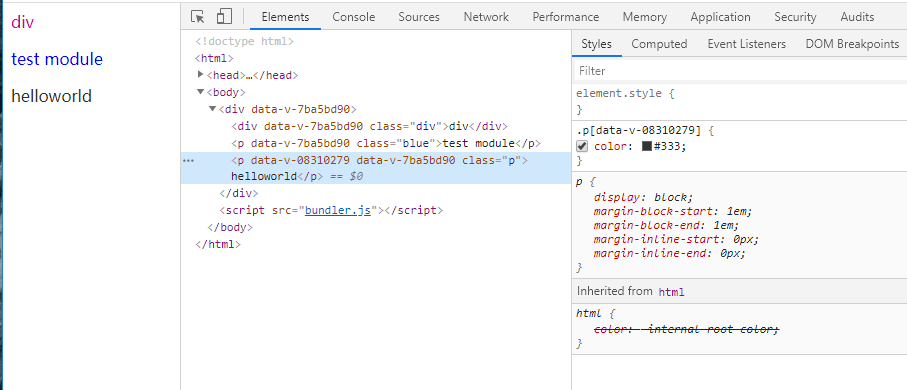

1.每个组件都会拥有一个`[data-v-hash:8]`插入HTML标签，子组件标签上也具体父组件`[data-v-hash:8]`;

2.如果style标签加了`scoped属性`，里面的选择器都会变成`(Attribute Selector) [data-v-hash:8]`;

3.如果子组件选择器跟父组件选择器完全一样，那么就会出现子组件样式被父组件覆盖，因为`子组件会优先于父组件mounted`，有兴趣可以测试一下哦。

**webpack.config.js配置**

我们先看看在`webpack.config.js`中的配置：

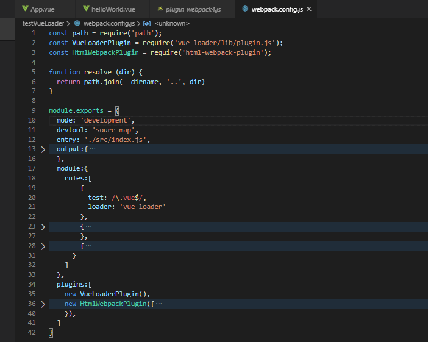

**vue-loader工作流**

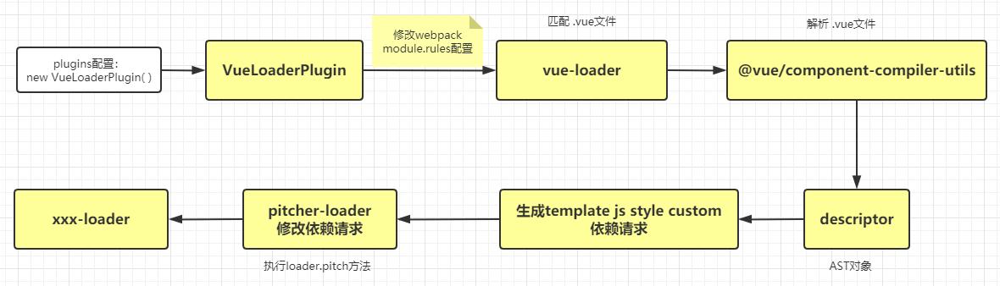

开启`node调试模式`进行查看阅读，package.json中配置如下：

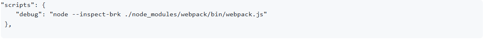

**vue-loader**

继续来看看`vue-loader`是如何操作.vue文件的，目前只关心`style`部分，逻辑在`lib/index.js`：

可以看到解析完vue文件的结果大概就是这样的：

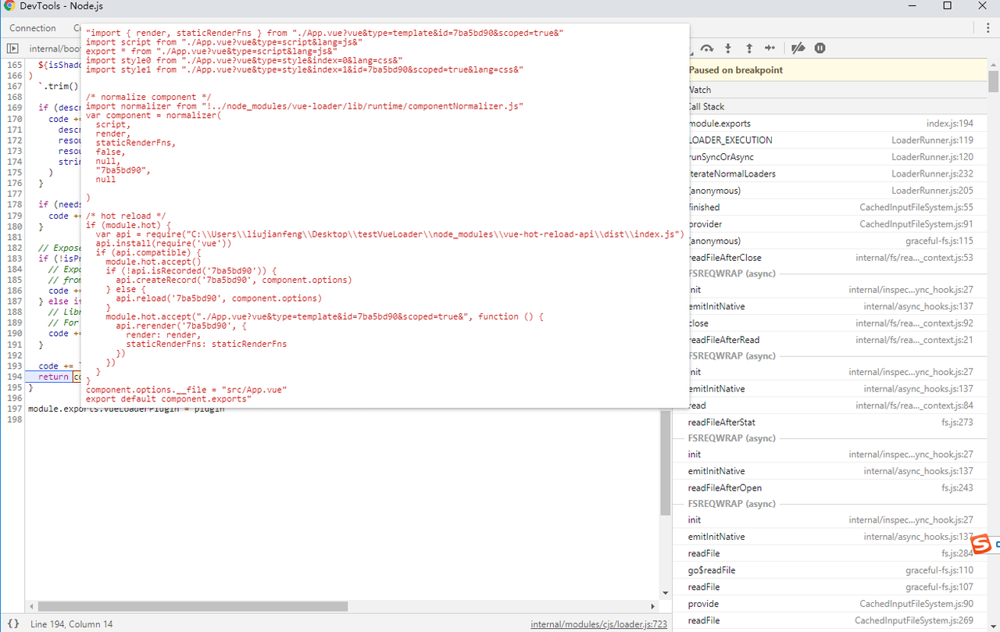

可以看到解析带scoped属性的style的结果大概就是这样的：

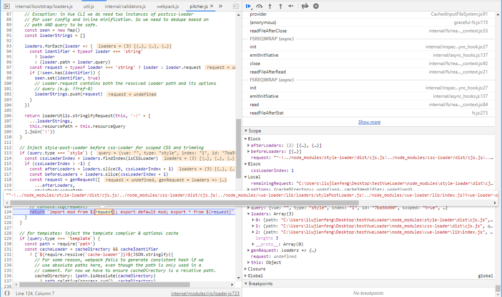

**新的依赖解析**

分析`{tyep：style}`的处理流程顺序：

- vue-loader、style-post-loader、css-loader、style-loader。

处理资源的时候先走的是`vue-loader`，这时vue-loader中的处理逻辑与第一次解析vue文件不一样了：

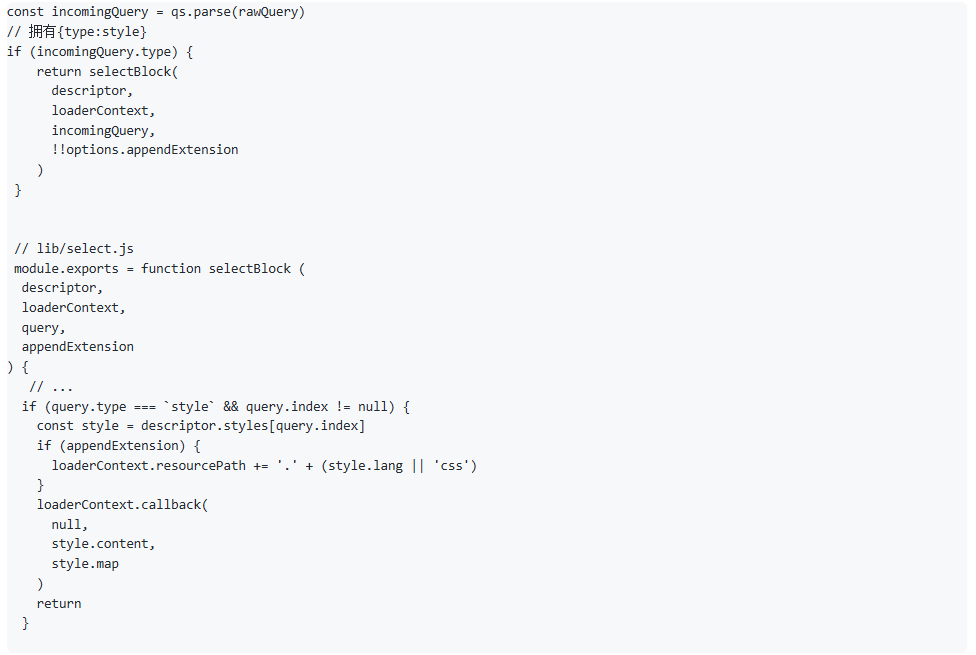

可以看到vue-loader处理完后返回的就是style.content，也就是style标签下的内容，然后交给后续的loader继续处理

再来看一下`style-post-loader`是如何生成`data-v-hash:8`的

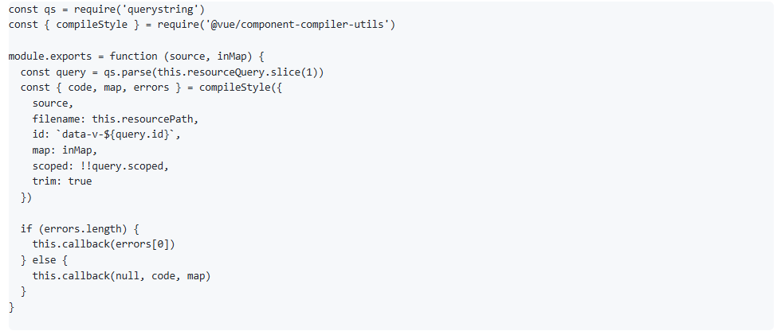

处理最终返回的code是这样的：

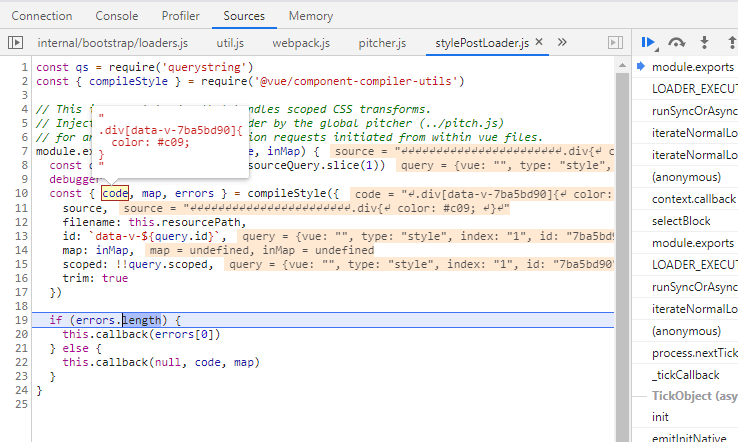

## 46.说说你对渐进式框架的理解

**参考答案：**

渐进式的含义：没有多做职责之外的事，只做了自己该做的事，没有做不该做的事，仅此而已。

更直白一点就是，用你想用或者能用的功能特性，你不想用的部分功能可以先不用。VUE不强求你一次性接受并使用它的全部功能特性。

比如以下两种场景，Vue 发挥了很大的优点：

- 场景一：公司刚开始一个项目，技术人员对Vue的掌握也不足够。那么我们就不能使用VUE了么？当然不是，如果你只是使用VUE做些基础操作，如：页面渲染、表单处理提交功能，那还是非常简单的，成熟技术人员上手也就一两天。完全可以用它去代替jquery。并不需要你去引入其他复杂特性功能。

- 场景二：我们的项目规模逐渐的变大了，我们可能会逐渐用到前端路由、状态集中管理、并最终实现一个高度工程化的前端项目。这些功能特性我们可以逐步引入，当然不用也可以。

Vue 的适用面很广，你可以用它代替老项目中的JQuery。也可以在新项目启动初期，有限的使用VUE的功能特性，从而降低上手的成本。

## 47.Vue中的 v-show 和 v-if 有什么区别

**参考答案：**

`v-if` 和 `v-show` 是 Vue.js 中用于条件渲染的指令，它们的作用是根据条件来控制元素的显示和隐藏。它们之间有一些重要的区别：

- ◦`v-if` 是一个“惰性”指令，在编译时刻，Vue.js 会根据条件决定是否编译或挂载元素到 DOM 中。如果条件为 `false`，元素根本不会被编译和渲染到 DOM 中。

- ◦`v-show` 是一个“非惰性”指令，在编译时刻，元素总是会被编译和渲染到 DOM 中。但是，根据条件的值，`v-show` 会通过 CSS 控制元素的显示和隐藏，不会从 DOM 中移除元素。

- ◦`v-if` 在条件为 `true` 时会渲染元素到 DOM，而在条件为 `false` 时会从 DOM 中移除元素。`v-if`也可以触发组件创建和销毁的生命钩子。

- ◦`v-show` 在条件为 `true` 时会通过 CSS 设置元素的 `display` 属性为可见（通常是 `display: block`），在条件为 `false` 时设置为隐藏（`display: none`）。元素始终存在于 DOM 中，只是通过 CSS 控制其显示状态。

- ◦`v-if` 在条件切换时，如果条件从 `true` 切换为 `false`，会销毁并重新创建元素，这涉及到 DOM 的删除和重新插入，可能会有一定的性能开销。

- ◦`v-show` 在条件切换时，只是简单地通过 CSS 控制元素的显示和隐藏，不会销毁和重新创建元素，因此切换的开销较小。

- ◦`v-if` 在初始渲染时，如果条件为 `false`，元素不会被渲染到 DOM 中，因此在初始渲染时可能会有一定的性能优势。

- ◦`v-show` 在初始渲染时，元素总是会被渲染到 DOM 中，因此在初始渲染时可能会有一些额外的开销。

综上所述，当需要频繁切换元素的显示状态时，且元素可能处于不同的状态，推荐使用 `v-show`。而当条件不会频繁改变，且希望在条件为 `false` 时不渲染元素到 DOM 中，推荐使用 `v-if`。在实际使用中，根据具体的场景和性能需求来选择合适的指令。

## 48.Vue3.0里为什么要用 Proxy API 替代 defineProperty API ？

**参考答案：**

在 Vue 3.0 中，使用 Proxy API 替代 defineProperty API 是为了改进响应式系统的性能和功能：

1.性能提升：Proxy API 比 defineProperty API 在许多情况下具有更好的性能。defineProperty 使用 Object.defineProperty 方法来拦截对象属性的访问和修改，但它需要遍历每个属性进行拦截。而 Proxy API 允许拦截整个对象，可以更高效地捕获对对象的访问和修改。

2.更全面的拦截能力：Proxy API 提供了更多的拦截方法，比 defineProperty API 更灵活、丰富。它支持拦截目标的各种操作，包括读取、设置、删除、枚举等，甚至还可以拦截函数调用和构造函数实例化。

3.更好的数组变化检测：Vue 3.0 使用 Proxy API 改善了数组的变化检测机制。Proxy 可以直接拦截数组的索引访问和修改，使得对数组的变化更容易被监听到，从而提供了更可靠的响应式行为。

4.更易于处理嵌套对象：Proxy API 能够递归地拦截对象的嵌套属性，而 defineProperty 无法自动递归处理嵌套对象。这使得在 Vue 3.0 中处理嵌套对象更加简单和方便。

5.更好的错误提示：相比于 defineProperty，Proxy API 提供了更好的错误追踪和调试信息。当使用 Proxy API 时，如果访问或修改了一个不存在的属性，会直接抛出错误，从而更容易发现和修复问题。

使用 Proxy API 取代 defineProperty API 是为了提升性能、增强功能，并提供更好的开发体验和错误提示。这些改进使得 Vue 3.0 的响应式系统更加高效、灵活和可靠。

## 49.SSR是什么？Vue中怎么实现？

**参考答案：**

**什么是 SSR**

SSR（Server-Side Rendering，服务器端渲染）是一种将应用程序的界面在服务器上进行预先渲染并以 HTML 形式发送到客户端的技术。与传统的客户端渲染（CSR）相比，SSR 在服务器端生成完整的 HTML 页面，然后将其发送到浏览器，以提供更好的性能和搜索引擎优化。

在传统的客户端渲染中，浏览器会下载一个包含 JavaScript 代码的文件，并在客户端执行该代码来构建和呈现页面。这意味着页面初始加载时只是一个空壳，页面内容需要在浏览器中通过 JavaScript 进行渲染。

而在 SSR 中，服务器接收到请求后，会根据请求的路由和数据，预先生成完整的 HTML 页面，其中包含了初始状态下的页面内容。服务器将这个完整的 HTML 页面发送给浏览器，浏览器无需再执行额外的 JavaScript，即可直接展示出页面内容。

SSR 的优势包括：

- 更快的首次渲染：由于服务器在响应请求时已经生成了完整的 HTML 页面，所以用户打开页面时可以立即看到内容，无需等待 JavaScript 下载和执行。

- 更好的搜索引擎优化（SEO）：搜索引擎爬虫能够抓取到完整的 HTML 页面，并且页面内容可直接被搜索引擎索引。

- 更好的用户体验：页面内容在服务器端渲染完成后即可展示，减少了白屏时间和加载等待。

需要注意的是，SSR 可能会增加服务器负载和响应时间，并且涉及到一些复杂性，例如处理路由、状态管理等。因此，在选择是否使用 SSR 时，需要根据项目需求和复杂性来权衡利弊。

**怎么使用 Vue 框架实现 SSR**

可以按照以下步骤进行操作：

- ◦首先，确保你的项目中已经安装了 Vue 相关的依赖和构建工具，如 Vue、Vue Router、Vue Server Renderer 等。

- ◦在项目中创建一个服务器入口文件，通常命名为 `server.js` 或类似名称。

- ◦在该文件中，引入必要的模块，包括 Vue、Vue Server Renderer、Express（或其他后端框架）等。

- ◦创建一个 Express 应用实例，并设置路由处理器来处理不同请求。

- ◦在服务器入口文件中，编写服务器端渲染的逻辑。

- ◦创建一个 Vue 实例，并配置路由、数据等相关内容。

- ◦使用 Vue Server Renderer 的 `createRenderer` 方法创建一个 renderer 实例。

- ◦在路由处理器中调用 renderer 实例的 `renderToString` 方法来将 Vue 实例渲染为字符串。

- ◦在服务器端渲染时，需要处理静态资源（如样式表、图片等）的加载和引用。

- ◦可以使用 Webpack 进行服务器端渲染的配置，以处理静态资源的导出和加载。

- ◦在服务器端渲染后，需要在客户端激活 Vue 实例，以便能够响应交互事件和更新页面。

- ◦可以通过在 HTML 中插入一个 JavaScript 脚本，并在脚本中使用 `createApp` 方法来创建客户端应用程序实例。

这些通信方式各有特点，可以根据具体情况选择合适的方式来实现祖孙组件之间的通信。对于简单的父子组件通信，Props / $emit 是常用的方式；而对于更复杂的应用程序状态管理和跨层级通信，使用 Vuex 或 Event Bus 可能更适合。

## 51.如何打破 scope 对样式隔离的限制？

**参考答案：**

在 Vue 中，作用域样式（Scoped Styles）的目的是将样式限制在单个组件的作用域中，以确保样式不会被其他组件影响。然而，有时候你可能需要打破作用域限制，让样式能够在组件外部生效。以下是几种打破作用域限制的方式：

- ◦在样式中使用 `/deep/` 或 `::v-deep`（Vue 2.x 中的别名）选择器可以覆盖作用域限制。

- ◦这样可以使得样式选择器的范围扩大到所有子组件，甚至是整个应用程序的 DOM 树。

- ◦例如，使用 `.container /deep/ .child` 可以选择 `.child` 类名的元素，即使 `.child` 是在另一个组件中定义的。

- ◦如果你希望一些样式在多个组件之间共享，并且不受作用域限制，可以使用全局样式。

- ◦在 Vue 单文件组件中，可以在 `<style>` 标签外部或使用 `@import` 引入全局样式文件，这样样式将不受作用域限制。

- ◦如果你希望某些样式继承自父组件或特定组件的样式，可以使用类名继承。

- ◦在子组件的 `<style>` 标签中使用 `@extend` 来继承父组件或其他组件的样式，这样可以打破作用域限制。

需要注意的是，打破作用域限制可能会导致样式冲突和不可预测的结果。建议尽量遵循作用域限制，仅在必要时才使用上述方法来打破限制。同时，合理地组织组件结构和样式层级，可以更好地管理样式和避免冲突。

## 52.Scoped Styles 为什么可以实现样式隔离？

**参考答案：**

在 Vue 中，作用域样式（Scoped Styles）是通过以下原理实现的：

- ◦当 Vue 编译单文件组件时，在样式中使用 `scoped` 特性或 `module` 特性时，Vue 会为每个样式选择器生成一个唯一的属性选择器。

- ◦这里的唯一选择器是类似于 `[data-v-xxxxxxx]` 的属性选择器，其中 `xxxxxxx` 是一个唯一的标识符。

- ◦Vue 在编译过程中会解析单文件组件的模板，并对样式进行处理。

- ◦对于具有 `scoped` 特性的样式，Vue 会将选择器转换为带有唯一属性选择器的形式，例如 `.class` 会被转换为 `.class[data-v-xxxxxxx]`。

- ◦对于具有 `module` 特性的样式，Vue 会为每个选择器生成一个唯一的类名，并将类名与元素关联起来。

- ◦在组件渲染过程中，Vue 会为组件的根元素添加一个属性值为唯一标识符的属性，例如 `data-v-xxxxxxx`。

- ◦当组件渲染完成后，样式选择器中的唯一属性选择器或唯一类名将与组件根元素的属性匹配，从而实现样式的隔离。

- ◦这样，只有具有相同属性值的元素才会应用相应的样式，避免了样式冲突和泄漏。

通过以上原理，Vue 实现了作用域样式的隔离。每个组件的样式都被限制在自己的作用域内，不会影响其他组件或全局样式。这种方式实现了组件级别的样式隔离，使得组件可以更好地封装和重用，同时减少了样式冲突的可能性。

## 53.vue 中怎么实现样式隔离？

**参考答案：**

Vue 提供了几种方式来实现样式的隔离：

- ◦在 Vue 单文件组件中，可以使用 `scoped` 特性将样式限定于当前组件的作用域。

- ◦使用`<style scoped>`标签包裹的样式只对当前组件起作用，不会影响其他组件或全局样式。

- ◦Vue 实现作用域样式的方式是通过给每个选择器添加一个唯一的属性选择器，以确保样式仅适用于当前组件。

- ◦Vue 支持使用 CSS Modules 来实现样式的模块化和隔离。

- ◦在 Vue 单文件组件中，可以借助 `module` 特性启用 CSS Modules 功能，在样式文件中使用类似 `:local(.className)` 的语法来定义局部样式。

- ◦CSS Modules 会自动生成唯一的类名，并在编译时将类名与元素关联起来，从而实现样式的隔离和局部作用域。

- ◦Vue 也可以结合 CSS-in-JS 库（如 `styled-components`、`emotion` 等）来实现样式的隔离。

- ◦使用这种方式，可以直接在组件代码中编写样式，并通过 JavaScript 对象或模板字符串的形式动态生成样式。

- ◦CSS-in-JS 方案将样式与组件紧密关联，实现了更高程度的样式隔离和可重用性。

这些方法各有特点，可以根据实际需求选择合适的方式来实现样式的隔离。作用域样式和 CSS Modules 是 Vue 官方提供的内置功能，而 CSS-in-JS 则是通过第三方库来实现。根据项目的规模和需求，选择适合的方式可以更好地管理和维护样式。

## 54.created 和 mounted 有什么区别？

2.Vue解析模板时，会将`v-model`指令转换成合适的属性和事件绑定。对于大多数表单元素，它会将`value`属性与输入框的当前值进行绑定，并监听`input`事件来实时更新绑定的数据。

3.当用户在输入框中键入或选择内容时，触发`input`事件。Vue会捕获该事件并更新绑定的数据，以及根据数据的变化重新渲染视图。

4.同样地，如果在表单元素上使用`v-model`的`lazy`修饰符，Vue会监听`change`事件而不是`input`事件。这样，只有当用户完成输入并触发`change`事件时，才会更新绑定的数据。

`v-model`指令实现双向绑定的原理是通过监听表单元素的输入事件（如`input`或`change`），将用户的输入同步到Vue实例中的属性，并在属性值变化时重新渲染视图。这使得我们可以轻松地将表单数据与Vue实例的状态保持同步，消除了手动监听和更新的冗余代码。

## 57.说说 Vuex 的原理

**参考答案：**

Vuex是Vue.js应用程序开发的状态管理模式和库。它为Vue应用程序提供了一个集中式的存储机制，用于管理应用程序的所有组件的状态。Vuex的设计受到了Flux和Redux的影响，它通过以下几个核心概念来工作：

1.State（状态）：应用程序的数据存储在一个单一的状态树中，即`state`。这个状态树是响应式的，当状态发生变化时，相关的组件将自动更新。

2.Getter（获取器）：`getter`允许从`state`中派生出一些衍生的状态，类似于计算属性。可以使用`getter`来对`state`进行处理和计算，并将其暴露给组件使用。

3.Mutation（突变）：`mutation`是用于修改`state`的唯一途径。它定义了一些操作函数，每个函数都有一个特定的名称（称为`type`），并且可以在这些函数中改变`state`的值。`mutation`必须是同步的，以确保状态变更是可追踪的。

4.Action（动作）：`action`用于处理异步操作和复杂的业务逻辑。类似于`mutation`，但`action`可以包含异步操作，可以在`action`中触发多个`mutation`，也可以在`action`中调用其他`action`。

5.Module（模块）：为了更好地组织和拆分大型的应用程序，Vuex允许将`state`、`getter`、`mutation`和`action`划分为模块。每个模块都有自己的`state`、`getter`、`mutation`和`action`，并且可以被嵌套和组合。

通过以上的核心概念，Vuex提供了一种可预测的状态管理方式，使得多个组件之间共享和同步状态变得更加容易和可控。它简化了应用程序的状态管理，提高了代码的可维护性和复用性。

## 58.Vue中给对象添加新属性时，界面不刷新怎么办?

**参考答案：**

**一、直接添加属性的问题**

我们从一个例子开始

定义一个`p`标签，通过`v-for`指令进行遍历

然后给`botton`标签绑定点击事件，我们预期点击按钮时，数据新增一个属性，界面也 新增一行

```
代码块
<p v-for="(value,key) in item" :key="key">
    {{ value }}
</p>
<button @click="addProperty">动态添加新属性</button>
```

实例化一个`vue`实例，定义`data`属性和`methods`方法

```
代码块
const app = new Vue({
    el:"#app",
           data:()=>{
               item:{
            oldProperty:"旧属性"
        }
    },
    methods:{
        addProperty(){
            this.items.newProperty = "新属性"  *// 为items添加新属性*
            console.log(this.items)  *// 输出带有newProperty的items*
        }
    }
})
```

点击按钮，发现结果不及预期，数据虽然更新了（`console`打印出了新属性），但页面并没有更新

**二、原理分析**

为什么产生上面的情况呢？

下面来分析一下

`vue2`是用过`Object.defineProperty`实现数据响应式

```
代码块
const obj = {}
Object.defineProperty(obj, 'foo', {
    get() {
        console.log(`get foo:${val}`);
        return val
    },
    set(newVal) {
        if (newVal !== val) {
            console.log(`set foo:${newVal}`);
            val = newVal
        }
    }
})
```

当我们访问`foo`属性或者设置`foo`值的时候都能够触发`setter`与`getter`

Vue.set( target, propertyName/index, value )

参数

- `{Object | Array} target`

- `{string | number} propertyName/index`

- `{any} value`

返回值：设置的值

通过`Vue.set`向响应式对象中添加一个`property`，并确保这个新 `property `同样是响应式的，且触发视图更新

关于`Vue.set`源码（省略了很多与本节不相关的代码）

```
代码块
function set (target: Array<any> | Object, key: any, val: any): any {
  ...
  defineReactive(ob.value, key, val)
  ob.dep.notify()
  return val
}
```

这里无非再次调用`defineReactive`方法，实现新增属性的响应式

关于`defineReactive`方法，内部还是通过`Object.defineProperty`实现属性拦截

大致代码如下：

```
代码块
function defineReactive(obj, key, val) {
    Object.defineProperty(obj, key, {
        get() {
            console.log(`get ${key}:${val}`);
            return val
        },
        set(newVal) {
            if (newVal !== val) {
                console.log(`set ${key}:${newVal}`);
                val = newVal
            }
        }
    })
}
```

**Object.assign()**

直接使用`Object.assign()`添加到对象的新属性不会触发更新

应创建一个新的对象，合并原对象和混入对象的属性

```
代码块
this.someObject = Object.assign({},this.someObject,{newProperty1:1,newProperty2:2 ...})
```

**$forceUpdate**

如果你发现你自己需要在 `Vue `中做一次强制更新，99.9% 的情况，是你在某个地方做错了事

`$forceUpdate`迫使` Vue` 实例重新渲染

PS：仅仅影响实例本身和插入插槽内容的子组件，而不是所有子组件。

**小结**

- 如果为对象添加少量的新属性，可以直接采用`Vue.set()`

- 如果需要为新对象添加大量的新属性，则通过`Object.assign()`创建新对象

- 如果你实在不知道怎么操作时，可采取`$forceUpdate()`进行强制刷新 (不建议)

PS：`vue3`是用过`proxy`实现数据响应式的，直接动态添加新属性仍可以实现数据响应式

## 59.Vue3有了解过吗？能说说跟Vue2的区别吗？

**参考答案：**

以下是一些主要区别的总结：

1.响应式系统（Reactivity System）：Vue 3 引入了 Composition API，这是一种新的响应式系统。Composition API 提供了更灵活和强大的组件状态和逻辑管理方式，使代码组织和重用更加方便。Composition API 使用函数而不是对象，可以提高摇树优化（Tree Shaking）并减小打包体积。

2.更小的包体积：Vue 3 通过更好的 Tree Shaking 和更高效的运行时代码生成，相较于 Vue 2，打包体积更小。Vue 3 的响应式系统也经过优化，性能更好。

3.性能改进：Vue 3 采用了更快、更高效的渲染机制，得益于新的编译器。虚拟 DOM 的差异化算法经过优化，减少不必要的更新，提升渲染性能。

4.作用域插槽替代为 `<slot>`：在 Vue 3 中，作用域插槽的概念被更直观、更简化的 `<slot>` 语法所取代，使得在组件组合中定义和使用插槽更加容易。

5.引入 Teleport 组件：Vue 3 引入了 Teleport 组件，可以在 DOM 树中的不同位置渲染内容，用于创建模态框、工具提示和其他覆盖层效果。

6.片段（Fragments）：Vue 3 引入了一个名为片段（Fragment）的内置组件，允许将多个元素进行分组，而无需添加额外的包装元素。

7.更好的 TypeScript 支持：Vue 3 默认提供了更好的 TypeScript 支持，具有增强的类型推断和与 TypeScript 工具更好的集成。

8.简化的 API：Vue 3 对许多 API 进行了简化和优化，使得学习和使用框架更加容易。新的 API 提供了更好的一致性，并与 JavaScript 标准更加对齐。

虽然 Vue 3 引入了这些变化，但它保持与 Vue 2 API 的向后兼容性，允许现有的 Vue 2 项目逐步升级。Vue 3 提供了一个迁移构建版本，与大多数 Vue 2 代码兼容，从而使开发者的过渡更加平滑。

总体而言，Vue 3 在性能、包体积和开发者体验方面带来了显著的改进，同时引入了 Composition API 作为管理组件状态和逻辑的更强大工具。

## 60.自定义指令是什么？有哪些应用场景？

**参考答案：**

在 Vue 中，自定义指令（Custom Directive）是一种用于扩展 Vue 的模板语法的机制。通过自定义指令，你可以在 DOM 元素上添加自定义行为，并在元素插入、更新和移除时进行相应的操作。

自定义指令由 Vue.directive 函数定义，它接收两个参数：指令名称和指令选项对象。指令选项对象包含一系列钩子函数，用于定义指令的行为。

以下是一些常见的自定义指令应用场景：

1.操作 DOM：自定义指令可以用于直接操作 DOM 元素，例如修改元素的样式、属性、事件绑定等。你可以通过在指令的钩子函数中访问和操作 DOM 元素。

2.表单验证：你可以创建自定义指令来实现表单验证逻辑。通过自定义指令，你可以监听输入框的值变化，并根据自定义的验证规则进行验证，以便提供实时的反馈。

3.权限控制：自定义指令可以用于权限控制场景，例如根据用户权限来隐藏或禁用某些元素。你可以在自定义指令中根据用户权限进行条件判断，并修改元素的显示或行为。

4.第三方库集成：当你需要在 Vue 中使用第三方库或插件时，可以使用自定义指令来进行集成。你可以创建一个自定义指令，在其中初始化和配置第三方库，并在适当的时机调用库的方法。

5.动画和过渡效果：自定义指令可以与 Vue 的过渡系统一起使用，实现自定义的动画和过渡效果。你可以在自定义指令中监听过渡钩子函数，并根据需要操作元素的样式或类名来实现过渡效果。

这只是一些常见的应用场景，实际上自定义指令的应用范围非常广泛，可以根据具体需求进行灵活的使用。通过自定义指令，你可以扩展 Vue 的能力，实现更复杂和灵活的交互行为。

## 61.说说vue中，key的原理

**参考答案：**

在 Vue 中，`key` 是用于帮助 Vue 识别和跟踪虚拟 DOM 的变化的特殊属性。当 Vue 更新渲染真实 DOM 时，它使用 `key` 属性来比较新旧节点，并尽可能地复用已存在的真实 DOM 节点，以提高性能。

Vue 在进行虚拟 DOM 的 diff 算法时，会使用 `key` 来匹配新旧节点，以确定节点的更新、移动或删除。它通过 `key` 属性来判断两个节点是否代表相同的实体，而不仅仅是根据它们的内容是否相同。这样可以保留节点的状态和避免不必要的 DOM 操作。

`key` 的工作原理如下：

1.当 Vue 更新渲染真实 DOM 时，它会对新旧节点进行比较，找出它们之间的差异。

2.如果两个节点具有相同的 `key` 值，则 Vue 认为它们是相同的节点，会尝试复用已存在的真实 DOM 节点。

3.如果节点具有不同的 `key` 值，Vue 会将其视为不同的节点，并进行适当的更新、移动或删除操作。

使用 `key` 可以提供更准确的节点识别和跟踪，避免出现一些常见的问题，比如在列表中重新排序时导致的元素闪烁、输入框内容丢失等。

`key` 必须是唯一且稳定的，最好使用具有唯一标识的值，例如使用数据的唯一 ID。同时，不推荐使用随机数作为 `key`，因为在每次更新时都会生成新的 `key`，导致所有节点都重新渲染，无法复用已有的节点，降低性能。

## 62.Vue常用的修饰符有哪些？分别有什么应用场景？

**参考答案：**

**一、修饰符是什么**

在程序世界里，修饰符是用于限定类型以及类型成员的声明的一种符号

在`Vue`中，修饰符处理了许多`DOM`事件的细节，让我们不再需要花大量的时间去处理这些烦恼的事情，而能有更多的精力专注于程序的逻辑处理

`vue`中修饰符分为以下五种：

- 表单修饰符

- 事件修饰符

- 鼠标按键修饰符

- 键值修饰符

- v-bind修饰符

**二、修饰符的作用**

**表单修饰符**

在我们填写表单的时候用得最多的是`input`标签，指令用得最多的是`v-model`

关于表单的修饰符有如下：

- lazy

- trim

- number

**lazy**

在我们填完信息，光标离开标签的时候，才会将值赋予给`value`，也就是在`change`事件之后再进行信息同步

```
代码块
<input type="text" v-model.lazy="value">
<p>{{value}}</p>
```

**trim**

自动过滤用户输入的首空格字符，而中间的空格不会过滤

```
代码块
<input type="text" v-model.trim="value">
```

**number**

自动将用户的输入值转为数值类型，但如果这个值无法被`parseFloat`解析，则会返回原来的值

```
代码块
<input v-model.number="age" type="number">
```

**事件修饰符**

事件修饰符是对事件捕获以及目标进行了处理，有如下修饰符：

- stop

- prevent

- self

- once

- capture

- passive

- native

**stop**

阻止了事件冒泡，相当于调用了`event.stopPropagation`方法

```
代码块
<div @click="shout(2)">
  <button @click.stop="shout(1)">ok</button>
```

**prevent**

阻止了事件的默认行为，相当于调用了`event.preventDefault`方法

```
代码块
<form v-on:submit.prevent="onSubmit"></form>
```

**self**

只当在 `event.target` 是当前元素自身时触发处理函数

```
代码块
<div v-on:click.self="doThat">...</div>
```

使用修饰符时，顺序很重要；相应的代码会以同样的顺序产生。因此，用 `v-on:click.prevent.self` 会阻止所有的点击，而 `v-on:click.self.prevent` 只会阻止对元素自身的点击

**once**

绑定了事件以后只能触发一次，第二次就不会触发

```
代码块
<button @click.once="shout(1)">ok</button>
```

**capture**

使事件触发从包含这个元素的顶层开始往下触发

```
代码块
<div @click.capture="shout(1)">
    obj1
<div @click.capture="shout(2)">
    obj2
<div @click="shout(3)">
    obj3
<div @click="shout(4)">
    obj4
</div>
```

**passive**

在移动端，当我们在监听元素滚动事件的时候，会一直触发`onscroll`事件会让我们的网页变卡，因此我们使用这个修饰符的时候，相当于给`onscroll`事件整了一个`.lazy`修饰符

```
代码块
<!-- 滚动事件的默认行为 (即滚动行为) 将会立即触发 -->
<!-- 而不会等待 `onScroll` 完成  -->
<!-- 这其中包含 `event.preventDefault()` 的情况 -->
<div v-on:scroll.passive="onScroll">...</div>
```

不要把 `.passive` 和 `.prevent` 一起使用,因为 `.prevent` 将会被忽略，同时浏览器可能会向你展示一个警告。

`passive` 会告诉浏览器你不想阻止事件的默认行为

**native**

让组件变成像`html`内置标签那样监听根元素的原生事件，否则组件上使用 `v-on` 只会监听自定义事件

```
代码块
<my-component v-on:click.native="doSomething"></my-component>
```

使用.native修饰符来操作普通HTML标签是会令事件失效的

**鼠标按钮修饰符**

鼠标按钮修饰符针对的就是左键、右键、中键点击，有如下：

- left 左键点击

- right 右键点击

- middle 中键点击

```
代码块
<button @click.left="shout(1)">ok</button>
<button @click.right="shout(1)">ok</button>
<button @click.middle="shout(1)">ok</button>
```

**键盘修饰符**

键盘修饰符是用来修饰键盘事件（`onkeyup`，`onkeydown`）的，有如下：

`keyCode`存在很多，但`vue`为我们提供了别名，分为以下两种：

- 普通键（enter、tab、delete、space、esc、up...）

- 系统修饰键（ctrl、alt、meta、shift...）

```
代码块
*// 只有按键为keyCode的时候才触发*
<input type="text" @keyup.keyCode="shout()">
```

还可以通过以下方式自定义一些全局的键盘码别名

```
代码块
Vue.config.keyCodes.f2 = 113
```

**v-bind修饰符**

v-bind修饰符主要是为属性进行操作，用来分别有如下：

- sync

- prop

- camel

**sync**

能对`props`进行一个双向绑定

```
代码块
*//父组件*
<comp :myMessage.sync="bar"></comp> 
*//子组件*
this.$emit('update:myMessage',params);
```

以上这种方法相当于以下的简写

```
代码块
```

使用`sync`需要注意以下两点：

- 使用`sync`的时候，子组件传递的事件名格式必须为`update:value`，其中`value`必须与子组件中`props`中声明的名称完全一致

- 注意带有 `.sync` 修饰符的 `v-bind` 不能和表达式一起使用

- 将 `v-bind.sync` 用在一个字面量的对象上，例如 `v-bind.sync=”{ title: doc.title }”`，是无法正常工作的

**props**

设置自定义标签属性，避免暴露数据，防止污染HTML结构

```
代码块
<input id="uid" title="title1" value="1" :index.prop="index">
```

**camel**

将命名变为驼峰命名法，如将` view-Box`属性名转换为 `viewBox`

```
代码块
<svg :viewBox="viewBox"></svg>
```

**三、应用场景**

根据每一个修饰符的功能，我们可以得到以下修饰符的应用场景：

- .stop：阻止事件冒泡

- .native：绑定原生事件

- .once：事件只执行一次

- .self ：将事件绑定在自身身上，相当于阻止事件冒泡

- .prevent：阻止默认事件

- .capture：用于事件捕获

- .once：只触发一次

- .keyCode：监听特定键盘按下

- .right：右键

## 63.vue 的响应式开发比命令式有哪些优势？

**参考答案：**

Vue 的响应式开发相较于命令式开发有以下优势：

1.简化代码：在 Vue 中，通过将数据和模板绑定起来实现视图更新的自动化，从而避免了手动操作 DOM 的繁琐和容易出错的操作。因此，可以大幅减少编写样板代码和调试代码所需的时间。

2.提高可维护性：使用 Vue 的响应式开发可以帮助我们更方便地管理应用程序的状态，并对状态变化进行统一处理。这不仅可以提高代码的可读性和可维护性，还可以更方便地进行单元测试和集成测试。

3.增强用户体验：通过 Vue 的响应式开发，可以实现局部更新、异步加载等功能，从而提升用户体验。例如，在列表中添加或删除项目时，只需要更新相应的项目，而不是重新渲染整个列表。又比如，在加载大量图片时，可以通过异步加载和懒加载的方式，提高页面加载速度和用户体验。

4.支持复杂组件设计：Vue 的响应式开发支持组件化设计，它能够轻松地将一个大型应用程序拆分成多个小型、可重用的组件。这些组件可以根据需要进行嵌套和组合，形成更为复杂和丰富的 UI 界面，而且每个组件都具有独立的状态和生命周期。

总之，Vue 的响应式开发可以帮助我们更高效、更方便、更灵活地进行前端开发，从而提供更好的用户体验和更高的代码质量。

## 64.vue 中 $route 和 $router 有什么区别？

**参考答案：**

在 Vue.js 中，$route 和 $router 都是与路由相关的对象，但它们之间有以下区别：

1.*ro**u**t**e*：route 是一个当前路由信息的对象，包括当前 URL 路径、查询参数、路径参数等信息。$route 对象是只读的，不可以直接修改其属性值，而需要通过路由跳转来更新。

2.*ro**u**t**er*：router 是 Vue Router 的实例对象，包括了许多用于导航控制和路由操作的 API，例如 push、replace、go、forward 等方法。$router 可以用来动态地改变 URL，从而实现页面间的无刷新跳转。

因此，$route 和 $router 在功能上有所不同，$route 主要用于获取当前路由信息，$router 则是用于进行路由操作，例如跳转到指定的路由、前进、后退等。通常来说，$route 和 $router 是紧密关联的，并且常常一起使用。

## 65.React 和 Vue 在技术层面有哪些区别？

**参考答案：**

React 和 Vue 是当前比较流行的前端框架，它们在技术层面有以下区别：

- 组件化方式不同：React 是基于组件实现的，组件包含了状态和行为，所有组件共享一个状态树。Vue 也是基于组件实现的，但是每个组件都有自己的状态，并且可以很容易地将数据和行为绑定在一起。

- 数据驱动方式不同：React 使用单向数据流来管理数据，即从父组件到子组件的传递，所以 React 中组件之间的数据交互相对更加复杂。Vue 则使用双向数据绑定来管理数据，使得组件之间的数据交互更加简洁。

- 模板语法不同：React 使用 JSX 语法，将 HTML 和 JavaScript 结合在一起，使得编写组件更加直观和灵活。Vue 则使用模板语法，并且支持模板内的表达式和指令，使得编写组件具有更高的可读性和可维护性。

- 生命周期不同：React 组件的生命周期分为三个阶段：初始化、更新和卸载。Vue 组件的生命周期分为八个阶段：创建、挂载、更新、销毁等。

- 状态管理方式不同：React 使用 Redux 或者 MobX 来管理应用程序的状态。Vue 则提供了自己的状态管理库 Vuex，可以更方便地管理组件之间的共享状态。

- 性能优化方式不同：React 使用虚拟 DOM 技术来实现高效的渲染性能，可以减少每次渲染时需要操作真实 DOM 的次数。Vue 则使用模板编译和响应式系统来实现高效的渲染性能，并且还提供了一些优化技术，例如懒加载和缓存等。

## 66.单页应用如何提高加载速度？

**参考答案：**

- 使用代码分割：将代码拆分成小块并按需加载（懒加载），以避免不必要的网络请求和减少加载时间。

- 缓存资源：利用浏览器缓存来存储重复使用的文件，例如 CSS 和 JS 文件、图片等。

- 预加载关键资源：在首次渲染之前，先提前加载关键资源，例如首页所需的 JS、CSS 或数据，以保证关键内容的快速呈现。

- 使用合适的图片格式：选择合适的图片格式（例如 JPEG、PNG、WebP 等），并根据需要进行压缩以减少文件大小。对于一些小图标，可以使用 `iconfont` 等字体文件来代替。

- 启用 Gzip 压缩：使用服务器端的 Gzip 压缩算法对文件进行压缩，以减少传输时间和带宽消耗。

- 使用 CDN：使用内容分发网络（CDN）来缓存和传递文件，以提高文件的下载速度和可靠性。

- 优化 API 请求：尽可能地减少 API 调用的数量，并使用缓存和延迟加载等技术来优化 API 请求的效率。

- 使用服务器端渲染：使用服务器端渲染（SSR）来生成 HTML，以减少客户端渲染所需的时间和资源。但需要注意，SSR 也可能增加了服务器的负担并使网站更复杂。

## 67.为什么Vue中的v-if和v-for不建议一起用?

**参考答案：**

**一、作用**

`v-if` 指令用于条件性地渲染一块内容。这块内容只会在指令的表达式返回 `true`值的时候被渲染

`v-for` 指令基于一个数组来渲染一个列表。`v-for` 指令需要使用 `item in items` 形式的特殊语法，其中 `items` 是源数据数组或者对象，而 `item` 则是被迭代的数组元素的别名

在 `v-for` 的时候，建议设置`key`值，并且保证每个`key`值是独一无二的，这便于`diff`算法进行优化

两者在用法上

```
代码块
<Modal v-if="isShow" />

<li v-for="item in items" :key="item.id">
    {{ item.label }}
</li>
```

**二、优先级**

`v-if`与`v-for`都是`vue`模板系统中的指令

在`vue`模板编译的时候，会将指令系统转化成可执行的`render`函数

在 `Vue2` 当中，v-for的优先级更高，而在 `Vue3` 当中，则是v-if的优先级更高。

在 `Vue3` 当中，做了v-if的提升优化，去除了没有必要的计算，但同时也会带来一个无法取到 `v-for` 当中遍历的item问题，这就需要开发者们采取其他灵活的方式去解决这种问题。

**三、注意事项**

1.永远不要把 `v-if` 和 `v-for` 同时用在同一个元素上，带来性能方面的浪费（每次渲染都会先循环再进行条件判断）

2.如果避免出现这种情况，则在外层嵌套`template`（页面渲染不生成`dom`节点），在这一层进行v-if判断，然后在内部进行v-for循环

```
代码块
<template v-if="isShow">
    <p v-for="item in items">
</template>
```

3.如果条件出现在循环内部，可通过计算属性`computed`提前过滤掉那些不需要显示的项

```
代码块
computed: {
    items: function() {
      return this.list.filter(function (item) {
        return item.isShow
      })
    }
}
```

## 68.vue3中怎么设置全局变量？

**参考答案：**

**方法一 config.globalProperties**

`vue2.x`挂载全局是使用 `Vue.prototype.$xxxx=xxx` 的形式来挂载，然后通过 `this.$xxx`来获取挂载到全局的变量或者方法。

这在 `Vue 3` 中，就等同于 `config.globalProperties`。这些 `property` 将被复制到应用中作为实例化组件的一部分。

```
代码块
*// 之前 (Vue 2.x)*
Vue.prototype.$http = () => {}
```

1.使用 `vuex-along`

2.使用 `localStorage` 或者 `sessionStroage`

**使用vuex-along**

`vuex-along` 的实质也是将 `vuex` 中的数据存放到 `localStorage` 或者 `sessionStroage` 中，只不过这个存取过程组件会帮我们完成，我们只需要用vuex的读取数据方式操作就可以了，简单介绍一下 `vuex-along` 的使用方法。

```
代码块
import VueXAlong from 'vuex-along' *//导入插件*
export default new Vuex.Store({
    *//modules: {*
        *//controler  //模块化vuex*
    *//},*
    plugins: [VueXAlong({
        name: 'store',     *//存放在localStroage或者sessionStroage 中的名字*
        local: false,      *//是否存放在local中  false 不存放 如果存放按照下面session的配置*
        session: { list: [], isFilter: true } *//如果值不为false 那么可以传递对象 其中 当isFilter设置为true时， list 数组中的值就会被过滤调,这些值不会存放在seesion或者local中*
    })]
});
```

**使用 ****`localStorage`**** 或者 ****`sessionStroage`**

```
代码块
created() {
    *//在页面加载时读取sessionStorage里的状态信息*
    if (sessionStorage.getItem("store")) {
      this.$store.replaceState(
        Object.assign(
          {},
          this.$store.state,
          JSON.parse(sessionStorage.getItem("store"))
        )
      );
    }
    *//在页面刷新时将vuex里的信息保存到sessionStorage里*
    window.addEventListener("beforeunload", () => {
      sessionStorage.setItem("store", JSON.stringify(this.$store.state));
    });
},
```

## 70.vue路由中，history和hash两种模式有什么区别？

**参考答案：**

前端路由有两种模式：hash 模式和 history 模式，接下来分析这两种模式的实现方式和优缺点。

**hash 模式**

hash 模式是一种把前端路由的路径用井号 `#` 拼接在真实 URL 后面的模式。当井号 `#` 后面的路径发生变化时，浏览器并不会重新发起请求，而是会触发 `hashchange` 事件。

示例：

我们新建一个 `hash.html` 文件，内容为：

```
代码块
<a href="#/a">A页面</a>
<a href="#/b">B页面</a>
<div id="app"></div>
<script>
  function render() {
    app.innerHTML = window.location.hash
  }
  window.addEventListener('hashchange', render)
  render()
</script>
```

在上面的例子中，我们利用 `a` 标签设置了两个路由导航，把 `app` 当做视图渲染容器，当切换路由的时候触发视图容器的更新，这其实就是大多数前端框架哈希路由的实现原理。

总结一下 hash 模式的优缺点：

- 优点：浏览器兼容性较好，连 IE8 都支持

- 缺点：路径在井号 `#` 的后面，比较丑

**history 模式**

history API 是 H5 提供的新特性，允许开发者直接更改前端路由，即更新浏览器 URL 地址而不重新发起请求。

示例：

我们新建一个 `history.html`，内容为：

```
代码块
<a href="javascript:toA();">A页面</a>
<a href="javascript:toB();">B页面</a>
<div id="app"></div>
<script>
  function render() {
    app.innerHTML = window.location.pathname
  }
  function toA() {
    history.pushState({}, null, '/a')
    render()
  }
  function toB() {
    history.pushState({}, null, '/b')
    render()
  }
  window.addEventListener('popstate', render)
</script>
```

- ◦el: HostNode | *null*，宿主阶段

- ◦anchor: HostNode | *null* // fragment anchor

- ◦target: HostElement | *null* ，teleport target 传送的目标

- ◦targetAnchor: HostNode | *null* // teleport target anchor

- ◦staticCount: *number*，包含的静态节点的数量

- ◦suspense: SuspenseBoundary | *null*

- ◦ssContent: VNode | *null*

- ◦ssFallback: VNode | *null*

- ◦shapeFlag: *number*

- ◦patchFlag: *number*

- ◦dynamicProps: *string*[] | *null*

- ◦dynamicChildren: VNode[] | *null*

- ◦appContext: AppContext | *null*，实例上下文

可以看到在Vue内部，对于一个Vnode描述对象的属性大概有二十多个。

Vue为了给用于减轻一定的负担，但又不至于太封闭，就创建了渲染h。可以在用户需要的时候，通过h函数创建对应的Vnode即可。

这样就给为一些高阶玩家保留了自由发挥的空间。

## 72.react 和 vue 有什么区别？

**参考答案：**

**前言**

React 是由Facebook创建的JavaScript UI框架，React推广了 Virtual DOM( 虚拟 DOM )并创造了 JSX 语法。JSX 语法的出现允许我们在 javascript 中书写 HTML 代码。

VUE 是由尤雨溪开发的，VUE 使用了模板系统而不是JSX，因其实模板系统都是用的普通的 HTML，所以对应用的升级更方便、更容易，而不需要整体重构。

VUE 相较于 React 更容易上手，如果是一个有一定开发经验的开发者，甚至都不需要花额外的时间去学习，直接一遍开发一遍查文挡即可。

**VUE 与 React 区别**

React 的思路是 HTML in JavaScript 也可以说是 All in JavaScript，通过 JavaScript 来生成 HTML，所以设计了 JSX 语法，还有通过 JS 来操作 CSS，社区的styled-component、JSS等。

Vue 是把 HTML，CSS，JavaScript 组合到一起，用各自的处理方式，Vue 有单文件组件，可以把 HTML、CSS、JS 写到一个文件中，HTML 提供了模板引擎来处理。

React 整体是函数式的思想，在 React 中是单向数据流，推崇结合 immutable 来实现数据不可变。

而 Vue 的思想是响应式的，也就是基于是数据可变的，通过对每一个属性建立 Watcher 来监听，当属性变化的时候，响应式的更新对应的虚拟 DOM。

如上，所以 React 的性能优化需要手动去做，而Vue的性能优化是自动的，但是Vue的响应式机制也有问题，就是当 state 特别多的时候，Watcher 会很多，会导致卡顿。

**React 与 VUE 共同点**

React 与 Vue 存在很多共同点，例如他们都是 JavaScript 的 UI 框架，专注于创造前端的富应用。不同于早期的 JavaScript 框架“功能齐全”，Reat 与 Vue 只有框架的骨架，其他的功能如路由、状态管理等是框架分离的组件。

**优势**

**React**

- 灵活性和响应性：它提供最大的灵活性和响应能力。

- 丰富的JavaScript库：来自世界各地的贡献者正在努力添加更多功能。

- 可扩展性：由于其灵活的结构和可扩展性，React已被证明对大型应用程序更好。

- 不断发展： React得到了Facebook专业开发人员的支持，他们不断寻找改进方法。

- Web或移动平台： React提供React Native平台，可通过相同的React组件模型为iOS和Android开发本机呈现的应用程序。

**Vue**

- 易于使用： Vue.js包含基于HTML的标准模板，可以更轻松地使用和修改现有应用程序。

- 更顺畅的集成：无论是单页应用程序还是复杂的Web界面，Vue.js都可以更平滑地集成更小的部件，而不会对整个系统产生任何影响。

- 更好的性能，更小的尺寸：它占用更少的空间，并且往往比其他框架提供更好的性能。

- 精心编写的文档：通过详细的文档提供简单的学习曲线，无需额外的知识; HTML和JavaScript将完成工作。

- 适应性：整体声音设计和架构使其成为一种流行的JavaScript框架。

- 它提供无障碍的迁移，简单有效的结构和可重用的模板。

**总结**

如上所说的 Vue 的响应式机制也有问题，当 state 特别多的时候，Watcher 会很多，会导致卡顿，所以大型应用（状态特别多的）一般用 React，更加可控。

可对于易用性来说，VUE 是更容易上手的，对于项目来说新人更容易接手。

使用 React 的公司：Facebook，Instagram，Netflix，纽约时报，雅虎，WhatsApp，Codecademy，Dropbox，Airbnb，Asana，微软等。

使用 Vue 的公司：Facebook，Netflix，Adobe，Grammarly，Behance，小米，阿里巴巴，Codeship，Gitlab和Laracasts等。

所以，技术没有哪个更好或者是更优秀，只要适合自己的才是最合适的。

## 73.computed怎么实现的缓存

**参考答案：**

下面将围绕一个例子，讲解一下computed初始化及更新时的流程，来看看计算属性是怎么实现的缓存，及依赖是怎么被收集的。

```
代码块
        return this.count + 1
      },
    },
  })
</script>
```

**初始化 computed**

vue初始化时先执行init方法，里面的initState会进行计算属性的初始化

```
代码块
if (opts.computed) {initComputed(vm, opts.computed);}
```

下面是initComputed的代码

```
代码块
var watchers = vm._computedWatchers = Object.create(null); 
*// 依次为每个 computed 属性定义一个计算watcher*
for (const key in computed) {
  const userDef = computed[key]
  watchers[key] = new Watcher(
      vm, *// 实例*
      getter, *// 用户传入的求值函数 sum*
      noop, *// 回调函数 可以先忽视*
      { lazy: true } *// 声明 lazy 属性 标记 computed watcher*
  )
  *// 用户在调用 this.sum 的时候，会发生的事情*
  defineComputed(vm, key, userDef)
}
```

每个计算属性对应的计算watcher的初始状态如下：

```
代码块
{
    deps: [],
    dirty: true,
    getter: ƒ sum(),
    lazy: true,
    value: undefined
}
```

可以看到它的 value 刚开始是 undefined，lazy 是 true，说明它的值是惰性计算的，只有到真正在模板里去读取它的值后才会计算。

这个 dirty 属性其实是缓存的关键，先记住它。

接下来看看比较关键的 defineComputed，它决定了用户在读取 this.sum 这个计算属性的值后会发生什么，继续简化，排除掉一些不影响流程的逻辑。

```
代码块
Object.defineProperty(target, key, { 
    get() {
        *// 从刚刚说过的组件实例上拿到 computed watcher*
        const watcher = this._computedWatchers && this._computedWatchers[key]
        if (watcher) {
          *// 只有dirty了才会重新求值*
          if (watcher.dirty) {
            *// 这里会求值，会调用get，会设置Dep.target*
            watcher.evaluate()
          }
          *// 这里也是个关键 等会细讲*
          if (Dep.target) {
            watcher.depend()
          }
          *// 最后返回计算出来的值*
          return watcher.value
        }
    }
})
```

这个函数需要仔细看看，它做了好几件事，我们以初始化的流程来讲解它：

首先 dirty 这个概念代表脏数据，说明这个数据需要重新调用用户传入的 sum 函数来求值了。我们暂且不管更新时候的逻辑，第一次在模板中读取到 {{sum}} 的时候它一定是 true，所以初始化就会经历一次求值。

```
代码块
evaluate () {
  *// 调用 get 函数求值*
  this.value = this.get()
  *// 把 dirty 标记为 false*
  this.dirty = false
}
```

这个函数其实很清晰，它先求值，然后把 dirty 置为 false。再回头看看我们刚刚那段 Object.defineProperty 的逻辑，下次没有特殊情况再读取到 sum 的时候，发现 dirty是false了，是不是直接就返回 watcher.value 这个值就可以了，这其实就是计算属性缓存的概念。

**依赖收集**

初始化完成之后，最终会调用render进行渲染，而render函数会作为watcher的getter，此时的watcher为渲染watcher。

```
代码块
updateComponent = () => {
  vm._update(vm._render(), hydrating)
}
*// 创建一个渲染watcher，渲染watcher初始化时，就会调用其get()方法，即render函数，就会进行依赖收集*
new Watcher(vm, updateComponent, noop, {}, true */* isRenderWatcher */*)
```

看一下watcher中的get方法

```
代码块
get () {
    *// 将当前watcher放入栈顶，同时设置给Dep.target*
```

```
代码块
  addSub (sub: Watcher) {
    this.subs.push(sub)
  }
}
```

通过这两段代码，计算watcher就被属性所绑定dep所收集。watcher依赖dep，dep同时也依赖watcher，它们之间的这种相互依赖的数据结构，可以方便知道一个watcher被哪些dep依赖和一个dep依赖了哪些watcher。

接着执行`watcher.depend()`

```
代码块
*// watcher.depend*
depend () {
  let i = this.deps.length
  while (i--) {
    this.deps[i].depend()
  }
}
```

还记得刚刚的 计算watcher 的形态吗？它的 deps 里保存了 count 的 dep。也就是说，又会调用 count 上的 dep.depend()

```
代码块
class Dep {
  subs = []
  
  depend () {
    if (Dep.target) {
      Dep.target.addDep(this)
    }
  }
}
```

这次的 Dep.target 已经是 渲染watcher 了，所以这个 count 的 dep 又会把 渲染watcher 存放进自身的 subs 中。

最终count的依赖收集完毕，它的dep为:

```
代码块
{
    subs: [ sum的计算watcher，渲染watcher ]
}
```

**派发更新**

那么来到了此题的重点，这时候 count 更新了，是如何去触发视图更新的呢？

再回到 count 的响应式劫持逻辑里去：

```
代码块
*// 在闭包中，会保留对于 count 这个 key 所定义的 dep*
const dep = new Dep()
 
*// 闭包中也会保留上一次 set 函数所设置的 val*
let val
 
Object.defineProperty(obj, key, {
  set: function reactiveSetter (newVal) {
      val = newVal
      *// 触发 count 的 dep 的 notify*
      dep.notify()
    }
  })
})
```

好，这里触发了我们刚刚精心准备的 count 的 dep 的 notify 函数。

```
代码块
class Dep {
  subs = []
  
  notify () {
    for (let i = 0, l = subs.length; i < l; i++) {
      subs[i].update()
    }
  }
}
```

这里的逻辑就很简单了，把 subs 里保存的 watcher 依次去调用它们的 update 方法，也就是

1.调用 计算watcher 的 update

2.调用 渲染watcher 的 update

计算watcher的update

```
代码块
update () {
  if (this.lazy) {
    this.dirty = true
  }
}
```

仅仅是把 计算watcher 的 dirty 属性置为 true，静静的等待下次读取即可（再次执行render函数时，会再次访问到sum属性，此时的dirty为true，就会进行再次求值）。

渲染watcher的update

这里其实就是调用 vm._update(vm._render()) 这个函数，重新根据 render 函数生成的 vnode 去渲染视图了。

而在 render 的过程中，一定会访问到su 这个值，那么又回到sum定义的get上：

```
代码块
Object.defineProperty(target, key, { 
    get() {
        const watcher = this._computedWatchers && this._computedWatchers[key]
        if (watcher) {
          *// 上一步中 dirty 已经置为 true, 所以会重新求值*
```

4.sum方法中访问this.count，即会调用this.count代理的get方法，将this.count的dep加入sum的watcher,同时该dep中的subs添加这个watcher。

5.设置vm.count = 2，调用count代理的set方法触发dep的notify方法，因为是computed属性，只是将watcher中的dirty设置为true。

6.最后一步vm.sum，访问其get方法时，得知sum的watcher.dirty为true,调用其watcher.evaluate()方法获取新的值。

## 74.vue-loader做了哪些事情？

**参考答案：**

**vue-loader 的使用配置**

使用 vue-loader 的之前， 我们需要安装一些必要的 loader。。

必需的 loader 包括：vue-loader、vue-style-loader、vue-template-compiler、css-loader。 可能需要的 loader 包含：sass-loader、less-loader、url-loader 等。

一个包含 vue-loader 的简单 webpack配置 如下：

```
代码块
const MiniCssExtractPlugin = require('mini-css-extract-plugin');
const { VueLoaderPlugin } = require('vue-loader')
const isProduction = process.env.NODE_ENV === 'production'
const extractLoader = {
    loader: MiniCssExtractPlugin.loader,
    options: {
        publicPath: '../',
        hmr: process.env.NODE_ENV === 'development'
    },
}
const cssExtractplugin = new MiniCssExtractPlugin({
    filename: '[name].css',
    chunkFilename: '[id].css',
    ignoreOrder: false
})
const webpackConfig = {
    entry: {...},
    output: {...},
    optimization: {...},
    resolve: {...},
    modules: {
        rules: [{
            test: /\.vue
$/,
            loader: 'vue-loader'
        }, {
            test: /\.css$
/,
            oneOf: [{
                resourceQuery: /\?vue/,
                use: [isProduction ? extractLoader  : 'vue-style-loader', 'css-loader']
            }, {
                use: [isProduction ? extractLoader  : 'style-loader', 'css-loader']
            }]
        },
        ...
        ]
    },
    plugins: [
        new VueLoaderPlugin(),
        isProduction ? cssExtractplugin : ''
    ]
    
}
```

注意，当使用的 vue-loader 版本为 15.x.x 时， 必须使用 vue-loader 提供的 VueLoaderPlugin。

**vue-loader 工作原理**

通过 vue-loader， webpack 可以将 .vue 文件 转化为 浏览器可识别的javascript。

vue-loader 的工作流程， 简单来说，分为以下几个步骤:

1.将一个 .vue 文件 切割成 template、script、styles 三个部分。

2.template 部分 通过 compile 生成 render、 staticRenderFns。

3.获取 script 部分 返回的配置项对象 scriptExports。

4.styles 部分，会通过 css-loader、vue-style-loader， 添加到 head 中， 或者通过 css-loader、MiniCssExtractPlugin 提取到一个 公共的css文件 中。

5.使用 vue-loader 提供的 normalizeComponent 方法， 合并 scriptExports、render、staticRenderFns， 返回 构建vue组件需要的配置项对象 - options， 即 {data, props, methods, render, staticRenderFns...}。

通过 vue-loader 生成的 js 文件 如下:

```
代码块
// 从 template区域块 获取 render、 staticRenderFns 方法
import { render, staticRenderFns } from "./App.vue?vue&type=template&id=7ba5bd90&scoped=true&"
// 从 script区域块 获取 组件的配置项对象
import script from "./App.vue?vue&type=script&lang=js&"
export * from "./App.vue?vue&type=script&lang=js&"
// 获取 styles区域块的内容
import style0 from "./App.vue?vue&type=style&index=0&lang=css&"
// 获取 styles(scoped)区域块的内容
import style1 from "./App.vue?vue&type=style&index=1&id=7ba5bd90&scoped=true&lang=css&"
/* normalize component */
import normalizer from "!../node_modules/_vue-loader@15.7.1@vue-loader/lib/runtime/componentNormalizer.js"
// 返回构建组件需要的配置项对象， 包含 data、props、render、staticRenderFns 等
var component = normalizer(
  script,
  render,
  staticRenderFns,
  false,
  null,
  "7ba5bd90",
  null
  
```

**css scoped**

当 .vue 文件 中的 style 标签 有 scoped 属性时，它的 css 样式 只作用于当前 组件 中的 元素。

css scoped 的 工作流程 如下:

1.使用 vue-loader 处理 .vue 文件， 根据 .vue 文件 的 请求路径 和 文件内容， 生成 .vue 文件 的 hash 值, 如：7ba5bd90；

2.如果 .vue 文件 的 某一个 style 标签 有 scoped 属性， 为 .vue 文件 生成一个 scopedId，scopedId 的格式为 data-v-hash， 如：data-v-7ba5bd90；

3.使用 vue-loader 从 .vue 文件 中获取 style区域块(scoped) 的 样式内容(字符串)；如果使用了 less 或者 sass， 要使用 less-loader 或者 sass-loader 处理 样式内容，使 样式内容 变为 浏览器可识别的css样式； 然后使用 PostCSS 提供的 parser 处理 样式内容， 为 样式内容 中的每一个 css选择器 添加 [data-v-hash]； 再使用 css-loader；最后使用 style-loader 把 css 样式 添加到 head 中或者通过 miniCssExtractPlugin 将 css 样式 提取一个公共的 css 文件中。

4.通过 normalizer 方法返回 完整的组件配置项 options， options 中有属性 _scopeId, 如 _scopedId: data-v-7ba5bd90;

5.使用 组件配置项 options 构建组件实例， 给 组件 中每一个 dom元素 添加属性: data-v-hash。

经历上述过程，style(scoped) 中的样式就变成了 组件的私有样式。

**深度作用选择器**

我们可以通过 >>> 操作符， 在 组件 中修改 子组件 的 私有样式。

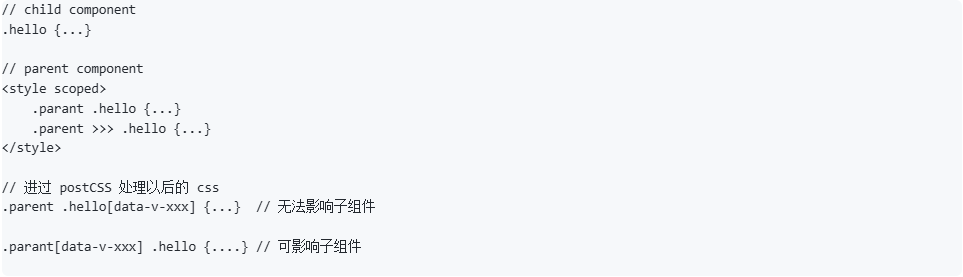

有些像 Sass 之类的 预处理器 无法 正确解析 >>>。这种情况下我们可以使用 /deep/ 或 ::v-deep 操作符取而代之，两者都是 >>> 的 别名，同样可以正常工作。

深度作用选择器， 必须在含有 scoped 属性 的 style 标签中使用，否则无效。 这是因为 >>>、/deep/、::v-deep 需要被 postCSS 解析才能起作用。 只有 style 标签 中有 scoped 属性， 样式内容 才会被 postCSS 解析。

postCSS 解析样式内容的时候， 会给 >>> 操作符 前面 的 css选择器 添加 [data-v-hash]。

注意： 父组件 中修改 子组件 的 私有样式 时， 父组件 中的 样式的优先级 要大于 子组件 中的 样式的优先级， 否则会导致 父组件中定义的样式不生效。

**CSS Modules**

我们也可以在 .vue 文件 的 style 标签 上添加 module 属性， 使得 style 标签 中的 样式 变为 组件私有

css modules 和 css scoped 都可以使 样式 变为 组件私有，但是 原理 不一样。

css scoped 的实质是利用 css属性选择器 使得 样式 称为 局部样式，而 css modules 的实质是让 样式的类名、id名唯一 使得 样式 称为 局部样式。

css modules 的 工作流程 如下:

1.使用 vue-loader 处理 .vue 文件， 将 .vue 文件内容 转化为 js 代码。 如果 .vue 文件 中的 style 标签 中有 module 属性， 向 js 代码 中注入一个 injectStyle 方法， 如下：

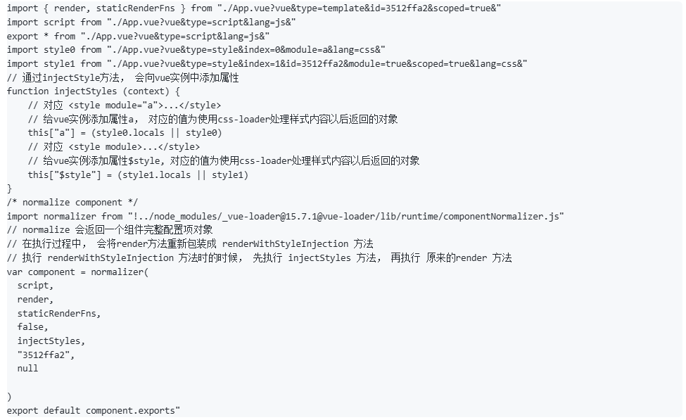

2.使用 css-loader 处理 .vue 文件 的 style 区域块，会将 style 区域块 中的样式内容， 转化为 js 代码， 如下:

```
代码块
```

在处理过程中， css-loader 会将样式中的 类名、id名 等用一个 唯一的命名代替。

在执行 步骤1 的代码时，会执行上面的代码， 返回一个 对象， 即 步骤一 中的 style0 、style1， 格式如下:

```
代码块
// css样式内容会通过 style-loader 提供的方法添加到 head 中  
// 或者被 miniCssExtractPlugin 提取到一个 公共的css文件 中  
style0 = [[css模块 id, css样式内容字符串, ''], ...]  
style0.locals = {

    "app": "_3cl756BP8kssTYTEsON-Ao",

        "class1": "_3IbrnaW__7RJMXk4rh9tW-"  
}  
```

3.运行项目执行打包以后的js代码， 即 步骤1中的代码， 获取 render、staticRenderFns、scriptExprots、 style0、style1， 然后通过 normalizer 方法返回 组件完整配置项 - options。 在执行过程中，将 render 方法重新包装成 renderWithStyleInjection 方法。构建 vue 实例 时，执行 renderWithStyleInjection 方法， 此时会 先 执行 injectStyles 方法，给 vue 实例 添加 $style、a 属性，属性值为 stlye0.locals、style1.locals， 再执行原来的 render 方法。这样， 我们就可以通过 vue 实例 的 $style、a 属性访问 样式 的 类名、id名。

**热更新**

开发模式 下，当使用 vue-loader、 vue-style-loader 处理 .vue 文件 的时候， 会向 生成的js代码 中注入与 热更新 相关的代码逻辑。 当我们修改 .vue 文件 时， dev-server 会通知 浏览器 进行 热更新。

.vue 文件 的 各个区域块(template、script、styles) 对应的 热更新逻辑 都不一样。

- **template & script**

vue-loader 会在 打包代码 中注入 热更新 template、script 区域块 的代码，如下:

```
代码块
// 从 template区域块 获取 render、 staticRenderFns 方法  
import { render, staticRenderFns } from "./App.vue?vue&type=template&id=7ba5bd90&scoped=true&"  
// 从 script区域块 获取 组件的配置项对象  
```

如果我们只修改了 .vue 文件 的 script 部分， 客户端(即浏览器) 会进行 热更新， 过程如下：

1.服务端 通过 websocket 连接 通知 客户端 更新；

2.客户端 通过 动态添加script元素 的方式获取 更新以后的打包文件；

3.安装打包文件，即执行 新的打包文件 中的 js 代码， 使用 打包文件中的 module 更新浏览器缓存的同名 module；

4.重新安装组件对应的 module， 即 重新执行组件对应的js代码， 获取 render、staticRenderFns 和 新的 scriptExports， 重新生成 组件 对应的 完整配置项；

5.执行 api 提供的 reload 方法， 更新组件。在 reload 方法中，会通过执行 父组件实例 的 $forceUpdate 方法来 更新组件。更新组件的时候， 由于组件 的 配置项(data、props、methods等属性) 发生变化， 需要为 组件 生成 新的构造函数 VueComponent， 然后使用 新的构造函数，构建 新的组件实例。即， 每次修改 .vue 文件 的 script 部分， 都会为 组件 生成一个 新的实例对象， 销毁旧的实例对象。如果我们只修改了 .vue 文件 的 template 部分, 客户端(即浏览器) 会进行 热更新， 过程如下：

6.同上，服务端 通过 websocket 连接 通知 客户端 更新；

7.同上， 客户端 通过 动态添加script元素 的方式获取 更新以后的打包文件；

8.同上， 安装打包文件，即执行 新的打包文件 中的 js 代码， 使用 打包文件中的 module 更新浏览器缓存的同名 module；

9.触发通过 module.hot.accept 注册的 callback；

10.执行 api 提供的 rerender 方法， 更新组件。执行 rerender 方法时， 会先获取 修改以后的template区域块 对应的 render、staticRenderFns， 然后 更新原组件的 render、staticRenderFns， 然后执行 组件实例 的 $forceUpdate 方法来更新 组件(更新组件的时候， 会使用新的render方法， 生成新的vnode节点树)。如果我们 同时 修改了 .vue 文件的 template、 script部分， 会按照上面 第一种情况 进行 热更新，并且不会触发上面代码中通过 module.hot.accept 注册的 callback。

**style**

vue-style-loader 会在 打包代码 中注入 热更新 style区域块 的代码， 如下:

```
代码块
...  
var add = require("!../node_modules/_vue-style-loader@4.1.2@vue-style-loader/lib/addStylesClient.js").default  
var update = add("05835b6f", content, false, {});  
// Hot Module Replacement  
if(module.hot) {

 // When the styles change, update the <style> tags

 if(!content.locals) {

   module.hot.accept("!!../node_modules/_css-loader@3.1.0@css-loader/dist/cjs.js!../node_modules/_vue-loader@15.7.1@vue-loader/lib/loaders/stylePostLoader.js!../node_modules/_vue-loader@15.7.1@vue-loader/lib/index.js??vue-loader-options!./App.vue?vue&type=style&index=0&lang=css&", function() {

     // 当 .vue 文件的 styles 区域块更改时， 客户端执行这一段代码

     var newContent = require("!!../node_modules/_css-loader@3.1.0@css-loader/dist/cjs.js!../node_modules/_vue-loader@15.7.1@vue-loader/lib/loaders/stylePostLoader.js!../node_modules/_vue-loader@15.7.1@vue-loader/lib/index.js??vue-loader-options!./App.vue?vue&type=style&index=0&lang=css&");

     if(typeof newContent === 'string') newContent = [[module.id, newContent, '']];

     // 执行update方法， 更新styles

     update(newContent);

   });

 }  
}  
```

如果我们修改了 .vue 文件 的 styles 区域块，客户端(即浏览器) 会进行 热更新， 过程如下：

1.同上，服务端 通过 websocket 连接 通知 客户端 更新；

2.同上，客户端 通过 动态添加script元素 的方式获取 更新以后的打包文件；

3.同上，安装打包文件，即执行 新的打包文件 中的 js 代码， 使用 打包文件中的 module 更新浏览器缓存的同名 module;

4.触发通过 module.hot.accept 注册的 callback；

5.执行 update 方法， 更新样式。更新样式 的时候， 会先 移除原来的 style 标签， 然后 添加新的 style 标签。如果 style 标签 上有 module 属性，除了 vue-style-loader 会注入 热更新代码 外，vue-loader 也会在 打包代码 中注入 热更新代码，如下:

```
代码块
  // 热更新代码    module.hot && module.hot.accept(["./App.vue?vue&type=style&index=1&id=7ba5bd90&module=true&scoped=true&lang=css&"], function () {      // 当.vue的style区域块发生变化， 且style标签有module属性， 执行这一段逻辑      var oldLocals = cssModules["$style"]  
      if (oldLocals) {  
        // 获取新的唯一类名、id名  
        var newLocals = require("./App.vue?vue&type=style&index=1&id=7ba5bd90&module=true&scoped=true&lang=css&")  
        if (JSON.stringify(newLocals) !== JSON.stringify(oldLocals)) {  
          // 更新vue实例的$style属性          cssModules["$style"] = newLocals  
          // 执行vue实例的 $forceUpdate 方法，重新执行 render 方法          require("D:\\study\\demo\\webpack\\webpack-4-demo\\node_modules\\_vue-hot-reload-api@2.3.3@vue-hot-reload-api\\dist\\index.js").rerender("7ba5bd90")        }      }    })  
```

执行上述 热更新代码， 会 更新 vue实例 的 $style 属性， 然后触发 vue 实例 的 $forceUpdate 方法， 重新渲染。

一个 style 区域块 对应一个 style 标签。修改某一个 style 区域块 之后，会更新对应的 style 标签。

style 区域块 的 热更新 和 template、script 区域块的 热更新 互不影响。

**tree shaking 副作用**

生产模式 下， webpack 默认启用 tree shaking。如果此时项目 根目录 中的 package.json 中的 sideEffects 的值为 false，且 .vue 文件 的 style 标签 没有 module 属性，使用 vue-loader 处理 .vue 文件 的时候， 会产生 样式丢失 的情况，即 styles 区域块 不会添加到 head 中或者 被提取到公共的css文件中。

首先，先看一下 .vue 文件 经过处理以后生成的 js代码， 如下:

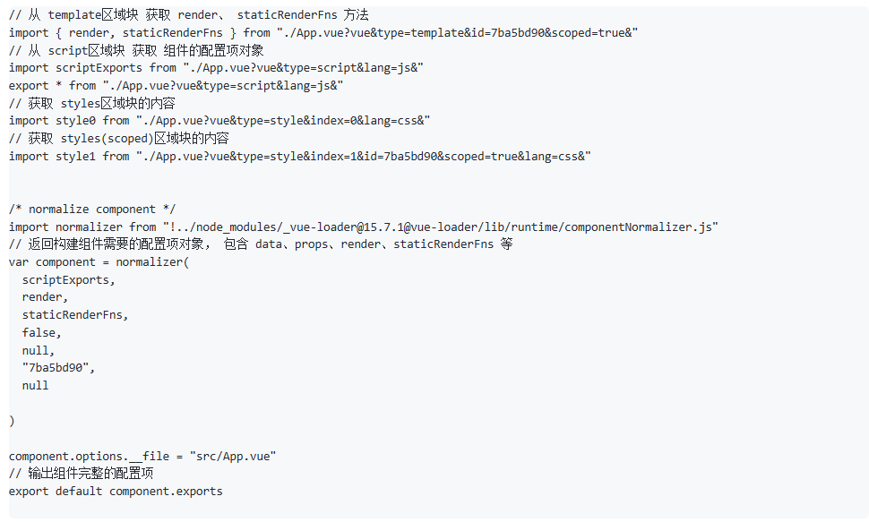

在上面的代码中，template 区域块 返回的 render、staticRenderFns， script 区域块 返回的 scriptExports， 都有被 normalizer 方法使用， 而 styles 区域块 返回的 style0、style1 则没有被使用。 在 打包代码 的时候， tree shaking 就会自动移除 styles 区域块 对应的代码，导致 样式丢失。

解决方法:

1.修改 package.json 文件中的 sideEffects 属性， 告诉 webpack .vue 文件在使用 tree shaking 的时候会有 副作用， 如下:

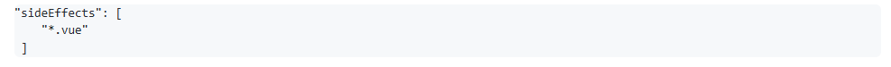

有了上述配置， webpack 在处理 .vue 文件的时候， 不会使用 tree shaking， 不会出现样式丢失的问题。

但是这种解决方法有一个问题， 如果 script 区域块 中通过 import 的方式引入了 未使用的模块，未使用的模块在最后打包代码的时候不会被删除。

2.通过 rule.sideEffects 指定 具体的模块 在使用 tree shaking 的时候会有 副作用， 如下:

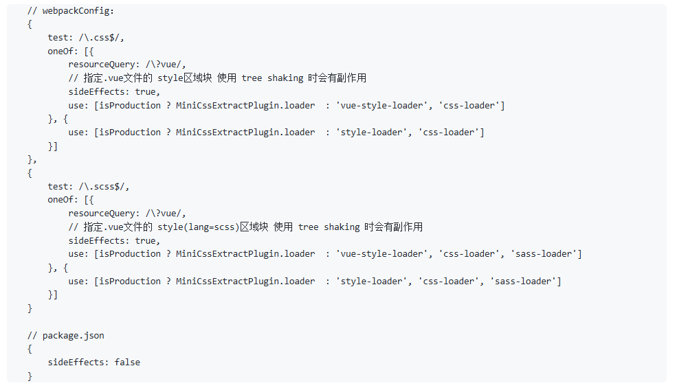

**参考答案：**

不会触发视图更新

当你把一个普通的 JavaScript 对象传给 Vue 实例的 data 选项，Vue 将遍历此对象所有的属性，并使用 Object.defineProperty 把这些属性全部转为 getter/setter。Object.defineProperty 是 ES5 中一个无法 shim 的特性，这也就是为什么 Vue 不支持 IE8 以及更低版本浏览器的原因。用户看不到 getter/setter，但是在内部它们让 Vue 追踪依赖，在属性被访问和修改时通知变化。这里需要注意的问题是浏览器控制台在打印数据对象时 getter/setter 的格式化并不同，所以你可能需要安装 vue-devtools 来获取更加友好的检查接口。 每个组件实例都有相应的 watcher 实例对象，它会在组件渲染的过程中把属性记录为依赖，之后当依赖项的 setter 被调用时，会通知 watcher 重新计算，从而致使它关联的组件得以更新。

触发视图更新的方法有如下几种：

**Vue.set**

可以设置对象或数组的值，通过key或数组索引，可以触发视图更新

数组修改

```
代码块
Vue.set(array, indexOfItem, newValue)
```

对象修改

```
代码块
Vue.set(obj, keyOfItem, newValue)
```

**Vue.delete**

删除对象或数组中元素，通过key或数组索引，可以触发视图更新

数组修改

```
代码块
Vue.delete(array, indexOfItem)
```

对象修改

```
代码块
Vue.delete(obj, keyOfItem)
```

**数组对象直接修改属性，可以触发视图更新**

```
代码块
this.array[0].isShow= true;
this.array.forEach(function(item){
    item.isShow= true;
});
```

**数组赋值为新数组，可以触发视图更新**

```
代码块
this.array = this.array.filter(...)
this.array = this.array.concat(...)
```

**Vue提供了如下的数组的变异方法，可以触发视图更新**

Vue 将被侦听的数组的变更方法进行了包裹，所以它们也将会触发视图更新。

这些被包裹过的方法包括：

```
代码块
push()
pop()
shift()
unshift()
splice()  
sort()
reverse()
```

## 76.Vuex有几种属性，它们存在的意义分别是什么？

**参考答案：**

有五种，分别是 State、 Getter、Mutation 、Action、 Module。

**State**

Vuex 使用单一状态树——是的，用一个对象就包含了全部的应用层级状态。至此它便作为一个“唯一数据源 (SSOT)”而存在。这也意味着，每个应用将仅仅包含一个 store 实例。单一状态树让我们能够直接地定位任一特定的状态片段，在调试的过程中也能轻易地取得整个当前应用状态的快照。

State属性是Vuex的单一状态树

**Getter**

有时候我们需要从 store 中的 state 中派生出一些状态，例如对列表进行过滤并计数

Getter类似于Vue的 computed 对象。是根据业务逻辑来处理State，使得生成业务所需的属性。

**Mutation**

更改 Vuex 的 store 中的状态的唯一方法是提交 mutation。Vuex 中的 mutation 非常类似于事件：每个 mutation 都有一个字符串的 事件类型 (type) 和 一个 回调函数 (handler)。

Mutation是唯一用来更改Vuex中状态的方法。

**Action**

Action 类似于 mutation，不同在于：

- Action 提交的是 mutation，而不是直接变更状态。

- `activated` 当组件被激活（使用）的时候触发 可以简单理解为进入这个页面的时候触发

- `deactivated` 当组件不被使用（inactive状态）的时候触发 可以简单理解为离开这个页面的时候触发

假设我们只缓存home组件，我们先看一下代码，再在钩子中打印出对应的顺序。就知道钩子执行的顺序了，自己动手印象深刻

```
代码块
<template>
<div>
  <el-checkbox v-model="checked">备选项</el-checkbox>
</div>
</template>
<script>
export default {
name: "home",
data() { return { checked: false } },
created() {
  console.log("我是created钩子");
},
mounted() {
  console.log("我是mounted钩子");
},
activated() {
  console.log("我是activated钩子");
},
deactivated() {
  console.log("我是deactivated钩子");
},
beforeDestroy() {
  console.log("我是beforeDestroy钩子");所以我们可以得出结论：
},
};
</script>
```

进入组件打印结果如下：

```
代码块
我是created钩子
我是mounted钩子
我是activated钩子
```

离开组件打印结果如下：

```
代码块
我是deactivated钩子
```

得出结论：

```
代码块
初始进入和离开 created ---> mounted ---> activated --> deactivated
后续进入和离开 activated --> deactivated
```

**keep-alive的应用场景举例**

- 查看表格某条数据详情页，返回还是之前的状态，比如还是之前的筛选结果，还是之前的页数等

- 填写的表单的内容路由跳转返回还在，比如input框、下选择拉框、开关切换等用户输入了一大把东西，跳转再回来不能清空啊，不用让用户再写一遍

## 79.什么是虚拟DOM？

**参考答案：**

虚拟DOM（VDOM）它是真实DOM的内存表示,一种编程概念，一种模式。它会和真实的DOM同步，比如通过ReactDOM这种库，这个同步的过程叫做调和(reconcilation)。

虚拟DOM更多是一种模式，不是一种特定的技术。

## 80.说说你对vue的理解?

**参考答案：**

Vue.js（/vjuː/，或简称为Vue）是一个用于创建用户界面的开源JavaScript框架，也是一个创建单页应用的Web应用框架。

Vue 是一套用于构建用户界面的渐进式MVVM框架。那怎么理解渐进式呢？渐进式含义：强制主张最少。

Vue.js包含了声明式渲染、组件化系统、客户端路由、大规模状态管理、构建工具、数据持久化、跨平台支持等，但在实际开发中，并没有强制要求开发者之后某一特定功能，而是根据需求逐渐扩展。

Vue所关注的核心是MVC模式中的视图层，同时，它也能方便地获取数据更新，并通过组件内部特定的方法实现视图与模型的交互。

Vue.js的核心库只关心视图渲染，且由于渐进式的特性，Vue.js便于与第三方库或既有项目整合。Vue.js 实现了一套声明式渲染引擎，并在runtime或者预编译时将声明式的模板编译成渲染函数，挂载在观察者 Watcher 中，在渲染函数中（touch），响应式系统使用响应式数据的getter方法对观察者进行依赖收集（Collect as Dependency），使用响应式数据的setter方法通知（notify）所有观察者进行更新，此时观察者 Watcher 会触发组件的渲染函数（Trigger re-render），组件执行的 render 函数，生成一个新的 Virtual DOM Tree，此时 Vue 会对新老 Virtual DOM Tree 进行 Diff，查找出需要操作的真实 DOM 并对其进行更新。
